# JAVASE

**声明：资料“  请不要 ！”擅自 随意更改和删除，谢谢 ！！！**

**本区域标题目录：**

[TOC]

# 1、写出Java的四类八种基本数据类型

整数                      byte (1字节)  short (2字节)  int (4字节)  long (8字节)

小数(浮点)             float (4字节)  double (8字节)

布尔                      boolean (Oracle的JVM占1个字节，Java的JVM中占4个字节)&#x20;

字符                      char (2字节)

# 2、& 和 && 的区别&#x20;

&  符号的左右两边,无论真或假都要执行

&& 符号的左边如果为假,符号的右边不再执行,提高了代码的执行效率

# 3、switch的参数可以是什么类型.

byte，short，int，char，String，枚举

# 4、说出成员变量和局部变量的区别

🌞bw：**↴**

***

**1、代码位置**

成员变量：类中，方法外

&#x20; ↓ 而 ↓

局部变量：方法体的花括号里

**2、内存位置**

成员变量：其中，静态变量（类变量）存储在方法区，非静态变量（实例变量）存储在堆中

局部变量：通常存储在**栈内存**中（栈帧）

**3、生命周期**

成员变量：其中，静态变量与类生命周期相同，非静态变量与所被调用的实例对象生命周期相同

局部变量：随着方法的调用而产生，随着方法调用结束而消失

\*\*4、有无默认值 \*\*

成员变量：有默认值，【整数→0】

&#x20;                                【小数→0.0】

&#x20;                                【字符 →‘\u0000’】

&#x20;                                【布尔→false】&#x20;

&#x20;                                【引用数据类型→null】

局部变量：没有默认值， 使用的时候，必须先赋值。

# 5、static关键字都能修饰什么？ 都有什么特点

🌞bw：**↴**

1、**修饰类：** 叫做 →**静态内部类**

**特点：** 不依赖外部类实例，可直接通过其外部类【其外部类名.静态内部类名】来访问。

***

2、**修饰成员变量：** 叫做 →**静态变量**

**特点：** 属于类本身，类所有实例共享，可直接通过【类名.】直接访问，节省内存空间。

***

3、**修饰方法：** 叫做 →**静态方法**

**特点：** 属于类的方法，可以直接使用【类名.】进行调用。

***

4、**修饰代码块：** 叫做 → **静态代码块**

**特点：** 在类加载时执行一次，用于初始化静态变量给静态变量进行赋值，或执行只需执行一次的代码。

# 6、overload和override的区别

🌞bw：**↴**

overload：是重载 ，必须写在同一个“类”中，说白了就是，同一个类中，存在多个同名的方法。

overload 重载  的这些方法：方法名相同，但方法括号里的参数不同。

***

override：是重写，让一个子类“继承”了父类的一个方法，

并保持：方法名相同、参数列表相同、返回类型相同，

然后我们重新改写了这个子类方法的方法体，这就是重写。

**原版解释说：**

参数列表不同表现在: 个数不同, 数据类型顺序不同,数据类型不同。

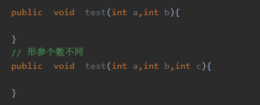

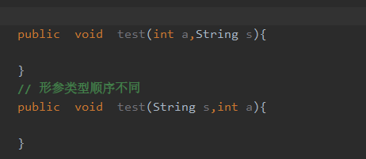

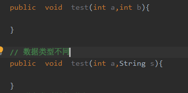

override是重写 要求发生在子父级的继承关系中,方法名相同,参数列表相同,返回值类型是父类返回值类型本身或其子类, 异常等于父类本身异常类型或小于父类本身异常。

**把控细节**：构造方法不能被重写,因为构造方法要求,方法名与类名保持一致 **.**

**返回值**：

**父类：**

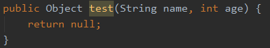

**子类：**

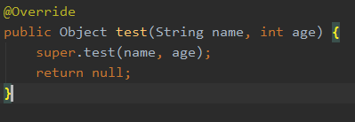

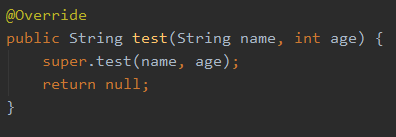

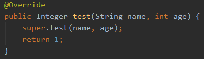

&#x20;**异常**：

**父类：**

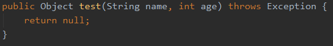

**子类：**

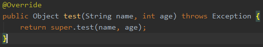

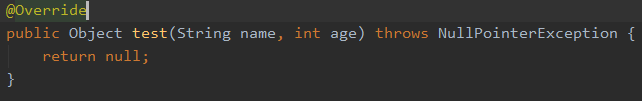

# 7、 final 和 finally的区别

**final 是权限修饰符, 表示最终的, 能修饰：类、方法、变量**。

修饰变量: 变成了常量。

修饰方法: 变成了最终的方法,不能被重写,但是可以被正常调用。

修饰类: 变成的最终的类,不能有子类,但是可以被正常创建对象。

**finally 是一个代码块,只能与我们的 try代码块（try catch）连用,表示无论代码是否发生异常,finally里面的代码都要执行**。

finally强制退出两种方式：System.exit()、

**Finally把控细节：**

```java
package se.finals;


public class FinallyDemo {
    public static void main(String[] args) {


        FinallyDemo finallyDemo = new FinallyDemo();
        // finallyDemo.finallyTestTryNoResult(); 
        // System.out.println(finallyDemo.finallyTestTryResult()); 
        / /System.out.println(finallyDemo.finallyTestCatchResult()); 

         System.out.println(finallyDemo.finallyTestFinallyResult()); 
    }

    // 1.都没有返回值
    public void finallyTestTryNoResult() {
        try {
            System.out.println("try code block invoked");
            //int i = 1 / 0;
            throw new Exception();
        } catch (Exception e) {
            System.out.println("catch code block invoked");
        } finally {
            System.out.println("finally code block invoked");
        }
    }

    // 2.try有返回值
    public String finallyTestTryResult() {
        try {
            System.out.println("try code block invoked");
            return "no result";
            //throw new Exception();
        } catch (Exception e) {
            e.printStackTrace();
            System.out.println("catch code block invoked");
        } finally {
            System.out.println("finally code block invoked");
        }
        return "result";

    }

    // 3.catch有返回值
    public String finallyTestCatchResult() {

        try {
            System.out.println("try code block invoked");
            //throw new Exception();
            int i = 1 / 0;
            return "no result";
        } catch (Exception e) {
            e.printStackTrace();
            System.out.println("catch code block invoked");
            return "error";
        } finally {
            System.out.println("finally code block invoked");
        }

    }

    // 4.finally有返回值
    public String finallyTestFinallyResult() {

        try {
            System.out.println("try code block invoked");
            //throw new Exception();
            int i = 1 / 0;
            return "no result";
        } catch (Exception e) {
            e.printStackTrace();
            System.out.println("catch code block invoked");
            return "error";
        } finally {
            System.out.println("finally code block invoked");
            return "success";
        }

    }


}
```

# 8、 this和super都能用到哪些地方

🌞bw：**↴**

***

**this**和**super** 都能用于访问：**成员变量**和**方法**还有**构造器** 上。

其中，**this**关键字能够用来帮助我们访问本类的：**成员变量**和**方法**还有**构造器**。

**this**关键字在Java中代指引用当前Class类对应的对象实例。

当遇到**变量名**冲突的时候，用来区分**成员变量**和**局部变量**。

而**super**关键字则是专门用于**子类**访问**父类**的地方。

它能够用来帮助我们访问父类的：**成员变量**和**方法**还有**构造器**，确保了在子类中可以正确地使用和继承父类的功能。

当遇到子类与父类有重名的**成员变量**和**方法**时，**super**就可以帮助我们明确出：哪些是调用父类的**成员变量**和**方法**。

***

**原版解释说：**

1、访问成员变量

this：可以区分成员变量与局部变量重名问题,如果本类没有这个成员变量,也可以调用父类的成员变量。

super：可以区分本类成员变量与父类成员变量重名问题，只能调用父类的成员变量。

2、访问成员方法                             &#x20;

this：可以调用本类的成员方法,如果本类没有这个成员方法,也可以调用父类的成员方法。

super：只能调用父类的成员方法。

3、访问构造器

this：可以通过this() 或 this(参数) 让其本类的构造方法直接相互调用。

super：子类通过super() 或 super(参数) 调用父类的构造方法。

🌞bw：**↴**

**以下是this和super的代码示例：**

***

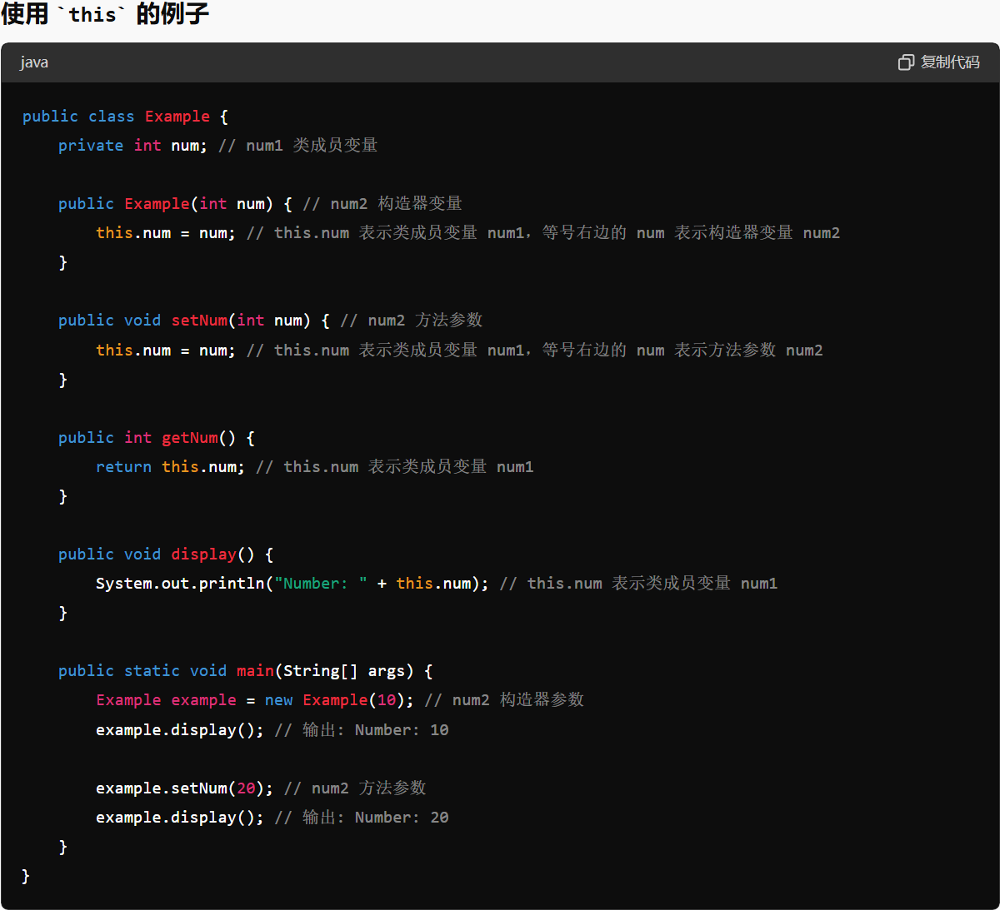

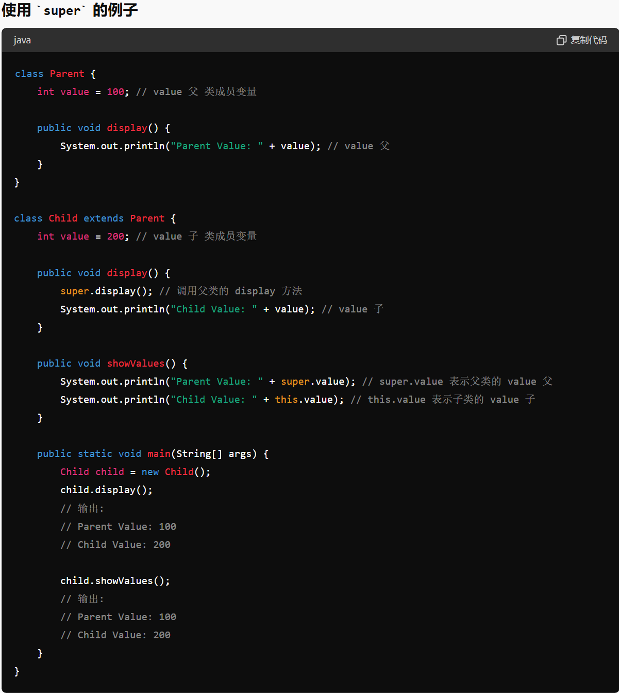

***

# 9、 接口 与 抽象类，的区别

🌞bw：**↴**

**理解化版本：**

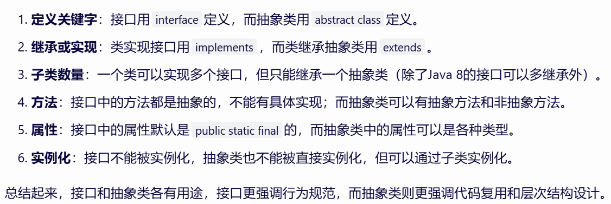

**原版解释说：**

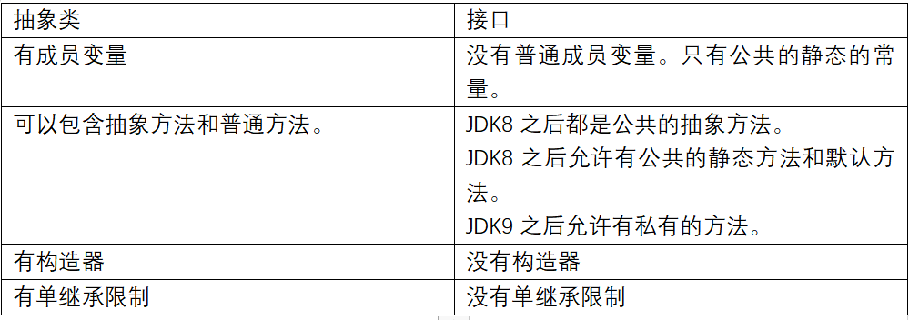

单继承限制：一个类只能继承一个抽象方法，

**把控细节**：

**抽象类：**

**例子（example）：**

```java
package se.abstracts;


public abstract class AbstractDemo {

    // 抽象类和普通类基本没有区别（只是多了一个可以定义抽象方法）
    private int a;// 成员变量
    private static int b;//静态变量
    private static final int c = 1;//常量

    // 1.抽象类中静态方法--有方法的实现
    public static void a() {

    }

    // 2.抽象类中构造方法
    public AbstractDemo(int a) {
        this.a = a;
    }

    // 3.抽象类中实例方法
    public void b() {

    }

    // 4.抽象类中定义一个抽象方法，注意没有方法实现体。
    //public abstract void c(){ //fail
    //
    //}
    public abstract void c();// ok

}

```

**接口**：

**例子（example）：**

```java
package se.abstracts;


public interface InterfaceDemo extends InterfaceDemo1, InterfaceDemo2 {
    // 1.接口中不能定义静态方法--但是可以有静态方法的实现
    public static void a() {

    }
    //public static void b();//fail
    
    // 2.接口中不可以定义构造方法
    //public InterfaceDemo(){//fail
    //
    //}

    // 3.接口中不可以定义实例方法（没有static  也没有abstract关键字）
    //public void c();//fail
    // 4.接口中不能定义变量--只能有常量
    public static final int d = 1;
    //public int x;//fail

    // 5.接口中所有的默认方法都是public abstract修饰  且访问修饰符必须要是public或者不写，不写则使用默认(注意：默认指的不是default)
    // 抽象类中的访问修饰符四种都可以（public protected private 不写）
    void world();// public abstract

    // 1.8允许接口中有方法的实现，但是必须用关键字default修饰
    default String hello() {
        return "hello";
    }


}

```

# 10、 静态变量 与 实例变量，的区别

🌞bw：**↴**

***

**静态变量：**

**内存位置：**在**方法区**中

**生命周期：** 在【类.class文件】加载时 创建，在【类.class文件】卸载时 销毁。

**调用方式：** 静态变量既可以通过【类名.】直接进行调用, 也可以通过【对象名.】进行调用。

与 **实例变量** 的区别：静态变量 → 用 static 关键字声明。

&#x20;                           静态变量 → 属于类本身，所有对象共享一个静态变量。

**实例变量：**

**内存位置：**在**堆内存**中

**生命周期：** 在对象创建时 产生，在对象被垃圾回收时 销毁。

**调用方式：** 实例变量只能通过【对象名.】进行访问。

与 **静态变量** 的区别：实例变量 → 没有 static 关键字。

&#x20;                           实例变量 → 属于对象，每个对象有自己独立的实例变量。

**关键点总结：**

- 静态变量：属于类，所有对象共享，通过类名访问。
- 实例变量：属于对象，每个对象独立，通过对象访问。

**下图为代码案例：**

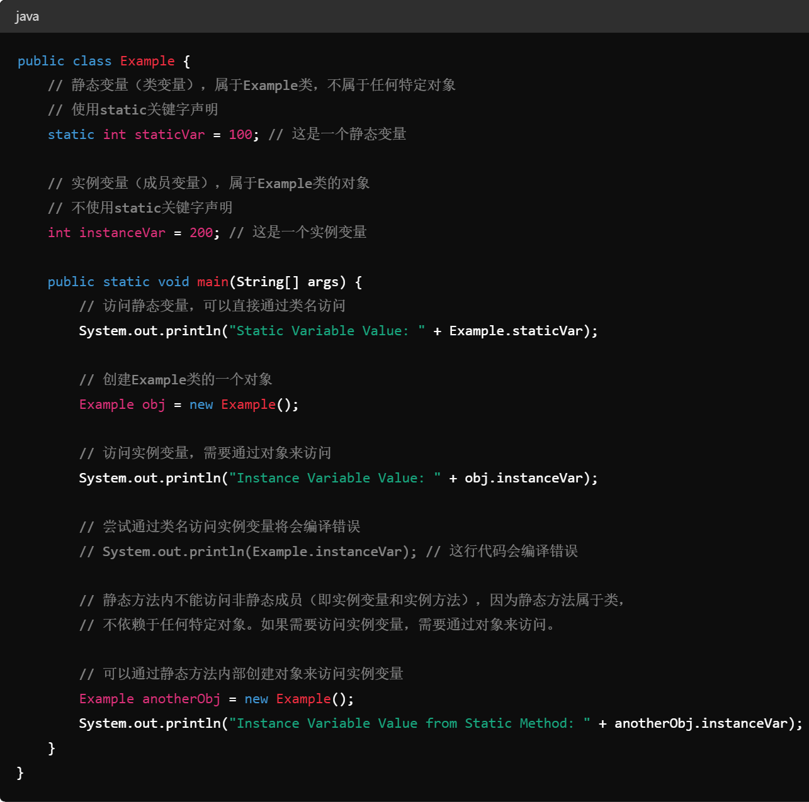

# 11、throw和throws 的区别

throw 是具体抛出一个异常对象,在方法的内部, 后面有且只能有一个异常对象,代码一旦遇到了throw证明出现了问题,代码就会停止,线程会异常退出。

throws 是异常的声明, 在方法定义的小括号后面,后面可以跟多个异常的类型,方法有throws,代码不一定发生异常。

# 12、String,StringBuilder 与 StringBuffer 的区别

🌞bw：**↴**

***

**相同点：**

1、String、StringBuilder、StringBuffer 都是final类，都不允许被 'extends' 继承。

**不同点：**

1、String 声明的 数据(变量/对象) 被修改时会产生一个新的内存对象，

而 StringBuilder、StringBuffer 则是可以直接对自身 数据(变量/对象) 进行修改，

不会产生新的内存对象。

2、如果要对 StringBuilder、StringBuffer 所修饰的 数据(变量/对象) 进行更改的话，

首先 StringBuilder 适用于单线程环境中频繁修改字符串，

反之 StringBuffer 则适用于多线程环境中使用。

***

**原版解释说：⬎****相同点**：

**String类**：**源码截图：**

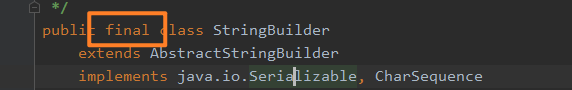

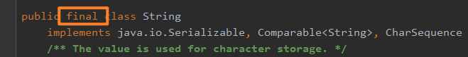

**StringBuilder类：**&#x20;

**StringBuffer类：**

1、String、StringBuffer、StringBuffer都是final类，不允许被继承；

2、String声明的对象进行内容修改会产生一个新的对象，而StringBuffer、StringBuilder则是对自身进行修改，不会产生新的对象；

**不同点：**

StringBuilder类中的大多数方法没有加Synchronized关键字修饰。而StringBuffer类中的大多数方法都是加了Synchronized关键字修饰，正因为如此，在多线程操作的时候，StringBuffer会比StringBuilder安全，但是其效率会偏低。StringBuffer是StringBuilder的父类

- StringBuilder 和 StringBuffer 非常类似，均代表可变的字符序列，而且提供相关功能的方法也一样。
- 区分String、StringBuffer、StringBuilder
  - String:不可变的字符序列； 底层使用char\[]数组存储(JDK8.0中)
  - StringBuffer:可变的字符序列；线程安全（方法有synchronized修饰），效率低；底层使用char\[]数组存储 (JDK8.0中)
  - StringBuilder:可变的字符序列； jdk1.5引入，线程不安全的，效率高；底层使用char\[]数组存储(JDK8.0中)

# 13、 == 和 equals的区别

🌞bw：**↴**

***

**==：**

既可以比较**基本**数据类型，也可以比较**引用**数据类型。

比较**基本**数据类型时：比较的是**具体的值**。

比较**引用**数据类型时：比较的是**地址值**。

**equals：**

直接调用使用**equals** 的默认方法：比较的是两个对象的**地址值**。

但遇到例如常见的**类**，如：

**String类**、

**包装类**（如`Integer`, `Double`, `Boolean`等）、

**集合类**（如`List`, `Set`等）、

**自定义类**，

这些我们常见的类，默认已经重写好了**equals** 的方法，因此 **比较的是值的内容**。

# 14、包装类的：拆箱、装箱

**装箱：** 将基本类型转换成包装类对象。

**拆箱：** 将包装类对象转换成基本类型的值。

**区别：** 以int和Integer为例。

（1）Integer是int的包装类，int则是java的一种基本数据类型；

（2）Integer变量必须实例化后才能使用，而int变量不需要；

（3）Integer实际是对象的引用，当new一个Integer时，实际上是生成一个指针指向此对象；而int则是直接存储数据值；

（4）Integer的默认值是null，int的默认值是0。

java为什么要引入自动装箱和拆箱的功能？主要是用于java集合中，List\<Inteter>list=new ArrayList\<Integer>();

list集合如果要放整数的话，只能放**对象**的形式，不能放**基本类型**的形式，因此需要将整数自动装箱成对象形式。

**例子（example）：**

```java
package se.packing;

/**
 * @Author huzhongkui
 * @Date 2023--08--31:14:45
 * 聪明出于勤奋,天才在于积累
 **/
public class IntAndIntegerDemo {
    public static void main(String[] args) {

        // 一组：两个Integer对象比较
        // 结论：两个对象比较 地址一定不等，则结果为false
        Integer integer = new Integer(66);
        Integer integer1 = new Integer(66);
        System.out.println(integer == integer1);
        
        // 二组：Integer类型属性值和int属性值比较
        // 结论：包装类Integer和基本数据类型比较的时候，将包装类自动拆箱为int，然后进行比较，本质就是两个int变量进行比较，只要两个变量的值相等，则结果就为true
        Integer integer2 = new Integer(88);
        //Integer a = 88;
        int i = 88;
        System.out.println(integer2 == i);
        
        // 三组：new Integer()类型变量值和Integer类型的变量值比较
        // 结论：new Integer() 堆中地址 Integer 常量池中地址，地址不等
        Integer integer3 = new Integer(88);
        Integer j = 88;
        System.out.println(integer3 == j);

        // 四组：Integer类型的变量值和Integer类型的变量值(范围在：[-128~127]相等,)
        // 其它则不相等会创建新的Integer对象
        Integer k = -129;
        Integer l = -129;
        System.out.println(k == l);
    }
}

```

# 15、异常结构图

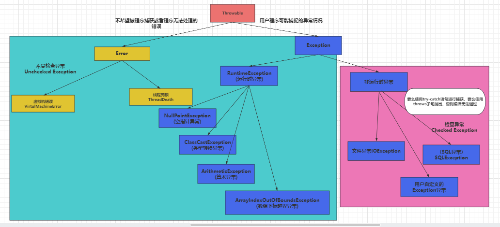

# 16、 HashSet 的去重原理

🌞bw：**↴**

***

HashSet在Java中是一个非常重要的集合类，主要用于存储唯一的元素。

它的主要特点和用途如下：

在Java中，当我们使用HashSet来存储对象时，为了确保对象的唯一性，HashSet会依赖于java默认给对象的hashCode()方法和equals()方法。

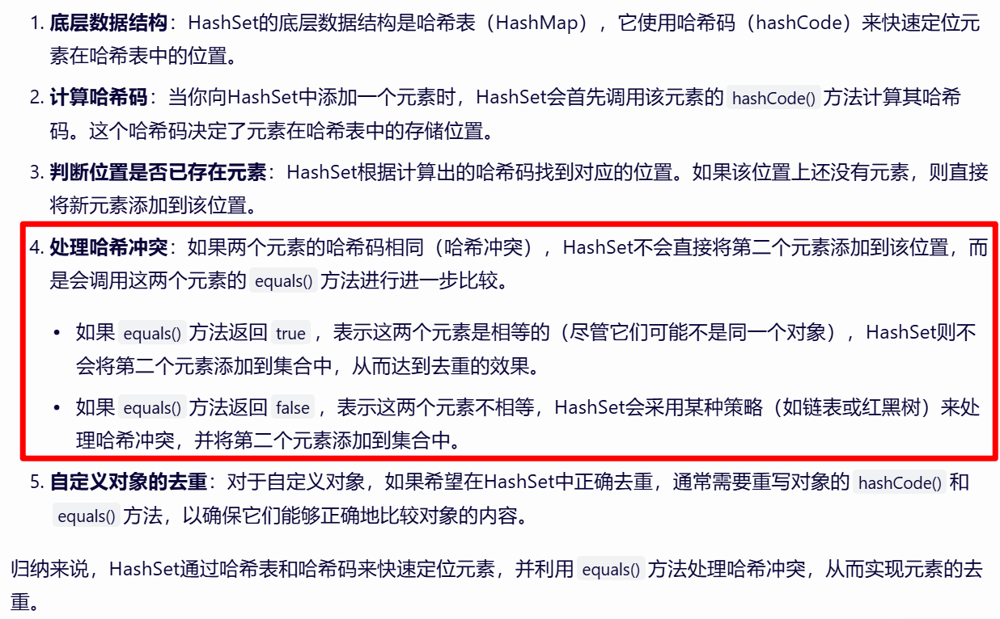

***

**原版解释说：**

如果两个对象的hashCode值不同，直接插入成功.
如果两个对象的hashCode值相同，再比较两个对象的地址值。如果地址值相同，即同一个对象，插入失败（无需继续判断）反之，则会继续调用equals方法比较，如果equals方法返回true，插入失败；如果equals方法返回false，插入成功。

#### **HashSet中添加元素的过程：**

• 第1步：当向 HashSet 集合中存入一个元素时，HashSet 会调用该对象的 hashCode() 方法得到该对象的 hashCode值，然后根据 hashCode值，通过某个散列函数决定该对象在 HashSet 底层数组中的存储位置。

• 第2步：如果要在数组中存储的位置上没有元素，则直接添加成功。

• 第3步：如果要在数组中存储的位置上有元素，则继续比较：

– 如果两个元素的hashCode值不相等，则添加成功；

– 如果两个元素的hashCode()值相等，则会继续调用equals()方法：

• 如果equals()方法结果为false，则添加成功。

• 如果equals()方法结果为true，则添加失败。

第2步添加成功，元素会保存在底层数组中。

第3步两种添加成功的操作，由于该底层数组的位置已经有元素了，则会通过\_链表\_的方式继续链接，存储。

# 17、集合 与 数组，的区别

🌞bw：**↴**

***

**集合** 与 **数组** 都是容器。

**数组**：既可以存**基本数据类型**，也可以存**引用数据类型**。数组的**长度固定**且不能发生改变。

**集合**：只能存**引用数据类型**，任意类型的**引用数据类型**，且 长度**可变**。

任意类型的**引用数据类型**：例如，你可以将String类、类似Integer这样的**包装类**、自定义的类，这些常见的引用类的实例添加到集合中。

# 18、多线程的五种实现方式

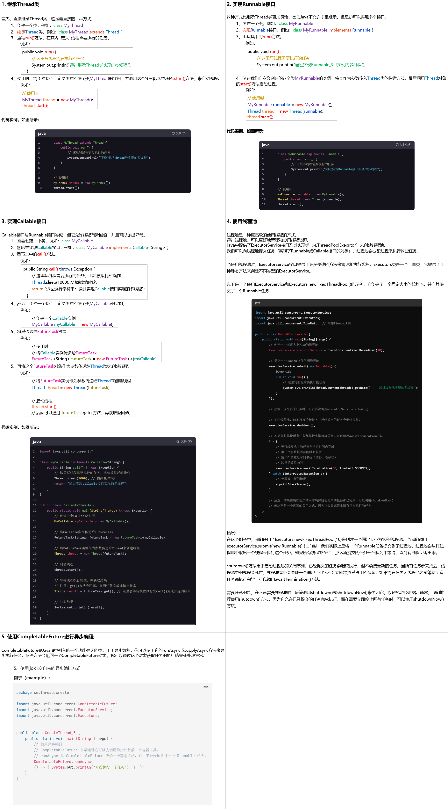

***

☝结合看👇

***

**老师版本：⬎**
1, 继承Thread,重写run方法,最后创建Thread 的子类对象,调用start()方法开启线程任务

**例子（example）：**

```java
package se.thread.create;


public class CreateThread_1 {
    public static void main(String[] args) {

        Thread thread = new Thread(new MyThread());
        thread.start();
    }
}


class MyThread extends Thread {
    @Override
    public void run() {
        System.out.println("do some  thing");
    }
}

```

2, 实现Runnable接口,重写run方法,创建Runnable 的实现类对象,通过Thread 的构造传递,调用start() 方法开启线程任务

**例子（example）：**

```java
package se.thread.create;


public class CreateThread_2 {
    public static void main(String[] args) {

        Thread thread = new Thread(new MyRunnable());
        thread.start();
    }
}

class MyRunnable implements Runnable {
    @Override
    public void run() {
        System.out.println("do some thing");
    }
}
```

3, 实现Callable接口,重写call方法,创建Callable的实现类对象,将Callable 的实现类对象,传递到FutureTask的构造方法中,最后将FutureTask传递到Thread 的构造方法中,通过start()方法开启线程任务

**例子（example）：**

```java
package se.thread.create;

import java.util.concurrent.Callable;
import java.util.concurrent.FutureTask;


public class CreateThread_3 {
    public static void main(String[] args) {
        FutureTask<Integer> futureTask = new FutureTask<Integer>(new MyCallable());
        Thread thread = new Thread(futureTask);
    }
}

/**
 * Callable 和Runnable接口有什么区别
 * 1、Callable接口中也是一个函数式接口 里面拥有一个call方法
 * 2、Callable接口的call方法可以有返回值。
 * 3、Callable接口中的call方法可以抛异常（run()方法和call()方法都能抓异常）
 */
class MyCallable implements Callable<Integer> {
    // 抛异常
    @Override
    public Integer call() throws Exception {
        // 抓异常
        try {
            System.out.println("do some thing");
        } catch (Exception e) {
            e.printStackTrace();
        }
        return 100;
    }
}

class MyRunnable implements Runnable {

    @Override
    public void run() {
        // 抓异常
        try {
            int i = 1 / 0;
        } catch (Exception e) {
            System.out.println("do some thing");
            e.printStackTrace();
        }
    }
}
```

4、使用线程池创建

**例子（example）：**

```java
package se.thread.create;

import java.util.concurrent.*;


public class CreateThread_4 {
    public static void main(String[] args) {

        // 比如使用线程池工具类
        ExecutorService executorService = Executors.newFixedThreadPool(1);
        executorService.submit(() -> {
            System.out.println("do some thing");
        });


        // 比如自定义线程池
        ThreadPoolExecutor threadPoolExecutor = new ThreadPoolExecutor(10,20,30,TimeUnit.MINUTES,new LinkedBlockingQueue<>());

        threadPoolExecutor.execute(new Runnable() {
            @Override
            public void run() {
                System.out.println("do some thing");
            }
        });
    }
}


```

5、使用jdk1.8自带的异步编排方式

**例子（example）：**

```java
package se.thread.create;

import java.util.concurrent.CompletableFuture;
import java.util.concurrent.ExecutorService;
import java.util.concurrent.Executors;


public class CreateThread_5 {
    public static void main(String[] args) {
        // 使用异步编排
        // CompletableFuture 表示通过它可以去调用异步计算的一个容器工具。
        // runAsync 是 CompletableFuture 类的一个静态方法，它用于异步地执行一个 Runnable 任务。
        CompletableFuture.runAsync(
        () -> { System.out.println("开始执行一个任务"); }  );
    }
}


```

**把控细节**：其实不管是哪种方式创建，底层都是通过实现Runnable接口方式创建线程。

# 19、多线程的生命周期

🌞bw：**↴**

***

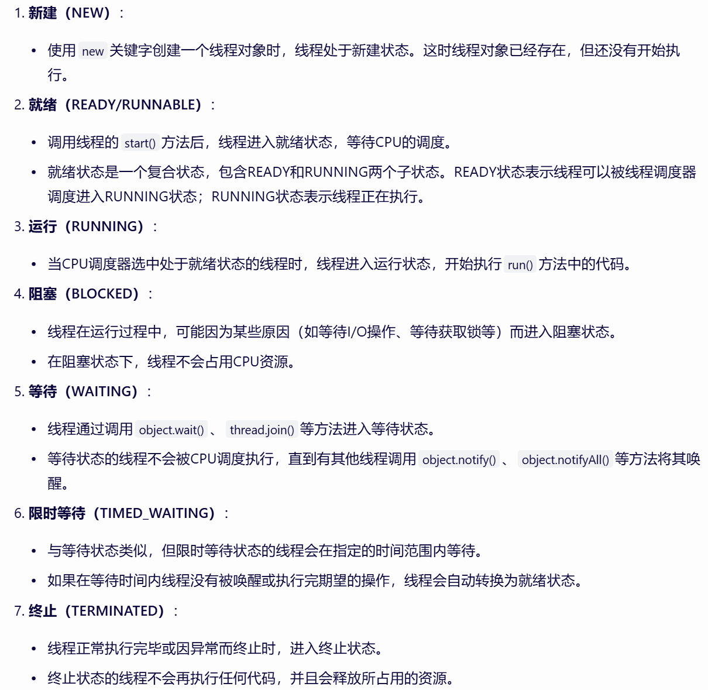

***

源码中一共定义了6钟状态。

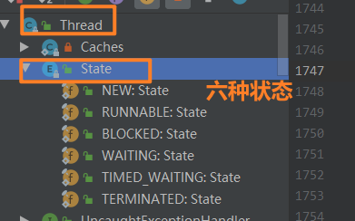

（1）新建（*NEW*）：线程对象刚给创建，但未启动（start）

**例子（example）：**

```java
package se.thread.life;


public class Thread_New {
    public static void main(String[] args) {

        Thread thread = new Thread();// 只要线程new出来
        System.out.println("线程的名字"+thread.getName()+"线程的状态:"+thread.getState());

    }
}

```

（2）可运行（*RUNNABLE*）：线程已被启动，可以被调度或正在被调度。

**例子（example）：**

```java
package se.thread.life;


public class Thread_Runnable {
    public static void main(String[] args) {

        Thread thread = new Thread(()->{
            System.out.println("1111");
            System.out.println("线程的状态"+Thread.currentThread().getState());
        });
        thread.start();
        System.out.println("线程的状态"+thread.getState());
    }
}

```

（3）锁阻塞（*BLOCKED*）：当前线程要获取的锁对象正在被其他线程占用，此时该线程处于Blocked状态。

**例子（example）：**

```java
package se.thread.life;


public class Thread_Blocked {
    public static void main(String[] args) {

        Object o = new Object();
        Thread threadA = new Thread(()->{
            synchronized (o){
                System.out.println("11111");
                try {
                    Thread.sleep(1000);
                } catch (InterruptedException e) {
                    e.printStackTrace();
                }
            }
        },"A");

        threadA.start();
        try {
            Thread.sleep(500);
        } catch (InterruptedException e) {
            e.printStackTrace();
        }
        Thread threadB = new Thread(()->{
          synchronized (o){

          }
        },"B");
        threadB.start();
        try {
            Thread.sleep(100);
        } catch (InterruptedException e) {
            e.printStackTrace();
        }
        System.out.println("线程"+threadB.getName()+"状态"+threadB.getState());

    }
}

```

（4）等待阻塞（*WAITING*）：当前线程遇到了wait()，join()等方法。

**例子（example）：**

```java
package se.thread.life;


public class Thread_Waiting {

    // 使用wait、notify或者notifyAll的时候必须要要结合synchronized使用
    public static void main(String[] args) throws InterruptedException {
        Object o = new Object();
        Thread thread = new Thread(() -> {
            synchronized (o) {
                try {
                    for (int i = 1; i <10 ; i++) {
                        System.out.println("i---"+i);
                        if(i==5){
                            o.wait();// 使用对象的wait方法时 必要要有一个对象和synchronized
                            // 如若不结合synchronized  那么就会出现一个监视器对象状态异常IllegalMonitorStateException。
                            // 任何一个对象中都有一个ObjectMonitor对象。监视器锁。管程技术。
                        }
                    }

                } catch (InterruptedException e) {
                    e.printStackTrace();
                }
            }

        });
        thread.start();
        Thread.sleep(2000);
        System.out.println(thread.getState());


        Thread thread1 = new Thread(()->{
          //  o.notify();//使用notify或者notifyAll()都要结合synchronized使用，不然就会出现监视器异常IllegalMonitorStateException
           synchronized (o){
               System.out.println("do some thing");
            o.notify();
           }
        });
        thread1.start();

        System.out.println("end");
    }
}

```

（5）限时等待（*TIMED\_WAITING*）：当前线程调用了sleep(时间)，wait(时间)，join(时间)等方法。

**例子（example）：**

```java
package se.thread.life;
public class Thread_TimeWaiting {

    public static void main(String[] args) throws InterruptedException {

        Object o = new Object();
        Thread thread = new Thread(()->{
          synchronized (o){
              try {
                  // 线程调用wait(5000)方法
                  o.wait(5000);
              } catch (InterruptedException e) {
                  e.printStackTrace();
              }
          }
        });
        thread.start();
        // 线程调用sleep(5000)方法
        Thread.sleep(5000);
        // 线程调用join(5000)方法
        thread.join(5000);
        System.out.println(thread.getState());
    }
}

```

（6）终止（*TERMINATED*）：线程正常结束或异常提前退出。

**例子（example）：**

```java
package se.thread.life;
public class Thread_Terminated {
    public static void main(String[] args) throws InterruptedException {
        Thread thread = new Thread(() -> {
            int i = 0;
            System.out.println("1111");
            try {
                i = 10 / 0;
            } catch (Exception e) {
                e.printStackTrace();
            }
            System.out.println(i);
        });
        thread.start();
        Thread.sleep(100);
        System.out.println(thread.getState());
    }
}

```

# 20、TreeSet和HashSet的区别

🌞bw：**↴**

***

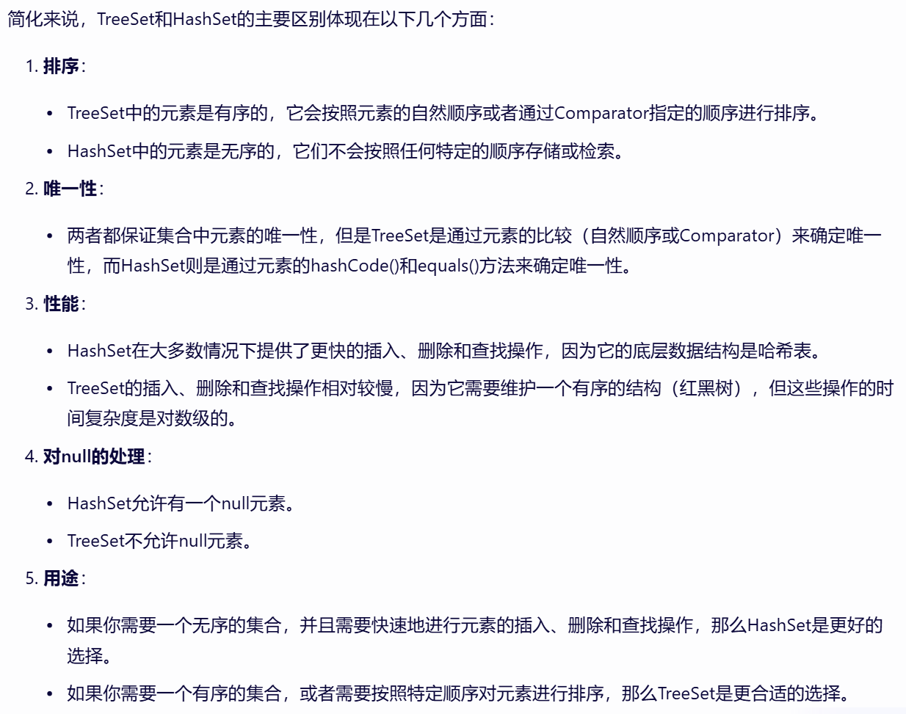

***

**原本解释说：**

**1、速度和内部实现**：

HashSet 内部使用哈希表来存储元素，因此它的查找、插入和删除操作的[时间复杂度](https://www.zhihu.com/search?q=时间复杂度\&search_source=Entity\&hybrid_search_source=Entity\&hybrid_search_extra={"sourceType":"answer","sourceId":3049364903} "时间复杂度")都是 O(1)。而 TreeSet 内部使用的是红黑树，因此它的时间复杂度为 O(log n)。

**2、排序方式：**

HashSet 不保证元素的顺序，因为它是根据哈希值来存储和检索元素的。而 TreeSet 则可以保证元素的顺序，因为它是根据元素的自然顺序或者比较器来进行排序的

**3、接口：**

HashSet 实现了 Set 接口，而 TreeSet 实现了 SortedSet 接口。

**4 使用场景**：

如果需要快速地插入、删除和查找元素，并且不关心它们的顺序，那么可以使用 HashSet。如果需要对元素进行比较、排序，那么可以使用 TreeSet。

# 21、所学习的io流一共分为几类

IO流根据流向 有输入流和输出流两种

IO流根据类型分类有 字节输入输出流 和 字符输入输出流 &#x20;

字节输入流  InputStream

字节输出流 OutputStream

字符输入流 Reader

字符输出流 Writer

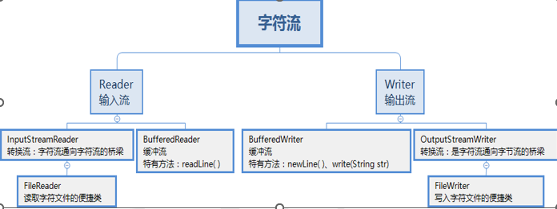

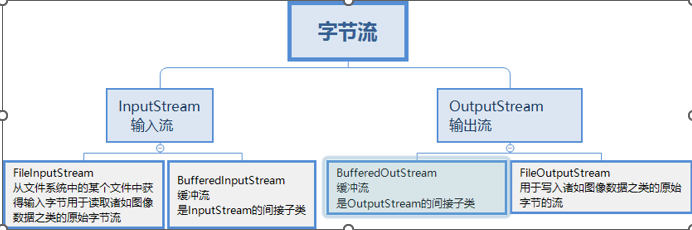

**把控细节：**

字节流是万能流,可以处理任意的文件。

字符流不是万能流,基本上用来处理纯文本文件。

# 22、map的三种遍历方式

🌞bw：**↴**

***

**map的概念：**

在Java中，Map是一个非常重要的数据结构，它用于存储键值对（key-value pairs）的映射关系。具体来说，Map中的每个键都映射到一个值，而且键是唯一的，不能重复。

***

**原版解释说：**

**map的遍历方式：**

方式一：增强for循环迭代

方式二：EntrySet迭代

方式三：KeySet迭代

**例子（example）：**

```java
package se.collect.map;
import java.util.HashMap;
import java.util.Iterator;
import java.util.Map;
import java.util.Set;

/**
 * @Author huzhongkui
 * @Date 2023--09--19:09:03
 * 聪明出于勤奋,天才在于积累
 **/
public class MapForDemo {
    public static void main(String[] args) {
        HashMap<String, String> map = new HashMap<>();
        map.put("name", "zs");
        map.put("age", "18");
        map.put("sex", "男");
        map.put("address", "武汉市");

        // 方式一：增强for
        //for (Map.Entry<String, String> entry : map.entrySet()) {
            //System.out.println("map的key:"+entry.getKey()+",map的value:"+entry.getValue());
        //}
        // 方式二：EntrySet迭代
        //Set<Map.Entry<String, String>> entries = map.entrySet();
        //Iterator<Map.Entry<String, String>> iterator = entries.iterator();
        //while (iterator.hasNext()) {
        //    Map.Entry<String, String> next = iterator.next();
        //    System.out.println("map的key:" + next.getKey() + ",map的value:" + next.getValue());
        //}

        //方式三：keySet迭代
        Iterator<String> keySetIterator = map.keySet().iterator();
        while (keySetIterator.hasNext()) {
            String key = keySetIterator.next();
            String value = map.get(key);
            System.out.println("map的key:"+key+",map的value:"+value);
        }
    }
}

```

# 23、HashMap与HashTable 的区别

**（1**）线程安全性不同

HashMap是线程不安全的，HashTable是线程安全的，其中HashTable的方法大多数都是Synchronize的，在多线程并发的情况下，可以直接使用HashTable，但是使用HashMap时必须自己增加同步处理。

**HashMap:**

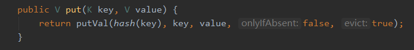

**HashTable:**

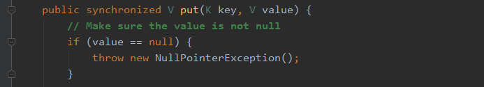

**（2**）是否提供**contains**方法

HashMap只有containsValue和containsKey方法；HashTable有contains、containsKey和containsValue三个方法，其中contains和containsValue方法功能相同。

**HashMap:**

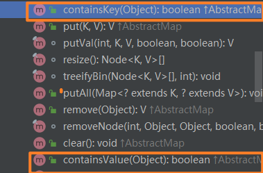

**HashTable:**

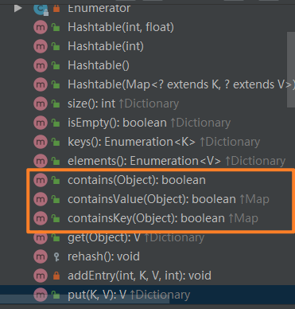

**（3**）**key**和**value**是否允许**null**值

Hashtable中，key和value都不允许出现null值。HashMap中，null可以作为键，这样的键只有一个；可以有一个或多个键所对应的值为null。

**HashMap:**

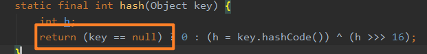

**HashTable:**

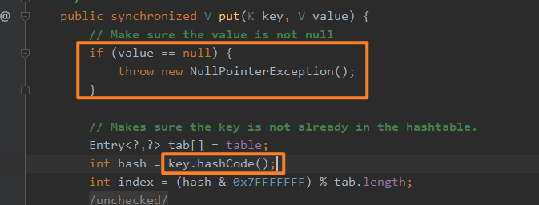

**（4**）数组初始化和扩容机制

**初始化**：HashTable在不指定容量的情况下的默认容量为11；而HashMap在不指定容量的时候，并不会提前构建指定长度大小的数组。而是当第一次put元素的时候才会去创建一个容量大小为16的数组，这点一定要注意！！！

**HashTable:**

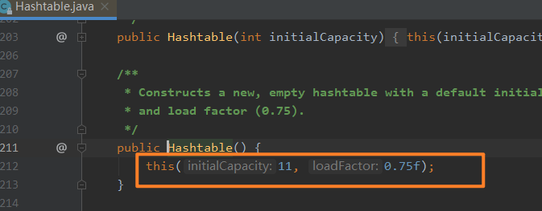

**HashMap:**

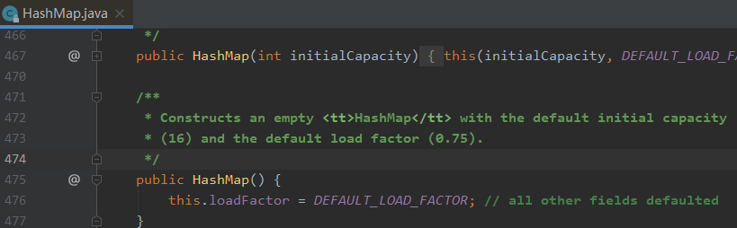

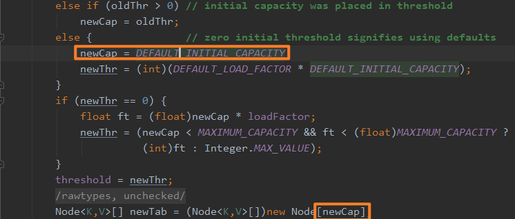

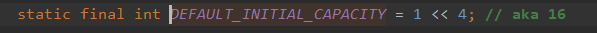

**扩容**：Hashtable扩容时，将容量变为原来的2倍加1，而HashMap扩容时，将容量变为原来的2倍。

**HashMap:**

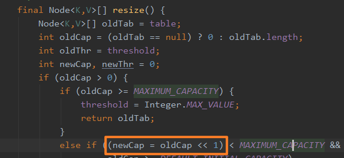

**HashTable:**

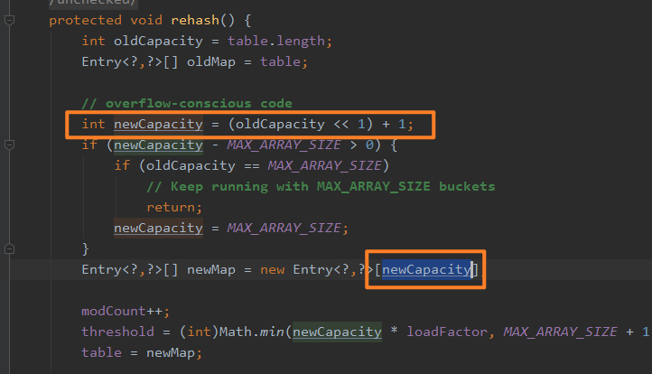

# 24、ArrayList和LinkedList的区别

🌞bw：**↴**

***

首先：

**ArrayList**是一个**基于动态数**组实现的数据集合列表，它能够在运行时根据需要改变数组的大小，并且提供了操作元素的快捷方法。当我们需要随机，也就是**通过索引**来快速访问数据的时候，适合使用ArrayList。

而**LinkedList**是一个**双向链表结构**的数据集合，它的**每个节点**包含了**数据** 和 对前一个节点与后一个节点的**引用**。当我们需要**频繁的插入或删除**元素时，LinkedList是一个更好的选择。

***

**原版解释说：
ArrayList**：基于动态数组，连续内存存储，适合下标访问（随机访问），扩容机制：因为数组长度固定，超出长度存数据时需要新建数组，然后将老数组的数据拷贝到新数组，如果不是尾部插入数据还会涉及到元素的移动（往后复制一份，插入新元素），使用尾插法并指定初始容量可以极大提升性能、甚至超过linkedList（需要创建大量的node对象）。

**LinkedList**：基于链表，可以存储在分散的内存中，适合做数据插入及删除操作，不适合查询：需要逐一遍历。遍历LinkedList必须使用iterator不能使用for循环，因为每次for循环体内通get(i)取得某一元素时都需要对list重新进行遍历，性能消耗极大。另外不要试图使用indexOf等返回元素索引，并利用其进行遍历，使用indexlOf对list进行了遍历，当结果为空时会遍历整个列表。

# 25、什么是反射

🌞bw：**↴**

***

反射是java语言 具有的独特的一种机制，

它允许我们在类的外部通过各种方法来获取和操作“类”本身的内部信息。

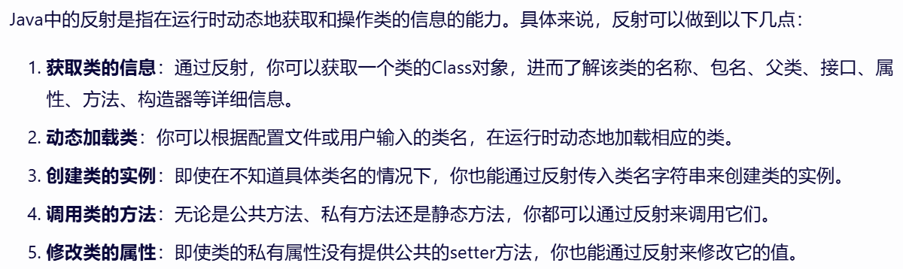

***

**原版解释说：**

**什么是Java反射机制：**

反射就是在程序运行时期，动态的获取类信息并操作该类成员（构造方法，成员变量，成员方法）的过程，这种动态获取类的信息以及动态调用对象的方法的功能来自于Java 语言的反射。

Java的反射机制的实现要借助于4个类Class，Constructor，Field，Method;

其中Class代表的时类对象，Constructor－类的构造器对象，Field－类的属性对象，Method－类的方法对象。通过这四个对象我们可以粗略的看到一个类的各个组成部分。

**Java** **反射机制提供功能**

在运行时判断任意一个对象所属的类。

在运行时构造任意一个类的对象。

在运行时判断任意一个类所具有的成员变量和方法。

在运行时调用任意一个对象的方法。

**例子（example）：**

```java
package se.reflective;

import java.lang.reflect.Constructor;
import java.lang.reflect.Field;
import java.lang.reflect.Method;

/**
 * @Author huzhongkui
 * @Date 2023--09--19:10:30
 * 聪明出于勤奋,天才在于积累
 **/
public class ReflectiveDemo {

    public static void main(String[] args) {

        try {
            //1.获取任意一个对象所属的类
            Student student = new Student();
            Class<? extends Student> aClass1 = student.getClass();
            System.out.println(aClass1);
            //2.构造任意一个类对象
            Student student1 = aClass1.newInstance();
            System.out.println(student1);
            //3.获取任意一个类中的构造方法
            Class<?> aClass = Class.forName("se.reflective.Student");
            for (Constructor<?> declaredConstructor : aClass.getDeclaredConstructors()) {
                Object instance = declaredConstructor.newInstance();
                System.out.println(instance);
            }
            //4. 获取任意一个类中的方法
            for (Method declaredMethod : aClass.getDeclaredMethods()) {
                System.out.println("Student类中的方法:" + declaredMethod.getName());
            }
            //5. 获取任意一个类中的成员变量
            for (Field declaredField : aClass.getDeclaredFields()) {
                System.out.println("Student类中的成员变量" + declaredField.getName());
            }
            //6.调用任意一个对象的方法
            System.out.println(student1.getAge());
        } catch (Exception e) {
            e.printStackTrace();
        }

    }
}


```

# 26、深拷贝和浅拷贝

🌞bw：**↴**

***

深拷贝和浅拷贝就是指对于对象的拷贝，一个对象中存在两种属性的类型，一种是基本数据类型，另外一种是引用数据类型。

- 对于 · **基本数据类型**：浅拷贝和深拷贝无区别，都是直接复制值。
- 对于 · **引用数据类型**：

  浅拷贝：只是复制引用地址，新旧对象会 → 共享、共用同一个实例。

  深拷贝：则是复制实例及其内容数据，会完全复制出来一个新的对象来用，新旧对象完全独立。

***

**以下为拓展了解的内容：**

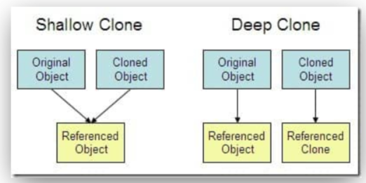

**浅拷贝例子：**

```java
package se.copy;

import lombok.Data;

/**
 * @Author huzhongkui
 * @Date 2023--08--31:13:59
 * 聪明出于勤奋,天才在于积累
 **/

class Person implements Cloneable {
    private String name;
    private Phone phone;
    
    public String getName() {
        return name;
    }
    public void setName(String name) {
        this.name = name;
    }
    public Phone getPhone() {
        return phone;
    }
    public void setPhone(Phone phone) {
        this.phone = phone;
    }
   
    @Override
    protected Object clone() throws CloneNotSupportedException {
        return super.clone();
    }
}

class Phone implements Cloneable {
    private String name;

    public String getName() {
        return name;
    }
    public void setName(String name) {
        this.name = name;
    }
    @Override
    protected Object clone() throws CloneNotSupportedException {
        return super.clone();
    }
}
public class ShallowCopy {
    // 浅拷贝
    public static void main(String[] args) throws CloneNotSupportedException {
        Phone phone = new Phone();
        phone.setName("小米");

        // 创建一个Person对象（原对象）
        Person person = new Person();
        person.setName("hzk");
        // 设置引用类型属性
        person.setPhone(phone);
        // 打印原对象的属性值
        System.out.println(person);
        System.out.println(person.getName());
        System.out.println(person.getPhone());
        System.out.println(person.getPhone().getName());

        System.out.println("-----------------");
        // 克隆一个Person对象(克隆对象)
        Person copyPerson = (Person) person.clone();
        // 打印克隆对象的属性值
        System.out.println(copyPerson);
        System.out.println(copyPerson.getName());
        System.out.println(copyPerson.getPhone());
        System.out.println(copyPerson.getPhone().getName());


        // 浅拷贝由于会拷贝引用数据类型的地址，因此修改拷贝对象的值，其被拷贝对象的值也会跟着变化。反之，同理。
        copyPerson.getPhone().setName("华为");

        System.out.println("原对象的引用类型Phone值" + person.getPhone().getName());
        System.out.println("克隆对象的引用类型Phone值" + copyPerson.getPhone().getName());

    }

}

```

**运行结果：**

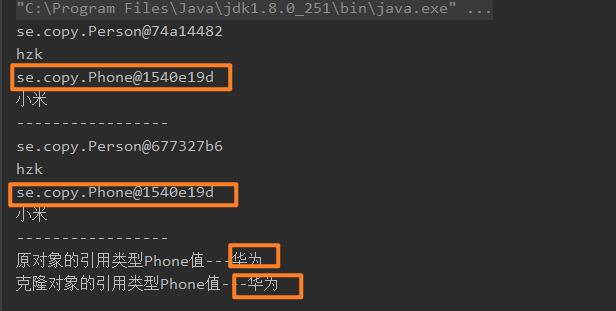

**深拷贝例子：**

```java
package se.copy;

/**
 * @Author huzhongkui
 * @Date 2023--08--31:13:59
 * 聪明出于勤奋,天才在于积累
 **/
class Person1 implements Cloneable {
    private String name;

    public String getName() {
        return name;
    }

    public void setName(String name) {
        this.name = name;
    }

    public Phone1 getPhone() {
        return phone;
    }

    public void setPhone(Phone1 phone) {
        this.phone = phone;
    }

    private Phone1 phone;

    @Override
    protected Object clone() throws CloneNotSupportedException {
//        return super.clone();
        //继续利用clone()方法，对该对象的引用类型变量再实现一次clone()方法。
        // 要想深克隆 要不就是序列化和反序列化 要不就是继续clone
        Person1 person = (Person1) super.clone();
        person.setPhone((Phone1) person.getPhone().clone());
        return person;
    }
}


class Phone1 implements Cloneable {
    private String name;

    public String getName() {
        return name;
    }

    public void setName(String name) {
        this.name = name;
    }

    @Override
    protected Object clone() throws CloneNotSupportedException {
        return super.clone();
    }
}

public class DeepCopy {

    // 深拷贝
    public static void main(String[] args) throws CloneNotSupportedException {
        Phone1 phone1 = new Phone1();
        phone1.setName("小米");

        Person1 person1 = new Person1();
        person1.setName("hzk");
        person1.setPhone(phone1);

        System.out.println(person1);
        System.out.println(person1.getName());
        System.out.println(person1.getPhone());
        System.out.println(person1.getPhone().getName());

        System.out.println("-----------------");
        Person1 copyPerson1 = (Person1) person1.clone();
        System.out.println(copyPerson1);
        System.out.println(copyPerson1.getName());
        System.out.println(copyPerson1.getPhone());
        System.out.println(copyPerson1.getPhone().getName());


        System.out.println("-----------------");
        // 深拷贝不会拷贝引用数据类型的地址（而是会创建一个新对象空间），因此修改拷贝对象的值，其被拷贝对象的值不会跟着变化。反之，同理。
        copyPerson1.getPhone().setName("华为");

        System.out.println("原对象的引用类型Phone值---" + person1.getPhone().getName());
        System.out.println("克隆对象的引用类型Phone值---" + copyPerson1.getPhone().getName());
    }
}

```

**运行结果**

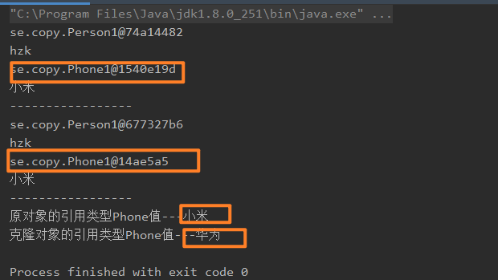

在我们对其

Integer, Double

⬎
