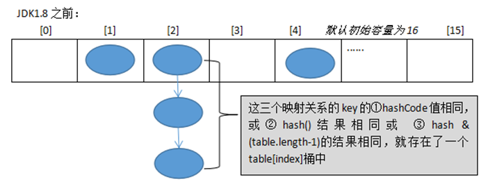
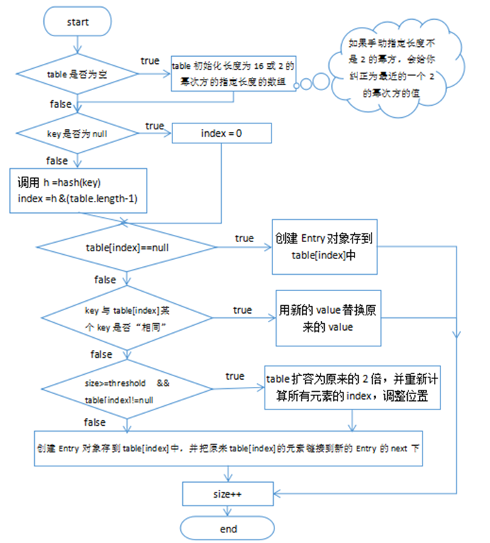
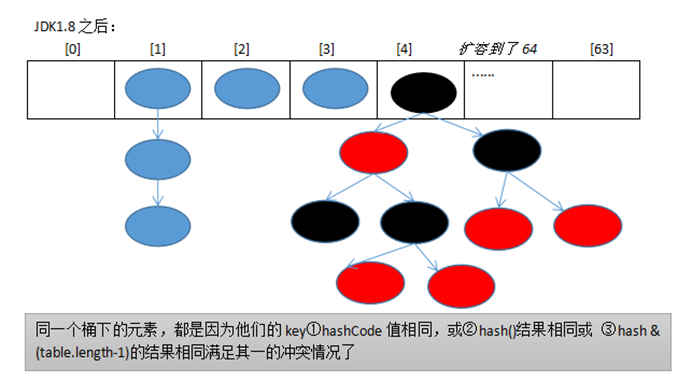
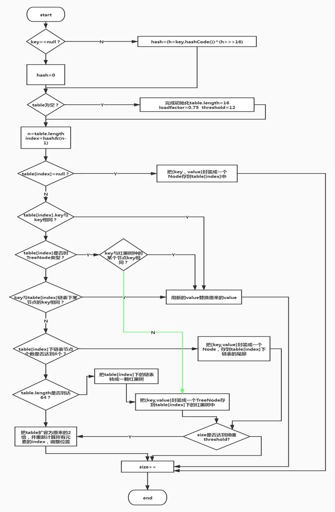

# 集合类

## 目录

- [1、Java集合框架是什么?说出集合框架的一些优点？](#1Java集合框架是什么说出集合框架的一些优点)
- [2、集合接口的常见实现类](#2集合接口的常见实现类)
- [3、List和Map区别?](#3List和Map区别)
- [4、List、Map、Set三个接口，存取元素时，各有什么特点?](#4ListMapSet三个接口存取元素时各有什么特点)
- [5、为什么Map接口不继承Collection接口?](#5为什么Map接口不继承Collection接口)
- [6、Iterator和ListIterator之间有什么区别?](#6Iterator和ListIterator之间有什么区别)
- [7、集合框架中的泛型有什么优点?](#7集合框架中的泛型有什么优点)
- [8、Map接口提供了哪些不同的集合视图?](#8Map接口提供了哪些不同的集合视图)
- [9、jdk1.7HashMap](#9jdk17HashMap)
- [10、jdk1.8HashMap](#10jdk18HashMap)
- [11、JDK8中的HashMap为什么要使用红黑树？](#11JDK8中的HashMap为什么要使用红黑树)
- [12、JDK8中的HashMap什么时候将链表转化为红黑树？](#12JDK8中的HashMap什么时候将链表转化为红黑树)
- [13、JDK7与JDK8中HashMap的不同点？](#13JDK7与JDK8中HashMap的不同点)
- [14、jdk1.7ConcurrentHashMap](#14jdk17ConcurrentHashMap)
- [15、jdk1.8ConcurrentHashMap](#15jdk18ConcurrentHashMap)
- [16、jdk1.7ConcurrentHashMap如何保证并发](#16jdk17ConcurrentHashMap如何保证并发)
- [17、jdk1.8ConcurrentHashMap如何保证并发](#17jdk18ConcurrentHashMap如何保证并发)
  - [1、Java集合框架是什么?说出集合框架的一些优点?](#1Java集合框架是什么说出集合框架的一些优点)
  - [2、集合接口的常见实现类](#2集合接口的常见实现类)
  - [3、List和Map区别?](#3List和Map区别)
  - [4、List、Map、Set三个接口，存取元素时，各有什么特点?](#4ListMapSet三个接口存取元素时各有什么特点)
  - [5、为什么Map接口不继承Collection接口?](#5为什么Map接口不继承Collection接口)
  - [6、Iterator和ListIterator之间有什么区别?](#6Iterator和ListIterator之间有什么区别)
  - [7、集合框架中的泛型有什么优点?](#7集合框架中的泛型有什么优点)
  - [8、Map接口提供了哪些不同的集合视图?](#8Map接口提供了哪些不同的集合视图)

## 1、Java集合框架是什么?说出集合框架的一些优点？

答：每种编程语言中都有集合，最初的Java版本包含几种集合类：Vector、Stack、HashTable和Arrays。随着集合的广泛使用，Java1.2提出了囊括所有集合接口和实现类、算法的集合框架。

在保证线程安全的情况下使用泛型和并发集合类，Java已经经历了很久。

集合框架的部分优点如下：

(1)使用核心集合类降低开发成本，而非实现我们自己的集合类。

(2)使用经过严格测试的集合框架类，代码质量会得到提高。

(3)通过使用JDK附带的集合类，可以降低代码维护成本。

(4)复用性和可操作性。


## 2、集合接口的常见实现类

1、**List接口的实现类**

List接口的实现类最常用的有ArrayList和LinkedList、Vector

ArrayList类实现了可变的数组，可以根据索引位置对集合进行快速的随机访问。

LinkedList类采用链表结构保存对象，便于向集合中插入和删除对象，但是如果将元素插入到集合的尾部，其实ArrayList原比LinkedList快。

Vector:也是List的一个常见实现类，但是在该类中的大多数方法都加了synchronized关键字，因此相比ArrayList、LinkedList集合在多线程访问时是线程安全的。

2 **、Set接口的实现类**

Set接口的实现类常用的有HashSet和TreeSet、LinkedHashSet。它们的元素都不可重复。

HashSet：底层是哈希表，遍历元素和添加顺序、大小顺序无关。

TreeSet：底层是红黑树，元素按照大小顺序存储和遍历。

LinkedHashSet：底层是哈希表+双链表，遍历元素可以体现添加时顺序。顺序性是体现和HashSet不同之处。

**3、Map接口的实现类**

Map接口的实现类常用的有HashMap、LinkedHashMap和TreeMap。它们的key都不可重复。这里面的key不可重复 **，指的是容器中对于同一个Key只会存在一个。**

HashMap：哈希表，底层是数组+链表+红黑树。遍历元素和添加顺序、大小顺序无关。

LinkedHashMap：哈希表+双链表，遍历元素可以体现添加顺序。

TreeMap：红黑树，元素按照key大小顺序存储和遍历。

**例子（example）：**

```java
package se.collect.map;
import java.util.*;
import java.util.concurrent.ConcurrentHashMap;

/**
 * @Author huzhongkui
 * @Date 2023--09--19:14:22
 * 聪明出于勤奋,天才在于积累
 **/
public class MapDemo1 {

    public static void main(String[] args) {
        System.out.println("input          1 : 1     3 : 3     2 : 2     4 : 4     5 : 5");
        //HashMap
        Map<String, String> hashMap = new HashMap<String, String>();
        hashMap.put("1", "1");
        hashMap.put("3", "3");
        hashMap.put("2", "2");
        hashMap.put("4", "4");
        hashMap.put("5", "5");
        System.out.print("HashMap        ");
        for (String key : hashMap.keySet()) {
            System.out.print(key + " : " + hashMap.get(key) + "     ");
        }
        System.out.println();
        
        //LinkedHashMap
        Map<String, String> linkedHashMap = new LinkedHashMap<String, String>();
        linkedHashMap.put("1", "1");
        linkedHashMap.put("3", "3");
        linkedHashMap.put("2", "2");
        linkedHashMap.put("4", "4");
        linkedHashMap.put("5", "5");
        System.out.print("LinkedHashMap  ");
        for (String key : linkedHashMap.keySet()) {
            System.out.print(key + " : " + linkedHashMap.get(key) + "     ");
        }
        System.out.println();


        //TreeMap
        Map<String, String> treeMap = new TreeMap<String, String>();
        treeMap.put("1", "1");
        treeMap.put("3", "3");
        treeMap.put("2", "2");
        treeMap.put("4", "4");
        treeMap.put("5", "5");
        System.out.print("TreeMap        ");
        for (String key : treeMap.keySet()) {
            System.out.print(key + " : " + treeMap.get(key) + "     ");
        }
        System.out.println();

    }
}

```

## 3、List和Map区别?

答：在数据结构方面，List存储的是单列数据的集合，而Map存储的是key、value类型的数据集合。在数据存储方面，List存储的数据是有序且可以重复的，而Map中存储的数据是无序（不同的子类也可以保证有序）且key值不会重复(value值可以重复)。

## 4、List、Map、Set三个接口，存取元素时，各有什么特点?

List与Set具有相似性，它们都是单列元素的集合，所以，它们有一个共同的父接口，叫Collection。

Set是无序且不可重复的。Set取元素时，不能通过索引访问元素，只能通过for循环或者迭代器逐一遍历各个元素。

List表示有先后顺序的集合， 注意，不是那种按年龄、按大小、按价格之类的排序。当我们多次调用add(Object e)方法时，每次加入的对象就像火车站买票有排队顺序一样，按先来后到的顺序排序。有时候，也可以插队，即调用add(int index,Object e)方法，就可以指定当前对象在集合中的存放位置。一个对象可以被反复存储进List中，每调用一次add方法，这个对象就被插入进集合中一次，其实，并不是把这个对象本身存储进了集合中，而是在集合中用一个索引变量指向这个对象，当这个对象被add多次时，即相当于集合中有多个索引指向了这个对象。List除了通过迭代器逐一遍历各个元素，还可以调用get(index i)来明确说明取第几个。

Map与List和Set不同，它是双列的集合，用put方法存储一对key/value，不能存储重复的key。取则可以根据key获得相应的value，即get(Object key)返回值为key 所对应的value。另外，也可以获得所有的key的集合(map.keySet())，还可以获得所有的value的结合(map.values())，还可以获得key和value组合成的Map.Entry对象的集合(map.entrySet())。

## 5、为什么Map接口不继承Collection接口?

首先Map提供的是键值对映射（即Key和value的映射），而collection提供的是一组数据（并不是键值对映射）。

其次如果map继承了collection接口，那么所有实现了map接口的类到底是用map的键值对映射数据还是用collection的一组数据呢（就我们平常所用的hashMap、hashTable、treeMap等都是键值对，所以它继承collection完全没意义），而且map如果继承了collection接口的话还违反了面向对象的**接口分离原则**。

## 6、Iterator和ListIterator之间有什么区别?

(1)我们可以使用Iterator来遍历Set和List集合，而ListIterator只能遍历List;

(2)Iterator只可以向前遍历，而LIstIterator可以双向遍历;

(3)ListIterator从Iterator接口继承，然后添加了一些额外的功能，比如添加一个元素、替换一个元素、获取前面或后面元素的索引位置。

```java
package se.collect.list;

import java.util.ArrayList;
import java.util.ListIterator;

/**
 * @Author huzhongkui
 * @Date 2023--09--19:15:04
 * 聪明出于勤奋,天才在于积累
 **/
public class ListIteratorDemo {

    public static void main(String[] args) {

        ArrayList<String> list = new ArrayList<>();
        list.add("1");
        list.add("3");
        list.add("2");
        list.add("4");
        list.add("5");
        System.out.println("正向遍历结果:");
        // 正向遍历
        ListIterator<String> listIterator = list.listIterator();
        while (listIterator.hasNext()) {
            System.out.println(listIterator.next());

        }
        System.out.println("反向遍历结果:");
        // 反向遍历
        while (listIterator.hasPrevious()) {
            System.out.println(listIterator.previous());
        }

        System.out.println("插入元素：");
        //插入元素
        ListIterator<String> listIterator1 = list.listIterator();
        listIterator1.add("7");
        while (listIterator1.hasPrevious()) {
            System.out.println(listIterator1.previous());

        }
        System.out.println(list);
        System.out.println();

        ListIterator<String> listIterator2 = list.listIterator();

        System.out.println("替换元素:");
        // 替换元素
        while (listIterator2.hasNext()) {
            String next = listIterator2.next();
            if ("5".equals(next)) {
                listIterator2.set("155");
            }
        }
        System.out.println(list);
      
    
    }
}

```

## 7、集合框架中的泛型有什么优点?

**类型安全：**

通过知道使用泛型定义的变量的类型限制，编译器可以在非常高的层次上验证类型假设。没有泛型，这些假设就只能在程序员编码时候去考虑了。

**消除**[**强制类型转换**](https://so.csdn.net/so/search?q=强制类型转换\&spm=1001.2101.3001.7020 "强制类型转换")**：**

消除源代码中的许多强制类型转换。这使得代码更加可读，并且减少了出错机会。

**更高的效率：**

在非泛型编程中，将筒单类型作为引用类型传递时会引起（装箱）和（拆箱）操作，这两个过程都是具有很大开销的。引入泛型后，就不必进行装箱和拆箱操作了，所以运行效率相对较高。

## 8、Map接口提供了哪些不同的集合视图?

Map接口提供三个集合视图：

(1)Set keyset()：返回map中包含的所有key的一个Set视图。此Set集合是受map支持的，map的变化会在集合中反映出来，反之亦然。当一个迭代器正在遍历一个此Set集合时，若map被修改了(除迭代器自身的移除操作以外)，迭代器的结果会变为不确定。此Set集合支持元素查找和删除，从此Set中删除元素会从map中移除对应的映射，它不支持add和addAll添加操作。

(2)Collection values()：返回一个map中包含的所有value的一个Collection视图。这个collection受map支持的，map的变化会在collection中反映出来，反之亦然。当一个迭代器正在遍历此collection时，若map被修改了(除迭代器自身的移除操作以外)，迭代器的结果会变为不确定。此Collection集合支持元素查找和删除，从此Collection中删除元素会从map中移除对应的映射，它不支持add和addAll添加操作。

(3)Set entrySet()：返回一个map中包含的所有映射的一个Set集合视图。这个Set集合受map支持的，map的变化会在collection中反映出来，反之亦然。当一个迭代器正在遍历此Set集合时，若map被修改了(除迭代器自身的移除操作，以及对迭代器返回的entry进行setValue外)，迭代器的结果会变为未定义。此Set集合支持元素查找和删除，从此Set中删除元素会从map中移除对应的映射，它不支持add和addAll添加操作。

# 9、jdk1.7HashMap



**数据结构：数组+链表**

**put方法的流程**



# **10、jdk1.8HashMap**

**数据结构：数组+链表+（红黑树）**



**put方法流程：**



**注意细节：**

HashMap基于哈希表的Map接口实现，是以key-value存储形式存在，即主要用来存放键值对。HashMap 的实现不是同步的，这意味着它不是线程安全的。它的key、value都可以为null。此外，HashMap中的映射不是有序的。

JDK1.8 之前 HashMap 由 数组+链表 组成的，数组是 HashMap 的主体，链表则是主要为了解决哈希冲突(两个对象调用的hashCode方法计算的哈希码值一致导致计算的数组索引值相同)而存在的（“拉链法”解决冲突）。JDK1.8 以后在解决哈希冲突时有了较大的变化，当链表长度大于阈值（或者红黑树的边界值，默认为 8）并且当前数组的长度大于64时，此时此索引位置上的所有数据改为使用红黑树存储。

补充：将链表转换成红黑树前会判断，即使阈值大于8，但是数组长度小于64，此时并不会将链表变为红黑树。而是选择进行数组扩容。

这样做的目的是因为数组比较小，尽量避开红黑树结构，这种情况下变为红黑树结构，反而会降低效率，因为红黑树需要进行左旋，右旋，变色这些操作来保持平衡 。同时数组长度小于64时，搜索时间相对要快些。所以综上所述为了提高性能和减少搜索时间，底层在阈值大于8并且数组长度大于64时，链表才转换为红黑树。具体可以参考 treeifyBin方法。

当然虽然增了红黑树作为底层数据结构，结构变得复杂了，但是阈值大于8并且数组长度大于64时，链表转换为红黑树时，效率也变的更高效。

# 11、JDK8中的HashMap为什么要使用红黑树？

当元素个数小于一个阈值时，链表整体的插入查询效率要高于红黑树，当元素个数大于此阈值时，链表整体的插入查询效率要低于红黑树。此阈值在HashMap中为8。

# 12、JDK8中的HashMap什么时候将链表转化为红黑树？

这个题很容易答错，大部分答案就是：当链表中的元素个数大于8时就会把链表转化为红黑树。但是其实还有另外一个限制：当发现链表中的元素个数大于8之后，还会判断一下当前数组的长度，如果数组长度小于64时，此时并不会转化为红黑树，而是进行扩容。只有**当链表中的元素个数大于8，并且数组的长度大于等于64**时才会将链表转为红黑树。

上面扩容的原因是，如果数组长度还比较小，就先利用扩容来缩小链表的长度。

# 13、JDK7与JDK8中HashMap的不同点？

1. JDK8中使用了红黑树
2. JDK7中链表的插入使用的**头插法**（扩容转移元素的时候也是使用的头插法，头插法速度更快，无需遍历链表，但是在多线程扩容的情况下使用头插法会出现循环链表的问题，导致CPU飙升），JDK8中链表使用的**尾插法**（JDK8中反正要去计算链表当前结点的个数，反正要遍历的链表的，所以直接使用尾插法）
3. JDK7的Hash算法比JDK8中的更复杂，Hash算法越复杂，生成的hashcode则更散列，那么hashmap中的元素则更散列，更散列则hashmap的查询性能更好，JDK7中没有红黑树，所以只能优化Hash算法使得元素更散列，而JDK8中增加了红黑树，查询性能得到了保障，所以可以简化一下Hash算法，毕竟Hash算法越复杂就越消耗CPU。
4. 扩容的过程中JDK7中有可能会重新对key进行哈希（重新Hash跟哈希种子有关系），而JDK8中没有这部分逻辑。
5. JDK8中扩容的条件和JDK7中不一样，除开判断size是否大于阈值之外，JDK7中还判断了table\[i]是否为空，不为空的时候才会进行扩容，而JDK8中则没有该条件了。
6. JDK8中还多了一个API：putIfAbsent(key,value)
7. JDK7和JDK8扩容过程中转移元素的逻辑不一样，JDK7是每次转移一个元素，JDK8是先算出来当前位置上哪些元素在新数组的低位上，哪些在新数组的高位上，然后在一次性转移。

# 14、jdk1.7ConcurrentHashMap

jdk1.7ConcurrentHashMap底层是由两层嵌套数组来实现的：

1. ConcurrentHashMap对象中有一个属性segments，类型为Segment\[];
2. Segment对象中有一个属性table，类型为HashEntry\[];

**put流程：**

1、当调用ConcurrentHashMap的put方法时，先根据key计算出对应的Segment\[]的数组下标j，确定好当前key,value应该插入到哪个Segment对象中，如果segments\[j]为空，则利用自旋锁的方式在j位置生成一个Segment对象。

2、然后调用Segment对象的put方法。

&#x20;  2.1 Segment对象的put方法会先加锁，然后也根据key计算出对应的HashEntry\[]的数组下标i，然后将key,value封装为HashEntry对象放入该位置，此过程和JDK7的HashMap的put方法一样，然后解锁。

&#x20;  2.2 在加锁的过程中逻辑比较复杂，先通过自旋加锁，如果超过一定次数就会直接阻塞等等加锁。

# 15、jdk1.8ConcurrentHashMap

**put流程：**

1、当向ConcurrentHashMap中put一个key,value时，首先根据key计算对应的数组下标i，如果该位置没有元素，则通过自旋的方法去向该位置赋值。如果该位置有元素，则synchronized会加锁

2、加锁成功之后，在判断该元素的类型。

2.1 如果是链表节点则进行添加节点到链表中

2.2 如果是红黑树则添加节点到红黑树

3、添加成功后，判断是否需要进行树化

4、addCount，这个方法的意思是ConcurrentHashMap的元素个数加1，但是这个操作也是需要并发安全的，并且元素个数加1成功后，会继续判断是否要进行扩容，如果需要，则会进行扩容，所以这个方法很重要。

5、同时一个线程在put时如果发现当前ConcurrentHashMap正在进行扩容则会去帮助扩容。

# 16、jdk1.7ConcurrentHashMap如何保证并发

主要利用Unsafe操作+ReentrantLock+分段思想。

主要使用了Unsafe操作中的：

1. compareAndSwapObject：通过cas的方式修改对象的属性
2. putOrderedObject：并发安全的给数组的某个位置赋值
3. getObjectVolatile：并发安全的获取数组某个位置的元素

分段思想是为了提高ConcurrentHashMap的并发量，分段数越高则支持的最大并发量越高，程序员可以通过concurrencyLevel参数来指定并发量。ConcurrentHashMap的内部类Segment就是用来表示某一个段的。

每个Segment就是一个小型的HashMap的，当调用ConcurrentHashMap的put方法是，最终会调用到Segment的put方法，而Segment类继承了ReentrantLock，所以Segment自带可重入锁，当调用到Segment的put方法时，会先利用可重入锁加锁，加锁成功后再将待插入的key,value插入到小型HashMap中，插入完成后解锁。

# 17、jdk1.8ConcurrentHashMap如何保证并发

主要利用Unsafe操作+synchronized关键字。

Unsafe操作的使用仍然和JDK7中的类似，主要负责并发安全的修改对象的属性或数组某个位置的值。

synchronized主要负责在需要操作某个位置时进行加锁（该位置不为空），比如向某个位置的链表进行插入结点，向某个位置的红黑树插入结点。

JDK8中其实仍然有分段锁的思想，只不过JDK7中段数是可以控制的，而JDK8中是数组的每一个位置都有一把锁。

## 1、Java集合框架是什么?说出集合框架的一些优点?

答：每种编程语言中都有集合，最初的Java版本包含几种集合类：Vector、Stack、HashTable和Arrays。随着集合的广泛使用，Java1.2提出了囊括所有集合接口和实现类、算法的集合框架。

在保证线程安全的情况下使用泛型和并发集合类，Java已经经历了很久。

集合框架的部分优点如下：

(1)使用核心集合类降低开发成本，而非实现我们自己的集合类。

(2)使用经过严格测试的集合框架类，代码质量会得到提高。

(3)通过使用JDK附带的集合类，可以降低代码维护成本。

(4)复用性和可操作性。


## 2、集合接口的常见实现类

1、**List接口的实现类**

List接口的实现类最常用的有ArrayList和LinkedList、Vector

ArrayList类实现了可变的数组，可以根据索引位置对集合进行快速的随机访问。

LinkedList类采用链表结构保存对象，便于向集合中插入和删除对象，但是如果将元素插入到集合的尾部，其实ArrayList原比LinkedList快。

Vector:也是List的一个常见实现类，但是在该类中的大多数方法都加了synchronized关键字，因此相比ArrayList、LinkedList集合在多线程访问时是线程安全的。

2 **、Set接口的实现类**

Set接口的实现类常用的有HashSet和TreeSet、LinkedHashSet。它们的元素都不可重复。

HashSet：底层是哈希表，遍历元素和添加顺序、大小顺序无关。

TreeSet：底层是红黑树，元素按照大小顺序存储和遍历。

LinkedHashSet：底层是哈希表+双链表，遍历元素可以体现添加时顺序。顺序性是体现和HashSet不同之处。

**3、Map接口的实现类**

Map接口的实现类常用的有HashMap、LinkedHashMap和TreeMap。它们的key都不可重复。这里面的key不可重复 **，指的是容器中对于同一个Key只会存在一个。**

HashMap：哈希表，底层是数组+链表+红黑树。遍历元素和添加顺序、大小顺序无关。

LinkedHashMap：哈希表+双链表，遍历元素可以体现添加顺序。

TreeMap：红黑树，元素按照key大小顺序存储和遍历。

**例子（example）：**

```java
package se.collect.map;
import java.util.*;
import java.util.concurrent.ConcurrentHashMap;

/**
 * @Author huzhongkui
 * @Date 2023--09--19:14:22
 * 聪明出于勤奋,天才在于积累
 **/
public class MapDemo1 {

    public static void main(String[] args) {
        System.out.println("input          1 : 1     3 : 3     2 : 2     4 : 4     5 : 5");
        //HashMap
        Map<String, String> hashMap = new HashMap<String, String>();
        hashMap.put("1", "1");
        hashMap.put("3", "3");
        hashMap.put("2", "2");
        hashMap.put("4", "4");
        hashMap.put("5", "5");
        System.out.print("HashMap        ");
        for (String key : hashMap.keySet()) {
            System.out.print(key + " : " + hashMap.get(key) + "     ");
        }
        System.out.println();
        
        //LinkedHashMap
        Map<String, String> linkedHashMap = new LinkedHashMap<String, String>();
        linkedHashMap.put("1", "1");
        linkedHashMap.put("3", "3");
        linkedHashMap.put("2", "2");
        linkedHashMap.put("4", "4");
        linkedHashMap.put("5", "5");
        System.out.print("LinkedHashMap  ");
        for (String key : linkedHashMap.keySet()) {
            System.out.print(key + " : " + linkedHashMap.get(key) + "     ");
        }
        System.out.println();


        //TreeMap
        Map<String, String> treeMap = new TreeMap<String, String>();
        treeMap.put("1", "1");
        treeMap.put("3", "3");
        treeMap.put("2", "2");
        treeMap.put("4", "4");
        treeMap.put("5", "5");
        System.out.print("TreeMap        ");
        for (String key : treeMap.keySet()) {
            System.out.print(key + " : " + treeMap.get(key) + "     ");
        }
        System.out.println();

    }
}

```

## 3、List和Map区别?

答：在数据结构方面，List存储的是单列数据的集合，而Map存储的是key、value类型的数据集合。在数据存储方面，List存储的数据是有序且可以重复的，而Map中存储的数据是无序（不同的子类也可以保证有序）且key值不会重复(value值可以重复)。

## 4、List、Map、Set三个接口，存取元素时，各有什么特点?

List与Set具有相似性，它们都是单列元素的集合，所以，它们有一个共同的父接口，叫Collection。

Set是无序且不可重复的。Set取元素时，不能通过索引访问元素，只能通过for循环或者迭代器逐一遍历各个元素。

List表示有先后顺序的集合， 注意，不是那种按年龄、按大小、按价格之类的排序。当我们多次调用add(Object e)方法时，每次加入的对象就像火车站买票有排队顺序一样，按先来后到的顺序排序。有时候，也可以插队，即调用add(int index,Object e)方法，就可以指定当前对象在集合中的存放位置。一个对象可以被反复存储进List中，每调用一次add方法，这个对象就被插入进集合中一次，其实，并不是把这个对象本身存储进了集合中，而是在集合中用一个索引变量指向这个对象，当这个对象被add多次时，即相当于集合中有多个索引指向了这个对象。List除了通过迭代器逐一遍历各个元素，还可以调用get(index i)来明确说明取第几个。

Map与List和Set不同，它是双列的集合，用put方法存储一对key/value，不能存储重复的key。取则可以根据key获得相应的value，即get(Object key)返回值为key 所对应的value。另外，也可以获得所有的key的集合(map.keySet())，还可以获得所有的value的结合(map.values())，还可以获得key和value组合成的Map.Entry对象的集合(map.entrySet())。

## 5、为什么Map接口不继承Collection接口?

首先Map提供的是键值对映射（即Key和value的映射），而collection提供的是一组数据（并不是键值对映射）。

其次如果map继承了collection接口，那么所有实现了map接口的类到底是用map的键值对映射数据还是用collection的一组数据呢（就我们平常所用的hashMap、hashTable、treeMap等都是键值对，所以它继承collection完全没意义），而且map如果继承了collection接口的话还违反了面向对象的**接口分离原则**。

## 6、Iterator和ListIterator之间有什么区别?

(1)我们可以使用Iterator来遍历Set和List集合，而ListIterator只能遍历List;

(2)Iterator只可以向前遍历，而LIstIterator可以双向遍历;

(3)ListIterator从Iterator接口继承，然后添加了一些额外的功能，比如添加一个元素、替换一个元素、获取前面或后面元素的索引位置。

```java
package se.collect.list;

import java.util.ArrayList;
import java.util.ListIterator;

/**
 * @Author huzhongkui
 * @Date 2023--09--19:15:04
 * 聪明出于勤奋,天才在于积累
 **/
public class ListIteratorDemo {

    public static void main(String[] args) {

        ArrayList<String> list = new ArrayList<>();
        list.add("1");
        list.add("3");
        list.add("2");
        list.add("4");
        list.add("5");
        System.out.println("正向遍历结果:");
        // 正向遍历
        ListIterator<String> listIterator = list.listIterator();
        while (listIterator.hasNext()) {
            System.out.println(listIterator.next());

        }
        System.out.println("反向遍历结果:");
        // 反向遍历
        while (listIterator.hasPrevious()) {
            System.out.println(listIterator.previous());
        }

        System.out.println("插入元素：");
        //插入元素
        ListIterator<String> listIterator1 = list.listIterator();
        listIterator1.add("7");
        while (listIterator1.hasPrevious()) {
            System.out.println(listIterator1.previous());

        }
        System.out.println(list);
        System.out.println();

        ListIterator<String> listIterator2 = list.listIterator();

        System.out.println("替换元素:");
        // 替换元素
        while (listIterator2.hasNext()) {
            String next = listIterator2.next();
            if ("5".equals(next)) {
                listIterator2.set("155");
            }
        }
        System.out.println(list);
      
    
    }
}

```

## 7、集合框架中的泛型有什么优点?

**类型安全：**

通过知道使用泛型定义的变量的类型限制，编译器可以在非常高的层次上验证类型假设。没有泛型，这些假设就只能在程序员编码时候去考虑了。

**消除**[**强制类型转换**](https://so.csdn.net/so/search?q=强制类型转换\&spm=1001.2101.3001.7020 "强制类型转换")**：**

消除源代码中的许多强制类型转换。这使得代码更加可读，并且减少了出错机会。

**更高的效率：**

在非泛型编程中，将筒单类型作为引用类型传递时会引起（装箱）和（拆箱）操作，这两个过程都是具有很大开销的。引入泛型后，就不必进行装箱和拆箱操作了，所以运行效率相对较高。

## 8、Map接口提供了哪些不同的集合视图?

Map接口提供三个集合视图：

(1)Set keyset()：返回map中包含的所有key的一个Set视图。此Set集合是受map支持的，map的变化会在集合中反映出来，反之亦然。当一个迭代器正在遍历一个此Set集合时，若map被修改了(除迭代器自身的移除操作以外)，迭代器的结果会变为不确定。此Set集合支持元素查找和删除，从此Set中删除元素会从map中移除对应的映射，它不支持add和addAll添加操作。

(2)Collection values()：返回一个map中包含的所有value的一个Collection视图。这个collection受map支持的，map的变化会在collection中反映出来，反之亦然。当一个迭代器正在遍历此collection时，若map被修改了(除迭代器自身的移除操作以外)，迭代器的结果会变为不确定。此Collection集合支持元素查找和删除，从此Collection中删除元素会从map中移除对应的映射，它不支持add和addAll添加操作。

(3)Set entrySet()：返回一个map中包含的所有映射的一个Set集合视图。这个Set集合受map支持的，map的变化会在collection中反映出来，反之亦然。当一个迭代器正在遍历此Set集合时，若map被修改了(除迭代器自身的移除操作，以及对迭代器返回的entry进行setValue外)，迭代器的结果会变为未定义。此Set集合支持元素查找和删除，从此Set中删除元素会从map中移除对应的映射，它不支持add和addAll添加操作。
