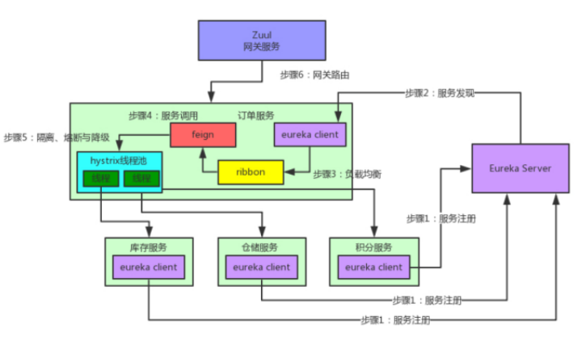
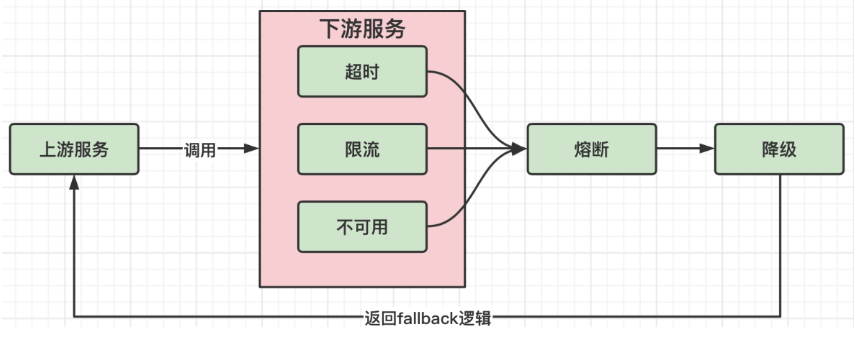

# SpringCloud

## 目录

- [1、spring cloud断路器的作用是什么？](#1spring-cloud断路器的作用是什么)
- [2、spring cloud的核心组件有哪些以及作用](#2spring-cloud的核心组件有哪些以及作用)
- [3、spring 如何注册cloud服务？](#3spring-如何注册cloud服务)
- [4、微服务优点是什么？](#4微服务优点是什么)
- [5、微服务的缺点是什么？](#5微服务的缺点是什么)
- [6、Spring Cloud Bus是什么?](#6Spring-Cloud-Bus是什么)
- [7、什么是服务熔断？什么是服务降级？](#7什么是服务熔断什么是服务降级)
- [8、负载均衡的意义是什么？](#8负载均衡的意义是什么)
- [9、SpringBoot和SpringCloud有什么联系和区别？](#9SpringBoot和SpringCloud有什么联系和区别)

# 1、spring cloud断路器的作用是什么？

Spring Cloud断路器（Hystrix）是一种用于构建弹性、容错和容灾机制的开源库。它提供了一种通过隔离和控制远程服务调用的方式，以防止由于服务故障或延迟而导致的级联故障。

断路器的作用如下：

1. 故障隔离：断路器通过将远程服务调用封装在一个独立的断路器中，可以隔离故障的影响范围。当远程服务发生故障或延迟时，断路器可以快速失败并返回预定义的默认值，而不会影响整个系统的稳定性。
2. 容错处理：断路器可以在远程服务不可用时提供备用方案。通过配置降级逻辑，可以在远程服务故障时返回预先定义的备用数据，以保证系统的可用性和稳定性。
3. 自动恢复：断路器具备自我修复的能力。它会定期尝试恢复远程服务的调用，以检查其可用性。当远程服务恢复正常时，断路器会逐渐恢复对该服务的调用，并重新建立正常的调用链路。
4. 实时监控：断路器提供了实时监控和度量功能，可以收集和展示远程服务调用的各项指标，如调用次数、失败率、响应时间等。这些指标可以帮助开发人员和运维人员了解系统的健康状况，并进行故障排查和性能优化。

通过使用Spring Cloud断路器，可以有效地处理分布式系统中的服务故障和延迟问题，提高系统的容错性和可用性。它是构建弹性和可靠微服务架构的重要组件之一。

# 2、spring cloud的核心组件有哪些以及作用



**Eureka**：服务注册与发现
注册：每个服务都向Eureka登记自己提供服务的元数据，包括服务的ip地址、端口号、版本号、通信协议等。eureka将各个服务维护在了一个服务清单中（双层Map，第一层key是服务名，第二层key是实例名，value是服务地址加端口）。同时对服务维持心跳，剔除不可用的服务，eureka集群各节点相互注册每个实例中都有一样的服务清单。

发现：eureka注册的服务之间调用不需要指定服务地址，而是通过服务名向注册中心咨询，并获取所有服务实例清单(缓存到本地)，然后实现服务的请求访问。

**Ribbon**：服务间发起请求的时候，基于Ribbon做负载均衡，从⼀个服务的多台机器中选择⼀台 （被调用方的服务地址有多个），Ribbon也是通过发起http请求，来进行的调用，只不过是通过调用服务名的地址来实现的。虽然说Ribbon不用去具体请求服务实例的ip地址或域名了，但是每调用一个接口都还要手动去发起Http请求。

**Hystrix**：发起请求是通过Hystrix的线程池来⾛的，不同的服务⾛不同的线程池，实现了不同服务调⽤的隔离，通过统计接口超时次数返回默认值，实现服务熔断和降级。

**Zuul**：如果前端、移动端要调⽤后端系统，统⼀从Zuul⽹关进⼊，由Zuul⽹关转发请求给对应的服务，通过与Eureka进行整合，将自身注册为Eureka下的应用，从Eureka下获取所有服务的实例，来进行服务的路由。Zuul还提供了一套过滤器机制，开发者可以自己指定哪些规则的请求需要执行校验逻辑，只有通过校验逻辑的请求才会被路由到具体服务实例上，否则返回错误提示。

**SpringCloud Config:** 提供服务器端和客户端。服务器存储后端的默认实现使用git，因此它轻松支持标签版本的配置环境，以及可以访问用于管理内容的各种工具。这个还是静态的，需要得配合Spring Cloud Bus实现动态的配置更新。

# 3、spring 如何注册cloud服务？

在Spring框架中使用Spring Cloud服务，需要进行以下步骤来注册和启用Spring Cloud组件：

1. 添加依赖：在项目的构建配置文件（如pom.xml）中添加所需的Spring Cloud依赖。例如，可以添加`spring-cloud-starter-netflix-eureka-client`依赖来使用Eureka服务注册与发现组件。
2. 配置文件：在应用程序的配置文件（如application.properties或application.yml）中配置Spring Cloud服务的相关属性。具体的配置内容取决于所使用的Spring Cloud组件。例如，使用Eureka服务注册与发现时，需要指定Eureka服务器的地址和端口等信息。
3. 注解标记：在Spring Boot应用程序的主类上添加相应的注解来启用Spring Cloud服务。具体的注解取决于所使用的Spring Cloud组件。例如，使用Eureka服务注册与发现时，可以在主类上添加`@EnableEurekaClient`注解。
4. 运行环境：确保应用程序运行的环境中包含了所需的Spring Cloud组件的运行实例。例如，如果使用Eureka服务注册与发现，需要确保Eureka服务器正常运行。

下面是一个使用Eureka服务注册与发现的示例：

1 . 添加依赖：

```xml
<dependency>
    <groupId>org.springframework.cloud</groupId>
    <artifactId>spring-cloud-starter-netflix-eureka-client</artifactId>
</dependency>
```

2 . 配置文件（application.yml）：

```yaml
spring:
  application:
    name: my-service
eureka:
  client:
    service-url:
      defaultZone: http://localhost:8761/eureka/
```

3 . 主类上添加注解：

```java
import org.springframework.boot.SpringApplication;
import org.springframework.boot.autoconfigure.SpringBootApplication;
import org.springframework.cloud.netflix.eureka.EnableEurekaClient;

@SpringBootApplication
@EnableEurekaClient
public class MyServiceApplication {
    public static void main(String[] args) {
        SpringApplication.run(MyServiceApplication.class, args);
    }
}
```

通过以上步骤，你就可以在Spring应用程序中注册和启用Spring Cloud服务了。具体的步骤和配置内容可能会根据所使用的Spring Cloud组件而有所不同，你可以根据具体的需求和文档进行相应的配置和操作。

# 4、微服务优点是什么？

(1)每个服务都足够内聚，代码易于理解；

(2)提高开发效率，一项服务只做一件事；

(3)微服务可以由小团队单独开发；

(4)微服务是松耦合的，是有功能意义的服务；

(5)可以用不同的语言开发，面向接口编程；

(6)易于与第三方集成；

(7)微服务只是业务逻辑的代码，不会和HTML一起使用。CSS或其它界面组合；

(8)可灵活搭配，连接公共库和独立库。

# 5、微服务的缺点是什么？

(1)分布式系统的责任；

(2)多服务运维难度，随着服务的增加，运维压力也在增加；

(3)系统部署依赖；

(4)服务间通信成本；

(5)数据一致性；

(6)系统集成测试；

(7)性能监控。

# 6、Spring Cloud Bus是什么?

Spring Cloud Bus是Spring Cloud框架中的一个组件，用于在分布式系统中实现消息总线功能。它建立在Spring Boot和Spring Cloud Stream之上，提供了一种方便的方式来在微服务架构中进行消息传递和事件广播。

Spring Cloud Bus的主要功能是通过消息代理将分布式系统中的各个微服务实例连接起来，使它们能够方便地进行消息的发送和接收。它使用轻量级的消息代理（如RabbitMQ或Kafka）作为中间件，实现了消息的广播和订阅机制。

使用Spring Cloud Bus，可以实现以下功能：

1. 配置中心的刷新：通过发送特定的消息，可以触发所有微服务实例重新加载配置信息，从而实现配置的动态更新。
2. 事件广播：可以将事件消息广播给所有微服务实例，用于实现系统内的事件驱动机制。
3. 监控和管理：可以通过消息传递的方式，实现对微服务实例的监控和管理，例如获取实例的健康状态、查看日志等。

Spring Cloud Bus使用了发布-订阅模式，其中一个微服务实例作为消息的生产者，将消息发送到消息代理，而其他微服务实例作为消息的消费者，订阅感兴趣的消息并进行相应的处理。通过这种方式，可以实现微服务之间的解耦和灵活的消息传递。

需要注意的是，Spring Cloud Bus并不是用于高频率的数据传输或大规模的消息通信，而是用于在分布式系统中进行配置更新、事件广播和管理操作。对于更复杂的消息通信需求，可以结合使用Spring Cloud Stream等组件来实现。

总之，Spring Cloud Bus提供了一种简单而强大的方式来实现分布式系统中的消息总线功能，实现了微服务之间的解耦和灵活的消息传递。它是构建基于Spring Cloud的分布式系统的重要工具之一。

# 7、什么是服务熔断？什么是服务降级？

**1、概念不同：**

服务熔断：其实很好理解，就是一个断开的过程。

下游的服务因为某种原因突然变得不可用或响应过慢，上游服务为了保证自己整体服务的可用性，不再继续调用目标服务，直接返回，快速释放资源。如果目标服务情况好转则恢复调用。

服务降级：降低级别的意思，它是指程序在出现问题时，仍能保证有限功能可用的一种机制。

因此：对于降级是一种退而求其次的选择，而熔断却是整体不可用。

**2、触发原因不太一样**：

服务熔断一般是某个服务（下游服务）故障引起，而服务降级一般是从整体负荷考虑。

**3、管理层次不太一样：**

服务熔断是一个框架层次的处理（每个服务都要考虑，无业务层级之分），服务降级是业务层次的处理。（比如降级一般是从最非核心服务开始）

服务熔断是服务降级的一种特殊情况，他是防止服务雪崩而采取的措施。系统发生异常或者延迟或者流量太大，都会触发该服务的服务熔断措施，链路熔断，返回兜底方法。这是对局部的一种保险措施。

服务降级是对系统整体资源的合理分配。区分核心服务和非核心服务。对某个服务的访问延迟时间、异常等情况做出预估并给出兜底方法。这是一种全局性的考量，对系统整体负荷进行管理。

其实一句话： 降级是一种设计思想，在Java层面就是一个接口，而熔断是降级的不同实现方式，在Java层面就是这个接口的一个实现类。

**4、熔断和降级的关系**



# 8、负载均衡的意义是什么？

负载均衡（Load Balancing）是指将网络或计算资源分配给多个服务器或设备，以达到提高系统性能、可扩展性和可靠性的目的。它在分布式系统中起到重要的作用，具有以下几个重要的意义：

1. 提高系统性能：负载均衡将请求均匀地分配给多个服务器，避免了单个服务器过载的情况。通过合理地分配负载，可以充分利用系统的资源，提高系统的吞吐量和响应速度。
2. 实现高可用性：通过将请求分发到多个服务器，即使其中某个服务器发生故障或不可用，仍然可以继续提供服务。负载均衡器能够检测到故障服务器，并将请求转发到其他正常工作的服务器，从而实现系统的高可用性和容错性。
3. 支持系统扩展：随着用户量和业务需求的增加，单个服务器可能无法满足系统的需求。负载均衡器可以根据实际情况动态地添加或删除服务器，实现系统的水平扩展。通过增加服务器数量，可以提高系统的处理能力和并发性能。
4. 优化资源利用：负载均衡器可以根据服务器的负载情况智能地分配请求，使每个服务器的负载相对均衡。这样可以避免某些服务器过载而其他服务器处于空闲状态的情况，最大限度地提高资源的利用率。
5. 简化系统管理：通过使用负载均衡器，可以将多个服务器组织成一个逻辑集群，对外提供统一的入口。这样可以简化系统的管理和维护工作，减少对客户端的影响，提高系统的可维护性和可管理性。

总之，负载均衡在分布式系统中具有重要的意义。它能够提高系统性能、可用性和可扩展性，优化资源利用，简化系统管理。通过合理地分配负载，负载均衡器能够实现高效、稳定和可靠的系统运行。

# 9、SpringBoot和SpringCloud有什么联系和区别？

Spring Boot和Spring Cloud是两个相互关联但又有不同重点的项目。

1. Spring Boot（Spring框架）：Spring Boot是一个用于简化和加速Spring应用程序开发的框架。它提供了一种约定优于配置的方式，通过自动配置和默认值，可以快速搭建和部署独立的、可执行的Spring应用程序。Spring Boot使得开发者可以更专注于业务逻辑的实现，而无需手动配置复杂的Spring配置文件。
2. Spring Cloud：Spring Cloud是一个用于构建分布式系统的工具集合，它基于Spring Boot提供了一系列的开箱即用的分布式系统模块和服务。Spring Cloud包含了多个组件，如服务注册与发现（Eureka、Consul）、服务调用（Feign、Ribbon）、断路器（Hystrix）、网关（Zuul、Gateway）、配置中心（Config）等，这些组件提供了分布式系统开发中常用的功能和解决方案。

联系和区别：

- 联系：Spring Boot是Spring框架的一部分，它为Spring应用程序提供了快速开发的能力，而Spring Cloud是构建分布式系统的工具集合，基于Spring Boot提供了一系列分布式系统模块和服务。
- 区别：Spring Boot主要关注于简化和加速单个Spring应用程序的开发，提供了自动配置、快速启动等特性。而Spring Cloud主要关注于构建分布式系统，提供了服务注册与发现、服务调用、负载均衡、断路器等组件，用于处理分布式系统中的各种挑战。

综上所述，Spring Boot和Spring Cloud是相互关联的，Spring Boot为Spring应用程序提供了快速开发的能力，而Spring Cloud则在此基础上提供了构建分布式系统的工具和解决方案。使用Spring Boot可以快速搭建单个Spring应用程序，而使用Spring Cloud可以在分布式系统中构建和管理多个相互协作的微服务。
