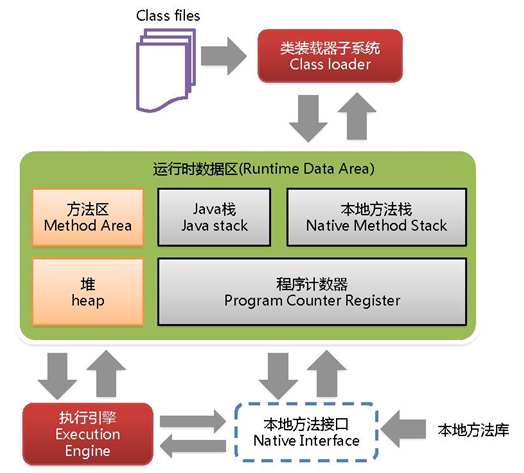
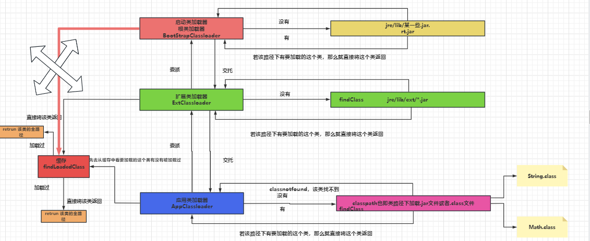

# JVM

## 目录

- [１、说一下JVM的主要组成部分？及其作用？](#１说一下JVM的主要组成部分及其作用)
- [2、说一下JVM运行时数据区？](#2说一下JVM运行时数据区)
- [3、什么是类加载器？](#3什么是类加载器)
- [4、双亲委派模型](#4双亲委派模型)
- [５、说一下类装载的执行过程？](#５说一下类装载的执行过程)
- [６、怎么判断对象是否可以被回收？](#６怎么判断对象是否可以被回收)
- [7、哪些对象可以作为GC-Roots](#7哪些对象可以作为GC-Roots)
- [8、Java中都有哪些引用类型？](#8Java中都有哪些引用类型)
- [9、说一下JVM有哪些垃圾回收算法？](#9说一下JVM有哪些垃圾回收算法)
- [10、说一下JVM有哪些垃圾回收器？](#10说一下JVM有哪些垃圾回收器)
- [11、详细介绍一下CMS垃圾回收器？](#11详细介绍一下CMS垃圾回收器)
- [12、新生代垃圾回收器和老年代垃圾回收器都有哪些？有什么区别？](#12新生代垃圾回收器和老年代垃圾回收器都有哪些有什么区别)
- [13、简述分代垃圾回收器是怎么工作的？](#13简述分代垃圾回收器是怎么工作的)
- [14、垃圾回收器的比较](#14垃圾回收器的比较)
- [15、三色标记](#15三色标记)
  - [写屏障 + 增量更新（IU）](#写屏障--增量更新IU)
  - [写屏障 + 原始快照（SATB）](#写屏障--原始快照SATB)
- [16、说一下JVM调优的工具？](#16说一下JVM调优的工具)
- [17、常用的JVM调优的参数都有哪些？](#17常用的JVM调优的参数都有哪些)
- [18、你能保证GC执行吗？](#18你能保证GC执行吗)
- [19、怎么获取Java程序使用的内存？堆使用的百分比？](#19怎么获取Java程序使用的内存堆使用的百分比)

# １、说一下JVM的主要组成部分？及其作用？




\*\*类加载器 (Class Loader) \*\*：将.class字节码文件加载到内存中。类加载器只管加载，不管运行。只要符合文件结构就会加载。

\*\*执行引擎（Execution Engine) \*\* ：也叫解释器，负责解释命令，其任务就是将[字节码](https://so.csdn.net/so/search?q=字节码\&spm=1001.2101.3001.7020 "字节码")指令解释/编译为对应平台上的本地机器指令。

**本地接口（Native Interface）**：本地接口。本地接口的作用是融合不同的语言为java所用。

**栈（Stack）**：也叫栈内存，是java程序的运行区，用于存储**局部变量表**、**操作栈**、**动态链接(即引用，比如方法区的成员变量)**、**方法出口等信息**。**它随着线程的创建而创建，随着线程结束而释放，只要线程一结束，该栈就结束；** 对于栈来说不存在垃圾回收的问题(垃圾回收只针对于堆和方法区)。**栈中的数据以栈帧的形式存在**，是一个数据集，是一个有关方法和运行期数据的集合，当方法A被调用时就产生了一个栈帧F1，并被压入到栈中，A方法又调用了B方法，于是产生栈帧F2也被压入栈，执行完毕后，先弹出F2栈帧，再弹出F1栈帧，遵循“**先进后出**”原则。

**堆（Heap）** **：** 存放的是实例对象。**一个JVM实例只存在一个堆内存，堆内存的大小是可以调节的**。\*\*堆内存分三部分：****永久区**（即存储的是运行环境必须的类信息，被装载至此区域的数据是不会被垃圾回收掉的，只有关闭jvm释放此区域所占用的内存）、**新生区****、\*\***老年代**

**方法区（Method Area）**：方法区只是**JVM规范**中定义的一个概念，它用于存储已被虚拟机加载的类的信息（类的名称、方法信息、字段信息）、常量、静态变量、即时编译器编译后的代码缓存等。

**程序计数器（PC Register）**：每个线程都有一个程序计数器，就是一个指针，指向方法区中的方法字节码（**用来存储下一条将要执行的字节码指令的地址**），由执行引擎读取下一条指令

# 2、说一下JVM运行时数据区？

不同虚拟机的运行时数据区可能略微有所不同，但都会遵从 Java 虚拟机规范， Java 虚拟机规范规定的区域分为以下 5 个部分：

程序计数器（Program Counter Register）：当前线程所执行的字节码的行号指示器，字节码解析器的工作是通过改变这个计数器的值，来选取下一条需要执行的字节码指令，分支、循环、跳转、异常处理、线程恢复等基础功能，都需要依赖这个计数器来完成；

Java 虚拟机栈（Java Virtual Machine Stacks）：用于存储局部变量表、操作数栈、动态链接、方法出口等信息；

本地方法栈（Native Method Stack）：与虚拟机栈的作用是一样的，只不过虚拟机栈是服务 Java 方法的，而本地方法栈是为虚拟机调用 Native 方法服务的；

Java 堆（Java Heap）：Java 虚拟机中内存最大的一块，是被所有线程共享的，存放对象实例

方法区（Methed Area）：用于存储已被虚拟机加载的类信息、常量、静态变量、即时编译后的代码等数据。

# 3、什么是类加载器？

对于任意一个类，都需要由加载它的类加载器和这个类本身一同确立在 JVM 中的唯一性，每一个类加载器，都有一个独立的类名称空间。类加载器就是根据指定全限定名称将 class 文件加载到 JVM 内存，然后再转化为 class 对象。

类加载器分类：

- 启动类加载器（Bootstrap）C++

  负责加载\$JAVA\_HOME中jre/lib/下的某些jre包中的类【比如rt.jar】，该类加载器由C++实现，不是ClassLoader子类。
- 扩展类加载器（Extension）Java

  负责加载java平台中**扩展功能**的一些jar包，包括\$JAVA\_HOME中jre/lib/ext/ \*.jar或-Djava.ext.dirs指定目录下的jar包
- 应用程序类加载器（AppClassLoader）

  也叫系统类加载器，负责加载**classpath**中指定的jar包及目录中class。或-Djava.class.path目录下的jar包或者.class文件。
- 用户自定义加载器  Java.lang.ClassLoader的子类，用户可以定制类的加载方式

注意：各种类加载器之间存在着逻辑上的父子关系，但不是真正意义上的父子关系，因为它们直接没有从属关系。

# 4、双亲委派模型

双亲委派机制是 Java 虚拟机加载一个类时为该类确定类加载器的一种机制。

简单的来说：如果一个类加载器收到了加载某个类的请求,则该类加载器并不会去加载该类,而是把这个请求委派给父类加载器,每一个层次的类加载器都是如此,因此所有的类加载请求最终都会传送到顶端的启动类加载器;只有当父类加载器在其搜索范围内无法找到所需的类,并将该结果反馈给子类加载器,子类加载器会尝试去自己加载。

具体的来说：例如有一个类 com.atguigu.classloader.Math需要加载，在双亲委派机制下流程是怎么样的呢？

- 首先 **应用类加载器** 会判断之前是否加载过这个类，如果加载过则返回，如果没有加载过，则会**向上**委托给**扩展类加载器**；
- **扩展类加载器**同样会去判断之前是否加载过这个类，如果加载过则返回，如果没有加载过，则继续**向上**委托给 **引导类加载器**；
- **引导类加载器**则会去 jre/lib 目录下去查询是否有这个类（注意：不会在问是否加载过），如果有这个类则加载，如果没有就**向下回传**给扩展类加载器加载； &#x20;
- **扩展类加载器**去 jre/lib/ext 目录下去查询是否有这个类，如果有这个类则加载，如果没有这个类就**向下**回传给应用类加载器；
- **应用类加载器**会去项目的类路径下 （classPath） 下去查询是否有这个类，如果有这个类则加载，如果没有这个类就会抛出经典的 **ClassNotFoundException**。

流程：



# ５、说一下类装载的执行过程？

类装载简单分为以下 5 个步骤：

**加载**：*将*\*`类的字节码文件`**加载到**`内存`\*\*(元空间）中。这一步会创建一个与被加载类对应的Class对象。\*

**验证**：*验证类是否*\*`符合 JVM规范`**，**`安全性检查`\*\*，不会造成安全或内存损坏等问题\*

**准备**：*为类*\*`变量分配内存`**并**`设置类变量初始值`\*

**解析**：虚拟机将常量池中的符号引用替换成直接引用的过程。符号引用就理解为一个标示，而在直接引用直接指向内存中的地址；

**初始化**：对类的`静态变量，静态代码块`执行`初始化`操作

# ６、怎么判断对象是否可以被回收？

一般有两种方法来判断：

引用计数器：为每个对象创建一个引用计数，有对象引用时计数器 +1，引用被释放时计数 -1，当计数器为 0 时就可以被回收。它有一个缺点**不能解决循环引用的问题**；

```java
public class ReferenceCount {

    private  Object instance=null;

    private static final int _1MB = 1024 * 1024;
    private byte[] bigObject= new byte[2*_1MB];

    public static void main(String[] args) {

        ReferenceCount objA = new ReferenceCount();
        ReferenceCount objB = new ReferenceCount();
        objA.instance = objB;
        objB.instance = objA;

        objA = null;
        objB = null;

        System.gc();

    }
}
```

**可达性分析：** 这个算法的基本思想就是通过一系列的称为**“GC Roots”** 的对象作为起点，从这些节点开始向下搜索，节点所走过的路径称为引用链，当一个对象到 GC Roots 没有任何引用链相连的话，则证明此对象是不可用的。


# 7、哪些对象可以作为GC-Roots

在Java语言中，可以作为GC Roots的对象包括下面几种：

- 虚拟机栈（栈帧中的本地变量表）中的引用对象。
- 方法区中的类静态属性引用的对象。
- 方法区中的常量引用的对象。
- 本地方法栈中JNI（Native方法）的引用对象


小技巧：

由于Root 采用栈方式存放指针，所以如果一个指针，它保存了堆里面的对象，但是自己又不存放在堆里面，那他就可以作为一个Root.

# 8、Java中都有哪些引用类型？

强引用：发生 gc 的时候不会被回收。

软引用：有用但不是必须的对象，在发生内存溢出之前会被回收。

弱引用：有用但不是必须的对象，在下一次GC时会被回收。

虚引用（幽灵引用/幻影引用）：无法通过虚引用获得对象，用 PhantomReference 实现虚引用，虚引用的用途是在 gc 时返回一个通知。（临死之前收到一个通知）

```java
package com.atguigu.jvm;
import java.lang.ref.PhantomReference;
import java.lang.ref.ReferenceQueue;
import java.lang.ref.SoftReference;
import java.lang.ref.WeakReference;

/**
 * @Author huzhongkui
 * @Date 2022--07--25:22:55
 * 聪明出于勤奋,天才在于积累
 **/
public class WeakReferenceDemo {
    public static void main(String[] args) {
        softReference();// 软引用
        weakReferenceTest();// 弱引用
        phantomReference();// 虚引用

    }
    
    /**
     * 软引用测试
     * 会发现gc后，软引用对象的值获仍然能够获取到
     */
    private static void softReference() {
        String str = new String("hzk 666!!!");
        SoftReference<String> stringSoftReference = new SoftReference<>(str);
        System.out.println("软引用的值" + stringSoftReference.get());//没有进行gc前软引用能得到对象
        str = null;
        System.gc();
        stringSoftReference.get();
        System.out.println("软引用对象被垃圾回收了,软引用对象的值" + stringSoftReference.get());
    }

    /**
     * 弱引用测试
     * 会发现gc后，弱引用对象的值获取不到
     */
    private static void weakReferenceTest() {
        String str = new String("hzk 666!!!");
        WeakReference<String> stringWeakReference = new WeakReference<>(str);
        str = null;
        System.out.println("软引用的值" + stringWeakReference.get());//没有进行gc前软引用能得到对象
        System.gc();//进行垃圾回收
        stringWeakReference.get();
        System.out.println("软引用对象被垃圾回收了,软引用对象的值" + stringWeakReference.get());
    }

    /**
     * 虚引用测试
     * 会发现gc前，弱引用对象的值都获取不到
     */
    private static void phantomReference() {
        String helloWorldString = new String("hzk 666!!!");
        ReferenceQueue queue = new ReferenceQueue();
        PhantomReference ref = new PhantomReference(helloWorldString, queue);
        System.out.println(ref.get());
        System.gc();//进行垃圾回收
        System.out.println(ref.get());

    }

}

```

# 9、说一下JVM有哪些垃圾回收算法？

**标记复制算法：****该算法将内存****平均分成两部分****，然后每次只使用其中的一部分，当这部分内存满的时候，会将内存中所有存活的对象复制到另一个内存中，然后将之前的内存清空，只使用这部分内存，循环下去。** ​

**标记-清除算法：** 1、使用可达性算法标记出需要回收的对象，且有根可达的就不会被标记清理。

&#x20;                        2、回收被标记的对象

**标记-整理算法：** ​**标记无用对象，让所有存活的对象都向一端移动，然后直接清除掉端边界以外的内存。**

**分代算法：根据对象存活周期的不同将内存划分为几块，一般是新生代和老年代，新生代基本采用复制算法，老年代采用标记整理算法。**

分代回收算法实际上是把复制算法和标记整理法的结合，并不是真正一个新的算法，一般分为：老年代（Old Generation）和新生代（Young Generation），老年代就是很少垃圾需要进行回收的，新生代就是有很多的内存空间需要回收，所以不同代就采用不同的回收算法，以此来达到高效的回收算法。

面试回答：

首先说明Stop-the-world：

在进行GC时，需要将所有线程全部停止，这段时间称为stop-the-world，所有算法都是针对stop-the-world优化展开的

**标记清理**：通过可达性分析，将标记为垃圾的对象进行清理。会造成碎片空间浪费

**标记压缩**：优化标记清理的算法，通过可达性分析，将标记为非垃圾的对象同一移动到一段，随后清除边界意外的内存。(避免产生不必要的内存碎片，但对象存活率低会造成重复操作，导致效率降低，一般放在老年代的更新) &#x20;
**复制算法**：将内存一分为二，通过可达性分析将存活对象全面复制给另一份空闲内存，随后清理原有内存(避免产生内存碎片，但是内存减半代价大，对象存活率高则是无用操作)

**分代收集**：年轻代使用复制算法(对象存活率低)，老年代使用标记压缩法(对象存活率高)

# 10、说一下JVM有哪些垃圾回收器？

垃圾回收器总体分为三大类:

**串行：**

Serial、Serial Old、

**并行**：

ParNew、Parallel、Parallel Old

**并发：**

CMS、G1

Serial：最早的单线程串行垃圾回收器。

Serial Old：Serial 垃圾回收器的老年版本，同样也是单线程的。

ParNew：是 Serial 的多线程版本。

Parallel 和 ParNew 收集器类似是多线程的，但 Parallel 是吞吐量优先的收集器，可以牺牲等待时间换取系统的吞吐量。Parallel Old 是 Parallel 老生代版本，Parallel 使用的是复制的内存回收算法，Parallel Old 使用的是标记-整理的内存回收算法。

CMS：一种以获得最短停顿时间为目标的收集器，非常适用 B/S 系统。

G1：一种兼顾吞吐量和停顿时间的 GC 实现。

**面试说**：

串行：Serial ,Serial old

并行：ParNew  , Paraller ，CMS垃圾收集 牺牲吞吐获得最短停顿时间（熟悉）  ，G1 兼顾吞吐和停顿JDK9后默认

# 11、详细介绍一下CMS垃圾回收器？

**CMS（Concurrent Mark Sweep）收集器是一种以获取最短回收停顿时间为目标的收集器。它非常符合在注重用户体验的应用上使用，它是HotSpot虚拟机第一款真正意义上的并发收集器，它第一次实现了让垃圾收集线程与用户线程（基本上）同时工作。**

从名字中的**Mark Sweep**这两个词可以看出，CMS收集器是一种 **“标记-清除”算法**实现的，它的运作过程相比于前面几种垃圾收集器来说更加复杂一些。整个过程分为四个步骤：

- 初始标记（CMS initial mark）
- 并发标记（CMS concurrent mark）
- 重新标记（CMS remark）
- 并发清理（CMS concurrent sweep）
- 其中初始标记、重新标记这两个步骤仍然需要“Stop The World”。初始标记仅仅只是枚举全部的GC Roots对象，速度很快，并发标记阶段就是进行GC Roots Tracing的过程【采用三色标记算法】，**这个过程耗时较长但是不需要停顿用户线程， 可以与垃圾收集线程一起并发运行**。因为用户程序继续运行，可能会有导致已经**标记过的对象状态发生改变**。而重新标记阶段则是为了修正并发标记期间，因用户程序继续运作而导致标记产生变动的那一部分对象的标记记录，这个阶段的停顿时间一般会比初始标记阶段稍长一些，但远比并发标记的时间短。并发清理这个阶段、清理删除掉标记阶段判断已经死亡的对象，由于不需要移动存活对象，因此这个阶段可以与用户线程同时发生。

  初始标记：迄今为止在进行根节点枚举这一步骤都是需要暂停用户线程的，必须要保证在一个能够保证一致性的快照中得以进行。这里的一致性指的是，不会出现在分析过程中，根节点集合的对象的引用关系还在不断地变化。因为如果这点不能满足，那么分析结果就不能保证。

  那么对于目前的Java应用来说，光是方法区的大小就有数百上千兆，里面的类或者常量更是恒河数沙，若是检查这里为起源的引用就需要消耗很多的时间，所以虚拟机自当是有办法直接得到哪些地方存在着对象的引用。在HotSpot虚拟机中，是使用的一组称为OopMap的数据结构来达存放这些引用。一旦类加载完成的时候，虚拟机就会把对象的偏移量数据计算出来。并且在JIT即时编译中也会在特定的位置记录下栈里的寄存器中存放哪些位置是引用。这样收集器在扫描的时候就可以得知这些信息了。并不需要真正的一个不漏的从方法区等GCROOT开始查找。


从它的名字就可以看出它是一款优秀的垃圾收集器，主要优点：**并发收集、低停顿**。但是它有下面几个明显的缺点：

- 对CPU资源敏感（会和服务抢资源，降低吞吐量）；当然，这是所有并发收集器的缺点
- 无法处理**浮动垃圾**(在并发标记和并发清理阶段又产生垃圾，这种浮动垃圾在本次收集中无法干掉他们，只能等到下一次gc再清理了，这一部分垃圾成为浮动垃圾)；
- 它使用的回收算法-**“标记-清除”算法**会导致收集结束时会有**大量空间碎片**产生

同样由于垃圾收集阶段用户程序还需要持续运行，那就还需要预留足够的空间给用户线程使用，因此CMS垃圾回收器不能像其他的收集器那样等待老年代几乎完全被填满在进行垃圾收集。如果CMS运行期间预留的内存无法满足程序分配新对象的空间，就会出现并发失败。这时候虚拟机就启动默认的备预案，冻结用户线程，临时启用·重新对老年代的垃圾收集。这样就导致停顿时间很长了，性能反而降低。

**面试说**：

牺牲吞吐量获得最短停顿时间的垃圾收集器，适用于对于响应速度较高的应用上，但使用标记清理算法会造成内存碎片浪费。

主要步骤如下：

初始标记阶段：进行可达性分析，短暂停顿

并发标记阶段：cms与应用程序并发执行，标记所有可达对象，同时可能有新对象产生。

并发预清理阶段：并发执行，提前清理部分对象，以减少后续工作量。

最终标记阶段：短暂停顿，处理并发标记开始后修改的对象，并标记他们。

并发清理阶段：并发执行，清理并释放未被标记的无用对象所占据的内存。

# 12、新生代垃圾回收器和老年代垃圾回收器都有哪些？有什么区别？

新生代回收器：Serial、ParNew、Parallel Scavenge

老年代回收器：Serial Old、Parallel Old、CMS整堆回收器：

G1新生代垃圾回收器一般采用的是复制算法，复制算法的优点是效率高，缺点是内存利用率低；

老年代回收器一般采用的是标记-整理的算法进行垃圾回收。

# 13、简述分代垃圾回收器是怎么工作的？

分代回收器有两个分区：老年代和新生代，新生代默认的空间占比总空间的 1/3，老年代的默认占比是 2/3。

新生代使用的是复制算法，新生代里有 3 个分区：Eden、To Survivor、From Survivor，它们的默认占比是 8:1:1，它的执行流程如下：

把 Eden + From Survivor 存活的对象放入 To Survivor 区；清空 Eden 和 From Survivor 分区；From Survivor 和 To Survivor 分区交换，From Survivor 变 To Survivor，To Survivor 变 From Survivor。每次在 From Survivor 到 To Survivor 移动时都存活的对象，年龄就 +1，当年龄到达 15（默认配置是 15）时，升级为老年代。大对象也会直接进入老年代。

老年代当空间占用到达某个值之后就会触发全局垃圾收回，一般使用标记整理的执行算法。以上这些循环往复就构成了整个分代垃圾回收的整体执行流程。

# 14、垃圾回收器的比较


# 15、三色标记

所有的垃圾回收算法都要经历标记阶段。如果GC线程在标记的时候暂停所有用户线程（STW），那就没三色标记什么事了。但是这样会有一个问题，用户线程需要等到GC线程标记完才能运行，给用户的感觉就是很卡，用户体验很差。

现在主流的垃圾收集器都支持并发标记。什么是并发标记呢？就是标记的时候不暂停或少暂停用户线程，一起运行。这势必会带来三个问题：多标、漏标。垃圾收集器是如何解决这个问题的呢：三色标记+读写屏障。

把遍历对象过程中遇到的对象，按照“是否访问过”这个条件标记成三种颜色：

- **白色**：尚未访问过。
- **黑色**：本对象已访问过，而且本对象 引用到 的其他对象 也全部访问过了。
- **灰色**：本对象已访问过，但是本对象 引用到 的其他对象 尚未全部访问完。全部访问后，会转换为黑色。

**多标浮动垃圾：**

GC线程正在标记B，此时用户代码中A断开了对B的引用，但此时B已经被标记成了灰色，本轮GC不会被回收，这就是所谓的多标，多标的对象即成为浮动垃圾，躲过了本次GC。

多标对程序逻辑是没有影响的，唯一的影响是该回收的对象躲过了一次GC，造成了些许的内存浪费。


**漏标 程序会出错**：

漏标是如何产生的呢？GC把B标记完，准备标记B引用的对象，这时用户线程执行代码，代码中断开了B对D的引用，改为A对D的引用。但是A已经被标记成黑色，不会再次扫描A，而D还是白色，执行垃圾回收逻辑的时候D会被回收，程序就会出错了。


**如何解决漏标问题：**

先分析下漏标问题是如何产生的：

条件一：灰色对象 断开了 白色对象的引用；即灰色对象 原来成员变量的引用 发生了变化。

条件二：黑色对象 重新引用了 该白色对象；即黑色对象 成员变量增加了 新的引用。

知道了问题所在就知道如何解决了。

#### 写屏障 + 增量更新（IU）

这种方式解决的是条件二，即通过写后屏障记录下更新，具体做法如下：

对象A对D的引用关系建立时，将D加入带扫描的集合中等待扫描

当对象A的成员变量的引用发生变化时，比如新增引用（a.d = d），我们可以利用写屏障，将A新的成员变量引用对象D 记录下来：

```java
#写后
void post_write_barrier(oop* field, oop new_value) {
 remark_set.add(new_value); // 记录新引用的对象
}
```

#### 写屏障 + 原始快照（SATB）

这种方式解决的是条件一，带来的结果是依然能够标记到D，具体做法如下：

对象B的引用关系变动的时候，即给B对象中的某个属性赋值时，将之前的引用关系记录下来。

当对象B的成员变量的引用发生变化时，比如引用消失（a.b.d = null），我们可以利用写屏障，将B原来成员变量的引用 对象D记录下来：

```java
#写前 
void pre_write_barrier(oop* field) {
 oop old_value = *field; // 获取旧值
 remark_set.add(old_value); // 记录原来的引用对象
}
```

重标记的时候，扫描旧的对象图，这个旧的对象图即原始快照。

实际应用：

CMS：写屏障 + 增量更新

G1：写屏障 + SATB

# 16、说一下JVM调优的工具？

JDK 自带了很多监控工具，都位于 JDK 的 bin 目录下，其中最常用的是 jconsole 和 jvisualvm 这两款视图监控工具。

jconsole：用于对 JVM 中的内存、线程和类等进行监控；

jvisualvm：JDK 自带的全能分析工具，可以分析：内存快照、线程快照、程序死锁、监控内存的变化、gc 变化等。

# 17、常用的JVM调优的参数都有哪些？

常用的JVM调优参数有很多，以下是一些常见的参数：

1. `-Xms`：设置JVM的初始堆大小。
2. `-Xmx`：设置JVM的最大堆大小。
3. `-Xss`：设置线程的栈大小。
4. `-XX:NewRatio`：设置新生代和老年代的比例。
5. `-XX:SurvivorRatio`：设置Eden区和Survivor区的比例。
6. `-XX:MaxPermSize`（在JDK 8之前）或`-XX:MaxMetaspaceSize`（在JDK 8及以后）：设置永久代（或元空间）的最大大小。
7. `-XX:ParallelGCThreads`：设置并行垃圾收集器的线程数。
8. `-XX:+UseConcMarkSweepGC`：启用并发标记清除垃圾收集器。
9. `-XX:+UseG1GC`：启用G1垃圾收集器。
10. `-XX:+UseSerialGC`：启用串行垃圾收集器。

这只是一小部分常用的JVM调优参数，具体使用哪些参数需要根据应用程序的需求和环境进行调整。调优参数的选择和调整需要根据具体情况进行实验和评估。

# 18、你能保证GC执行吗？

不能，虽然你可以调用 System.gc() 或者 Runtime.gc()，但是没有办法保证 GC 的执行。

GC（垃圾收集）是由JVM自动管理的过程，它负责回收不再使用的内存资源。JVM根据一定的策略和算法来触发和执行GC操作。

虽然无法保证GC的执行，但是你可以通过调整JVM的参数和配置来影响GC的行为和性能。例如，可以调整堆大小、选择合适的垃圾收集器、调整GC线程数等来优化GC的性能和效果。

请注意，在进行GC调优时，需要仔细评估和测试不同的配置和参数，以确保在特定的应用程序和环境中获得最佳的性能和内存管理。

# 19、怎么获取Java程序使用的内存？堆使用的百分比？

可以通过 java.lang.Runtime 类中与内存相关方法来获取剩余的内存，总内存及 最大堆内存。

通过这些方法你也可以获取到堆使用的百分比及堆内存的剩余空间。 Runtime.freeMemory() 方法返回剩余空间的字节数，Runtime.totalMemory() 方法总内存的字节数，Runtime.maxMemory() 返回最大内存的字节数。
