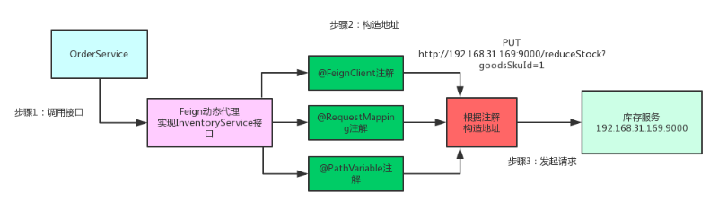
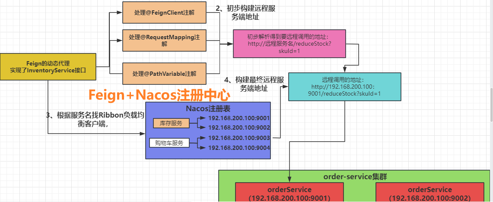

# Cloud核心中间件

## 目录

- [1、Nacos](#1Nacos)
  - [1、注册中心如何选型？](#1注册中心如何选型)
  - [2、什么是Nacos，主要用来作什么？](#2什么是Nacos主要用来作什么)
  - [3、Nacos是AP的还是CP的？](#3Nacos是AP的还是CP的)
  - [4、Nacos如何实现的配置变化客户端可以感知到？](#4Nacos如何实现的配置变化客户端可以感知到)
  - [5、Nacos能同时实现AP和CP的原理是什么？](#5Nacos能同时实现AP和CP的原理是什么)
  - [6、Nacos服务发现的原理](#6Nacos服务发现的原理)
  - [7、Nacos注册中心原理](#7Nacos注册中心原理)
- [2、Feign](#2Feign)

## **1、Nacos**

### 1、注册中心如何选型？

选择注册中心时，需要考虑以下几个方面的因素：&#x20;

1. 高可用性：注册中心是服务治理的核心组件，因此高可用性是非常重要的。注册中心应该能够容忍单点故障，并且能够自动进行故障转移和恢复。
2. 性能和扩展性：注册中心需要能够处理大量的服务实例注册和查询请求，并保持较低的延迟。此外，注册中心还应该支持水平扩展，以应对日益增长的服务规模。
3. 数据一致性：注册中心应该保证数据的一致性，即使在面对网络分区或节点故障的情况下也能保持数据的可靠性和准确性。
4. 安全性：注册中心应该提供合适的安全机制，包括身份认证、访问控制和数据加密等，以保护服务实例的注册信息和通信数据的安全。
5. 功能和灵活性：注册中心应该提供丰富的功能，如服务发现、负载均衡、服务路由、健康检查等，还应该具备灵活的配置和扩展能力，以满足不同的业务需求。
6. 社区支持和生态系统：选择一个有活跃的社区和丰富的生态系统的注册中心，可以获得更好的技术支持和资源，以及更多的集成和扩展选项。

常见的注册中心选型包括：ZooKeeper、Consul、Etcd、Eureka等。每个注册中心都有其特点和优势，需要根据具体的业务需求和技术栈来选择适合的注册中心。同时，也可以考虑多个注册中心组合使用，以实现高可用性和灵活性的要求。

### 2、什么是Nacos，主要用来作什么？

Nacos是一个开源的分布式服务注册和配置中心。它提供了服务注册、发现、配置和管理的能力，可以帮助开发者构建和管理微服务架构。

主要功能包括：

1. 服务注册与发现：Nacos充当了服务注册中心的角色，服务提供者通过向Nacos注册自己的服务，使得服务消费者能够方便地发现和调用服务。
2. 动态配置管理：Nacos提供了统一的配置管理功能，可以集中管理应用程序的配置信息。它支持动态刷新配置，可以在运行时动态修改应用程序的配置，而无需重启应用。
3. 服务路由与负载均衡：Nacos可以根据服务的健康状况和负载情况，动态地进行服务路由和负载均衡，以提供更好的服务质量和可用性。
4. 服务共享与版本管理：Nacos支持多租户的服务共享，不同的租户可以共享同一个服务。同时，Nacos还提供了版本管理功能，可以管理不同版本的服务。
5. 服务监控与治理：Nacos提供了服务的健康检查和监控功能，可以实时监控服务的状态和性能指标。此外，Nacos还提供了服务熔断、限流等治理能力，以提高系统的稳定性和可靠性。

总之，Nacos是一个功能强大的分布式服务注册和配置中心，它可以帮助开发者简化微服务架构的开发和管理工作，提高系统的弹性和可伸缩性。

### 3、Nacos是AP的还是CP的？

Nacos是一个AP（可用性和分区容忍性）的系统。在分布式系统中，CAP定理指出，一个系统无法同时满足一致性（Consistency）、可用性（Availability）和分区容忍性（Partition tolerance）这三个特性。Nacos选择了AP模型，即在面对网络分区时，为了保证系统的可用性和分区容忍性，它牺牲了一致性。这意味着在网络分区的情况下，Nacos可能会出现数据的不一致性，但它能够保证服务的可用性和高效性。对于服务注册发现、配置管理等功能，Nacos提供了强大的可用性和灵活性，使得开发者能够便捷地构建和管理分布式系统。然而，在某些特定情况下，如果一致性是系统中最重要的特性，那么可能需要考虑选择其他CP模型的系统。

### 4、Nacos如何实现的配置变化客户端可以感知到？

Nacos通过以下机制实现配置变化客户端可以感知到：

1. 长轮询（Long Polling）：客户端可以向Nacos发送一个长轮询请求，如果配置发生变化，Nacos会立即返回配置变化的通知给客户端。客户端在收到通知后可以及时更新本地配置。
2. 客户端缓存：Nacos客户端会在本地缓存配置信息，定期从Nacos服务器拉取最新的配置。当Nacos服务器上的配置发生变化时，客户端会通过定时任务或者其他方式从Nacos服务器获取最新的配置。
3. 事件通知机制：Nacos会将配置变更事件发布给订阅了该配置的客户端。客户端可以订阅特定的配置，当该配置发生变化时，Nacos会发送事件通知给客户端，客户端收到通知后可以进行相应的处理。

通过以上机制，Nacos实现了配置变化的实时感知。客户端可以根据自身的需求选择适合的方式来获取配置变化的通知，并进行相应的处理。这样，当配置发生变化时，客户端可以及时更新配置，实现配置的动态管理。

### 5、Nacos能同时实现AP和CP的原理是什么？

Nacos能够同时实现AP（可用性和分区容忍性）和CP（一致性和分区容忍性）的原理是通过引入不同的组件和机制来实现的。

在Nacos中，服务注册和发现模块采用了AP模型，通过将服务实例的注册信息存储在多个节点上，实现了服务的高可用性和分区容忍性。当某个节点发生故障或网络分区时，其他节点仍然可以提供服务注册和发现的功能。

而配置管理模块则采用了CP模型，通过使用Raft协议来实现一致性。当客户端更新配置时，Nacos会将配置写入多个节点的Raft日志中，经过多数节点的确认后才会认为配置写入成功。这保证了配置的一致性。在配置变更时，通过Raft协议的复制机制，确保配置变更在集群中的所有节点上同步，保证了配置的一致性和可靠性。

通过这种方式，Nacos在不同的模块中根据需求选择了合适的一致性和可用性模型，从而同时实现了AP和CP的特性。这使得Nacos能够满足分布式系统在服务注册、发现和配置管理等方面的需求，提供高可用性、弹性和可靠性的服务。

### 6、Nacos服务发现的原理

服务发现：

调用方在第一去发起远程调用的时候，会把远程的服务以及该服务的实例都缓存到本地Map中，当后面在去发起远程调用的时候，就会优先查询本地Map,如果本地Map有，那么直接根据本地Map的数据，去发起远程调用，如若没有，才像远程（Nacos）发送一个请求:/nacos/v1/ns/list.获取到远程数据在同步到缓存。

有了本地缓存机制，就可以保证我未来发起远程调用的时候，更快。但是会带来数据一致性问题。

如何解决本地缓存和远程数据一致性问题：

**1、被动定时拉取**，每隔10s钟会发起一个查询（远程Nacos）最新数据，来同步本地Map这样做虽然能够解决最终这两份数据是一致的，但是在这一次定时任务和下一次定时任务开始之间，远程注册表发生了变化，那么就获取不到远程（Nacos）最新。而对于定时任务发请求去要远程数据这个环节走的是tcp协议，而用了

tcp协议之后就可以保证数据包不丢失。但是tcp协议会有三次握手和四次挥手，因此从效率来说，会慢一些。

初始化1s执行这个定时任务，如果在某一次找远程要的时候没有出现异常，那么这个任务每隔10s会继续执行，但是如果在找远程要数据的时候，出现了异常，那么这个时间就会从2s开始,最多到1min钟结束。

**2、主动推送更新**，一旦远程注册表发生了改变，那么Nacos服务端会主动发送一个事件，并且使用的是udp协议来发送的，接着我客户端只要订阅了这个udp的端口，那么就会让客户端主动去找远程Nacos获取最新的注册表。

upd协议：快，（因为没有三次握手和四种挥手的过程）但是可能会丢失数据包。

最终Ncaos来解决服务发现数据不一致问题是通过TCP协议的定时任务发请求，和UDP协议的主动发送事件请求，来解决一致性的。

### 7、**Nacos注册中心原理**

[0301-Nacos.pdf](file/0301-Nacos_gff_M_penq.pdf " 0301-Nacos.pdf")

[Nacos注册中心AP架构剖析流程图 (1).pdf](<file/Nacos注册中心AP架构剖析流程图 (1)_ziezOyYX7Y.pdf> " Nacos注册中心AP架构剖析流程图 (1).pdf")

**具体细节请结合课上分析。**

# 2、Feign

**Feign的调用原理：**

首先，如果你对某个接口定义了@FeignClient注解，Feign就会针对这个接口创建一个动态代理 &#x20;
Feign的动态代理会根据你在接口上的@RequestMapping等注解，来动态构造出你要请求的服务的地址  最后针对这个地址，发起请求、解析响应。

**Feign+Nacos注册中心原理**：

**Feign的底层调用源码大致流程:**

1.1、判断当前代理的方式是不是equals()、hashCode()、toString().如果是 直接结束，因为本地服务有这些方法，压根不需要从远程来要。 &#x20;

1.2、dispatch.get(method).invoke(args)  **：核心代理逻辑**

从一个派发器中获取解析当前方法的处理器  ---派发器的结构是一个Map--- Map\<Method, MethodHandler>来获取解析这个方法的处理器  。

默认从这个Map中找到的方法处理器是SynchronousMethodHandler---同步方法处理器 &#x20;

1.3、SynchronousMethodHandler.invoke（args） &#x20;

1.3.1 构建一个RequestTemplate。作用是为了发请求的是时候用这个模版造一个请求 &#x20;

细节：根据老的请求模版构建一个新的请求模版，接着会将老的请求模版中的一些参数放到新的请求模版中，但是请求头中参数如果没有在Feign中去指定的话，  那么这个老模版中就没有头，而新模板中也就没有请求头数据。因此后面在用这个新模版创建请求的时候，该请求就没有请求头数据，所以Feign在远程调用时出现了请求头丢失问题。 &#x20;

1.3.2 支持Options---可以独立对自己的业务远程接口去指定一些连接超时时间和读取的超时时间。 &#x20;

1.3.3 得到一个重试器Retryer &#x20;

如果在发送远程调用的时候，出现异常，那么feign在底层会用catch捕捉到， &#x20;

然后进行重试---  retryer.continueOrPropagate(e); &#x20;

但是对于重试feign自己也有规则： &#x20;

如果一旦在重试期间出现了异常，直接将异常抛出，结束这一次远程调用。 &#x20;

如果在重试期间没有出现异常，但是feign通过最大次数（5次调用）如果到了最大次数5 那么feign仍然是会抛出异常，结束这一次远程调用。 &#x20;

1.3.4 executeAndDecode---执行并解码（执行：指的是要去给远程发请求 解码：远程给我的数据都是字节流 我要将自字节流转成我业务能用的对象【反序列化】 ） &#x20;

1.3.4.1 发送请求 &#x20;

response = client.execute(); &#x20;

\---根据服务名从Nacos找到该服务下的所有客户端，然后负载均衡的掉用某一个。并且在第一次找该客户端的时候， &#x20;

会将第一次找到的这个客户端放到缓存中去，下一次再来发起远程调用的时候，直接从缓存中获取该客户端。&#x20;

1.3.4.2 对响应的数据进行反序列化 &#x20;

handleResponse();

**远程调用的本质**：

1、建立连接 &#x20;
2、给远程发送请求 &#x20;
3、远程处理数据 &#x20;
4、远程响应数据 &#x20;
5、将数据进行渲染
