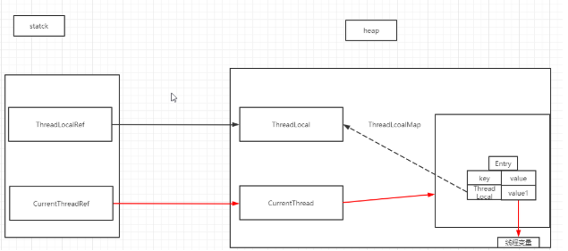
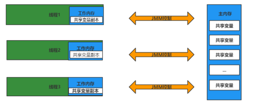
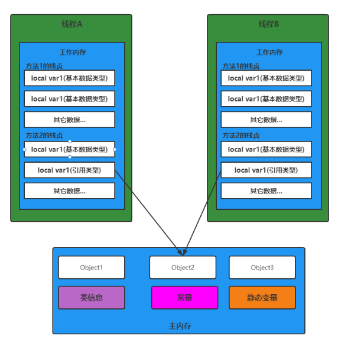
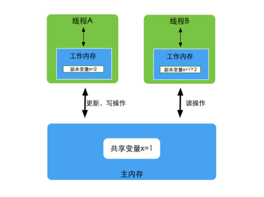
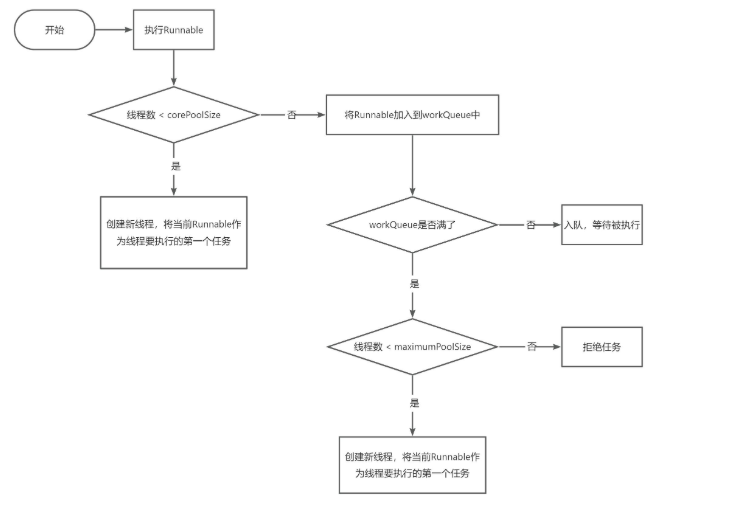
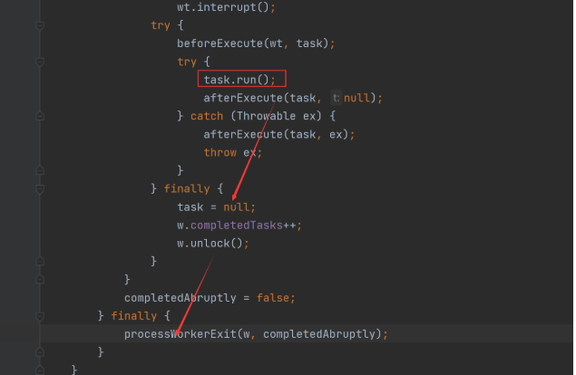
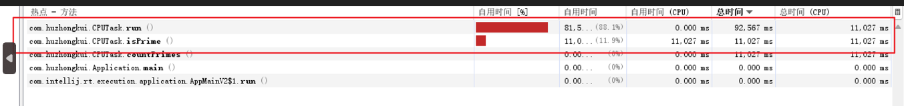

# 线程、并发

## 目录

- [1、什么是并发？](#1什么是并发)
- [2、并发和并行有什么区别？](#2并发和并行有什么区别)
- [3、为什么要使用并发？](#3为什么要使用并发)
- [4、并发编程有哪些缺点？](#4并发编程有哪些缺点)
- [5、上下文切换是什么？](#5上下文切换是什么)
- [6、使用多线程可能会带来什么问题？](#6使用多线程可能会带来什么问题)
- [7、简要总结线程与进程的关系？](#7简要总结线程与进程的关系)
- [8、sleep()、wait()、join()、yield()的区别](#8sleepwaitjoinyield的区别)
- [9、谈谈对线程安全的理解](#9谈谈对线程安全的理解)
- [10、Thread和Runnable的区别](#10Thread和Runnable的区别)
- [11、谈谈对守护线程的理解](#11谈谈对守护线程的理解)
- [12、ThreadLocal的原理和使用场景](#12ThreadLocal的原理和使用场景)
- [13、ThreadLocal内存泄露原因，如何避免](#13ThreadLocal内存泄露原因如何避免)
- [14、并发的三大特征](#14并发的三大特征)
- [15、JMM内存模型](#15JMM内存模型)
- [16、JMM存在的必要性](#16JMM存在的必要性)
- [17、谈谈Volatile关键字的理解](#17谈谈Volatile关键字的理解)
  - [1、验证可见性](#1验证可见性)
  - [2、验证有序性](#2验证有序性)
  - [3、不具备原子性](#3不具备原子性)
- [18、为什么用线程池？解释下线程池参数？](#18为什么用线程池解释下线程池参数)
- [19、JUC线程池的工作原理](#19JUC线程池的工作原理)
- [20、线程池的五种状态是如何流转的](#20线程池的五种状态是如何流转的)
- [21、线程池为什么一定得是阻塞队列？](#21线程池为什么一定得是阻塞队列)
- [22、线程发生异常，会被移出线程池吗？](#22线程发生异常会被移出线程池吗)
- [23、线程池的核心线程数、最大线程数该如何设置？](#23线程池的核心线程数最大线程数该如何设置)
- [24、Tomcat是如何自定义线程池的？](#24Tomcat是如何自定义线程池的)
- [25、volatile变量和atomic变量有什么区别？](#25volatile变量和atomic变量有什么区别)

# 1、什么是并发？

答:是指在一定时间内交替执行多任务的任务。操作时有多个线程CPU运行时间分为几个时间段，然后将时间段分配给每个线程执行。 当线程代码在一段时间内运行时，其他线程处于悬挂状。

# 2、并发和并行有什么区别？

答:并发和并行是一个很容易混淆的概念。并发是指多个任务的交替，而并行是指真正意义上的“同时进行”。事实上，如果系统中只有一个CPU，在实际系统环境中不能并行使用多线程，则只能通过切换时间片来交替执行任务。真正的平行只能出现在拥有多个CPU的系统中。

并发： 同时，许多任务正在执行中 (单位时间内不一定同时执行)；

并行： 在单位时间内，同时执行多项任务。

# 3、为什么要使用并发？

答:并发编程在一定程度上离不开多核CPU的发展。随着单核CPU的研发，无法遵循“摩尔定律”(摩尔定律是基于硬件开发的观测定律，也是基于“摩尔定律”的“反摩尔定律”，不过“反摩尔定律”是软件领域的定律，有兴趣的可以自己理解)，为了进一步提高计算速度，硬件工程师不再追求单独的计算单元，而是将多个计算单元集成在一起，即形成多核CPU。短短十几年，Intel等家用CPU i7可以达到4个甚至8个核心。短短十几年，Intel等家用CPU i7可以达到4个甚至8个核心。专业服务器通常可以达到几个独立的CPU，每个CPU甚至有8个以上的核心。因此，“摩尔定律”它似乎继续体验CPU的核心扩展。在多核CPU的背景下，并发编程的趋势应运而生。通过并发编程，可以充分发挥多核CPU的计算能力，提高其性能。

# 4、并发编程有哪些缺点？

答：（1)上下文切换频繁

时间片是CPU分配给每个线程的时间，因为时间很短，所以CPU不断切换线程，让我们觉得多个线程是同时执行的，时间片通常是几十毫秒。每次切换时，都需要保存当前状态，以恢复以前的状态。这种切换行为非常失去性能。过于频繁的切换不能充分发挥多线程编程的优势。无锁并发编程可用于通常减少上下文切换。 CAS算法，使用最少的线程和使用协程。

（2)线程的安全问题

多线程编程中最难把握的是临界区域的线程安全。如果你不注意，就会有死锁。一旦产生死锁，系统功能将不可用。

# 5、上下文切换是什么？

答：多线程编程中一般线程的数量大于 CPU 核心数，而一个 CPU 为了有效地执行这些线程，核心只能在任何时候使用一个线程，CPU 策略是将时间片分配到每个线程并旋转。当一个线程的时间片用完时，它将重新处于就绪状态，供其他线程使用。这个过程属于上下文切换。

上下文切换通常是计算密集型的。换句话说，它需要相当可观的处理器时间。在每秒几十次或数百次的切换中，每次切换都需要纳秒量级时间。因此，上下文切换意味着系统消耗了大量事实上，CPU时间可能是操作系统中时间消耗最大的操作。Linux与其他操作系统相比(包括其他类别)Unix系统有很多优点，其中之一就是上下文切换和模式切换的时间消耗很少。

# 6、使用多线程可能会带来什么问题？

答：并发编程的目的是提高程序执行效率和程序运行速度，但并发编程并不总是提高程序运行速度，并发编程可能会遇到内存泄漏、上下文切换、死锁、硬件和软件资源闲置等诸多问题。

# 7、简要总结线程与进程的关系？

答:一个进程中可以有多个线程，多个线程共享进程的堆叠和方法区 (JDK1.8 之后的元空间)资源，但每个线程都有自己的程序计数器、虚拟机栈和本地方法栈。综上所述，线程是过程划分为较小的操作单元。线程和进程最大的区别在于，每个进程基本上都是独立的，而每个线程都不一定，因为同一进程中的线程很可能相互影响。线程执行成本小，但不利于资源管理和保护；进程恰恰相反。

# 8、sleep()、wait()、join()、yield()的区别

**1.锁池**
所有需要竞争同步锁的线程都会放在锁池当中，比如当前对象的锁已经被其中一个线程得到，则其他线程需要在这个锁池进行等待，当前面的线程释放同步锁后锁池中的线程去竞争同步锁，当某个线程得到后会进入就绪队列进行等待cpu资源分配。

**2.等待池**
当我们调用wait（）方法后，线程会放到等待池当中，等待池的线程是不会去竞争同步锁。只有调用了notify（）或notifyAll()后等待池的线程才会开始去竞争锁，notify（）是随机从等待池选出一个线程放到锁池，而notifyAll()是将等待池的所有线程放到锁池当中。

1、sleep 是 Thread 类的静态本地方法，wait 则是 Object 类的本地方法。
2、sleep方法不会释放lock，但是wait会释放，而且会加入到等待队列中。
3、sleep方法不依赖于同步器synchronized，但是wait需要依赖synchronized关键字。
4、sleep不需要被唤醒（休眠之后推出阻塞），但是wait需要（不指定时间需要被别人中断）。
5、sleep 一般用于当前线程休眠，或者轮循暂停操作，wait 则多用于多线程之间的通信。
6、sleep 会让出 CPU 执行时间且强制上下文切换，而 wait 则不一定，wait 后可能还是有机会重新竞争到锁继续执行的。

yield（）执行后线程直接进入就绪状态，马上释放了cpu的执行权，但是依然保留了cpu的执行资格，所以有可能cpu下次进行线程调度还会让这个线程获取到执行权继续执行。

join（）执行后线程进入阻塞状态，例如在线程B中调用线程A的join（），那线程B会进入到阻塞队列，直到线程A结束或中断线程。

```java
public static void main(String[] args) throws InterruptedException {
Thread t1 = new Thread(new Runnable() {
@Override
public void run() {
try {
Thread.sleep(3000);
} catch (InterruptedException e) {

e.printStackTrace();
}
System.out.println("22222222");
}
});
t1.start();
t1.join();
// 这行代码必须要等t1全部执行完毕，才会执行
System.out.println("1111");
}
```

# 9、谈谈对线程安全的理解

不是线程安全、应该是内存安全，堆是共享内存，可以被所有线程访问。

```text
当多个线程访问一个对象时，如果不用进行额外的同步控制或其他的协调操作，调用这个对象的行为都可以获得正确的结果，我们就说这个对象是线程安全的。
```

**堆**是进程和线程共有的空间，分全局堆和局部堆。全局堆就是所有没有分配的空间，局部堆就是用户分配的空间。堆在操作系统对进程初始化的时候分配，运行过程中也可以向系统要额外的堆，但是用完了要还给操作系统，要不然就是内存泄漏。

```纯文本
在Java中，堆是Java虚拟机所管理的内存中最大的一块，是所有线程共享的一块内存区域，在虚
拟机启动时创建。堆所存在的内存区域的唯一目的就是存放对象实例，几乎所有的对象实例以及
数组都在这里分配内存。
```

**栈**是每个线程独有的，保存其运行状态和局部自动变量的。栈在线程开始的时候初始化，每个线程的栈互相独立，因此，栈是线程安全的。操作系统在切换线程的时候会自动切换栈。栈空间不需要在高级语言里面显式的分配和释放。

目前主流操作系统都是多任务的，即多个进程同时运行。为了保证安全，每个进程只能访问分配给自己的内存空间，而不能访问别的进程的，这是由操作系统保障的。

在每个进程的内存空间中都会有一块特殊的公共区域，通常称为堆（内存）。进程内的所有线程都可以访问到该区域，**这就是造成问题的潜在原因。**

# 10、Thread和Runnable的区别

Thread和Runnable的实质是继承关系，没有可比性。无论使用Runnable还是Thread，都会newThread，然后执行run方法。用法上，如果有复杂的线程操作需求，那就选择继承Thread，如果只是简单的执行一个任务，那就实现runnable。

```java
//会卖出多一倍的票
public class Test {
    public static void main(String[] args) {
        // TODO Auto-generated method stub
        new MyThread().start();
        new MyThread().start();
        }
            static class MyThread extends Thread{
                private int ticket = 5;
                public void run(){
                while(true){
                System.out.println("Thread ticket = " + ticket--);
                if(ticket < 0){
                    break;
                }
            }
        }
    }
}
```

```java
//正常卖出
public class Test2 {
public static void main(String[] args) {
// TODO Auto-generated method stub
MyThread2 mt=new MyThread2();
new Thread(mt).start();
new Thread(mt).start();
}
static class MyThread2 implements Runnable{
private int ticket = 5;
public void run(){
while(true){
System.out.println("Runnable ticket = " + ticket--);
if(ticket < 0){
break;
}
}
}
}
}
```

原因是：MyThread创建了两个实例，自然会卖出两倍，属于用法错误。

# 11、谈谈对守护线程的理解

**守护线程：** 为所有非守护线程提供服务的线程；任何一个守护线程都是整个JVM中所有非守护线程的保姆；
守护线程类似于整个进程的一个默默无闻的小喽喽；它的生死无关重要，它却依赖整个进程而运行；哪天其他线程结束了，没有要执行的了，程序就结束了，理都没理守护线程，就把它中断了；

注意： 由于守护线程的终止是自身无法控制的，因此千万不要把IO、File等重要操作逻辑分配给它；因为它不靠谱；

**守护线程的作用是什么？**
举例， GC垃圾回收线程：就是一个经典的守护线程，当我们的程序中不再有任何运行的Thread,程序就不会再产生垃圾，垃圾回收器也就无事可做，所以当垃圾回收线程是JVM上仅剩的线程时，垃圾回收线程会自动离开。它始终在低级别的状态中运行，用于实时监控和管理系统中的可回收资源。

**应用场景：**

（1）来为其它线程提供服务支持的情况；

（2） 或者在任何情况下，程序结束时，这个线程必须正常且立刻关闭，就可以作为守护线程来使用；反之，如果一个正在执行某个操作的线程必须要正确地关闭掉否则就会出现不好的后果的话，那么这个线程就不能是守护线程，而是用户线程。通常都是些关键的事务，比方说，数据库录入或者更新，这些操作都是不能中断的。

thread.setDaemon(true)必须在thread.start()之前设置，否则会跑出一个IllegalThreadStateException异常。你不能把正在运行的常规线程设置为守护线程。

在Daemon线程中产生的新线程也是Daemon的。
守护线程不能用于去访问固有资源，比如读写操作或者计算逻辑。因为它会在任何时候甚至在一个操作的中间发生中断。

Java自带的多线程框架，比如ExecutorService，会将守护线程转换为用户线程，所以如果要使用后台线程就不能用Java的线程池。

# 12、ThreadLocal的原理和使用场景

每一个 Thread 对象均含有一个 ThreadLocalMap 类型的成员变量 threadLocals ，它存储本线程中所有ThreadLocal对象及其对应的值ThreadLocalMap 由一个个 Entry 对象构成Entry 继承自 WeakReference\<ThreadLocal\<?>> ，一个 Entry 由 ThreadLocal 对象和 Object 构成。由此可见， Entry 的key是ThreadLocal对象，并且是一个弱引用。当没指向key的强引用后，该
key就会被垃圾收集器回收。

当执行set方法时，ThreadLocal首先会获取当前线程对象，然后获取当前线程的ThreadLocalMap对象。再以当前ThreadLocal对象为key，将值存储进ThreadLocalMap对象中。
get方法执行过程类似。ThreadLocal首先会获取当前线程对象，然后获取当前线程的ThreadLocalMap对象。再以当前ThreadLocal对象为key，获取对应的value。

由于每一条线程均含有各自私有的ThreadLocalMap容器，这些容器相互独立互不影响，因此不会存在线程安全性问题，从而也无需使用同步机制来保证多条线程访问容器的互斥性。

使用场景：
1、在进行对象跨层传递的时候，使用ThreadLocal可以避免多次传递，打破层次间的约束。
2、Spring框架进行事务操作，用于存储线程事务信息。
3、Spring框架数据库连接，Session会话管理。

4、SpringMVC框架的处理器请求管理。

```text
Spring框架在事务开始时会给当前线程绑定一个Jdbc Connection,在整个事务过程都是使用该线程绑定的connection来执行数据库操作，实现了事务的隔离性。Spring框架里面就是用的ThreadLocal来实现这种隔离
```

**例子：example:**

```java
package com.hzk.test.my;
/**
 * @Author huzhongkui
 * @Date 2022--04--20 21:14
 * 聪明出于勤奋,天才在于积累
 **/
public class Person {

    private ThreadLocal<String> name = new ThreadLocal<>();

    public void setName(String name) {
        this.name.set(name);
    }

    public String getName() {
        return this.name.get();
    }

    public void remove() {
        this.name.remove();
    }

}


```

```java
package com.hzk.test.my;

import java.util.concurrent.TimeUnit;

/**
 * @Author huzhongkui
 * @Date 2022--04--20 21:16
 * 聪明出于勤奋,天才在于积累
 **/
public class Test {

    public static void main(String[] args) {

        Person person = new Person();

        Thread thread1 = new Thread(new Runnable() {

            @Override
            public void run() {
              person.setName("hzk");
                try {
                    TimeUnit.SECONDS.sleep(3);
                } catch (InterruptedException e) {
                    e.printStackTrace();
                }
                System.out.println("线程1==="+person.getName());
            }
        });
        thread1.start();


        Thread thread2 = new Thread(new Runnable() {

            @Override
            public void run() {
                person.setName("hello");
                try {
                    TimeUnit.SECONDS.sleep(3);
                } catch (InterruptedException e) {
                    e.printStackTrace();
                }
                System.out.println("线程2==="+person.getName());
            }
        });
        thread2.start();


    }

}
```

# 13、ThreadLocal内存泄露原因，如何避免

**内存泄露**：为程序在申请内存后，无法释放已申请的内存空间，一次内存泄露危害可以忽略，但内存泄露堆积后果很严重，无论多少内存,迟早会被占光，不再会被使用的对象或者变量占用的内存不能被回收，就是内存泄露。

**强引用**：使用最普遍的引用(new)，一个对象具有强引用，不会被垃圾回收器回收。当内存空间不足，Java虚拟机宁愿抛出OutOfMemoryError错误，使程序异常终止，也不回收这种对象。

如果想取消强引用和某个对象之间的关联，可以显式地将引用赋值为null，这样可以使JVM在合适的时间就会回收该对象。

**弱引用**：JVM进行垃圾回收时，无论内存是否充足，都会回收被弱引用关联的对象。在java中，用java.lang.ref.WeakReference类来表示。可以在缓存中使用弱引用。

ThreadLocal的实现原理，每一个Thread维护一个ThreadLocalMap，key为使用弱引用的ThreadLocal实例，value为线程变量的副本。

ThreadLocalMap使用ThreadLocal的弱引用作为key，如果一个ThreadLocal不存在外部强引用时， Key(ThreadLocal)势必会被GC回收，这样就会导致ThreadLocalMap中key为null， 而value还存在着强引用，只有thead线程退出以后,value的强引用链条才会断掉，但如果当前线程再迟迟不结束的话，这些key为null的Entry的value就会一直存在一条强引用链（红色链条）

key使用强引用当ThreadLocalMap的key为强引用回收ThreadLocal时，因为ThreadLocalMap还持有ThreadLocal的强引用，如果没有手动删除，ThreadLocal不会被回收。

key 使用弱引用当ThreadLocalMap的key为弱引用回收ThreadLocal时，由于ThreadLocalMap持有ThreadLocal的弱引用，即使没有手动删除，ThreadLocal也会被回收。当key为null时，调用完set方法之后，在调用remove方法的时候会清除value值。

**因此，内存泄漏的根源是**：由于ThreadLocalMap的生命周期跟Thread一样长，如果没有手动删除对应key的value,就会导致内存泄漏，而不是因为弱引用。

ThreadLocal正确的使用姿势：每次使用完ThreadLocal都调用它的remove()方法清除数据 .



# 14、并发的三大特征

- **原子性：**

原子性是指在一个操作中cpu不可以在中途暂停然后再调度，即不被中断操作，要不全部执行完成，要不都不执行。就好比转账，从账户A向账户B转1000元，那么必然包括2个操作：从账户A减去1000元，往账户B加上1000元。2个操作必须全部完成。

```java
private long count = 0;
public void calc() {
count++;
}
```

1：将 count 从主存读到工作内存中的副本中
2：+1的运算
3：将结果写入工作内存
4：将工作内存的值刷回主存(什么时候刷入由操作系统决定，不确定的)

那程序中原子性指的是最小的操作单元，比如自增操作，它本身其实并不是原子性操作，分了3步的，包括读取变量的原始值、进行加1操作、写入工作内存。所以在多线程中，有可能一个线程还没自增完，可能才执行到第二部，另一个线程就已经读取了值，导致结果错误。那如果我们能保证自增操作是一个原子性的操作，那么就能保证其他线程读取到的一定是自增后的数据。

**关键字：synchronize**d

- **可见性**

当多个线程访问同一个变量时，一个线程修改了这个变量的值，其他线程能够立即看得到修改的值。若两个线程在不同的cpu，那么线程1改变了i的值还没刷新到主存，线程2又使用了i，那么这个i值肯定还是之前的，线程1对变量的修改线程没看到这就是可见性问题。

```java
//线程1
boolean stop = false;
while(!stop){
doSomething();
}
//线程2
stop = true;
```

如果线程2改变了stop的值，线程1一定会停止吗？不一定。当线程2更改了stop变量的值之后，但是还没来得及写入主存当中，线程2转去做其他事情了，那么线程1由于不知道线程2对stop变量的更改，因此还会一直循环下去。

**关键字**：**volatile、synchronized、fina**l

- **有序性**

虚拟机在进行代码编译时，对于那些改变顺序之后不会对最终结果造成影响的代码，虚拟机不一定会按照我们写的代码的顺序来执行，有可能将他们重排序。实际上，对于有些代码进行重排序之后，虽然对变量的值没有造成影响，但有可能会出现线程安全问题。

```java
int a = 0;
bool flag = false;
public void write() {
a = 2; //1
flag = true; //2
}
public void multiply() {
if (flag) { //3
int ret = a * a;//4
}
}
```

write方法里的1和2做了重排序，线程1先对flag赋值为true，随后执行到线程2，ret直接计算出结果，再到线程1，这时候a才赋值为2,很明显迟了一步。
**关键字：volatile、synchronized**

volatile本身就包含了禁止指令重排序的语义，而synchronized关键字是由“一个变量在同一时刻只允许一条线程对其进行lock操作”这条规则明确的。

**synchronized关键字同时满足以上三种特性，但是volatile关键字不满足原子性。**

在某些情况下，volatile的同步机制的性能确实要优于锁(使用synchronized关键字或
java.util.concurrent包里面的锁)，因为volatile的总开销要比锁低。

我们判断使用volatile还是加锁的唯一依据就是volatile的语义能否满足使用的场景(原子性)

# 15、JMM内存模型

Java内存模型(Java Memory Model简称JMM)是一**种抽象的概念，并不真实存在**，它描述的是一组规则或规范，通过这组规范定义了程序中各个变量（包括实例字段，静态字段）的访问方式。JVM运行程序的实体是线程，而每个线程创建时JVM都会为 其创建一个工作内存(有些地方称为栈空间)，用于存储线程私有的数据，而Java内存模型中规定**所有变量都存储在主内存，主内存是共享内存区域，所有线程都可以访问，但线程对变量的操作(读取赋值等)必须在工作内存中进行**，首先要将变量从主内存拷贝的自己的工作内存中，然后对变量进行操作，操作完成后再将变量写回主内存，**不能直接操作主内存中的变量**， 工作内存中存储着主内存中的变量副本拷贝，前面说过，工作内存是每个线程的私有数据区域，因此不同的线程间无法访问对方的工作内存，线程间的通信(传值)必须通过主内存来完成。



JMM规定了内存主要划分为**主内存**和**工作内存**两种。

**主内存**：主要存储的是**Java实例对象**，所有线程创建的实例对象都存放在主内存中，当然也包括了共享的**类信息、常量、静态变量**。由于是共享数据区域，多条线程对同一个变量进行访问可能会发生线程安全问题。

**共享变量**：如果一个变量被多个线程使用，那么这个变量会在每个线程的工作内存中保有一个副本，这种变量就是共享变量。

**工作内存**：主要存储当前方法的所有本地变量信息(工作内存中存储着主内存中的变量副本拷贝)，每 个线程只能访问自己的工作内存，即线程中的本地变量对其它线程是不可见的，就算是两个线 程执行的是同一段代码，它们也会各自在自己的工作内存中创建属于当前线程的本地变量，当 然也包括了字节码行号指示器、相关Native方法的信息。注意由于工作内存是每个线程的私有数据，线程间无法相互访问工作内存，因此存储在工作内存的数据不存在线程安全问题。

模型入下图：（基于JMM规范）



```text
注意：

**JMM**不同于**JVM内存区域模型** 
JMM与JVM内存区域的划分是**不同的概念层次**，更恰当说JMM描述的是一组规则，
通过 这组规则控制程序中各个变量在共享数据区域和私有数据区域的访问方式，JMM是围绕原子性，有序性、可见性展开。
JMM与Java内存区域唯一相似点，都存在共享数据区域和私有数据区域，在JMM中主内存属于共享数据区域，
从某个程度上讲应该包括了堆和方法区，而工作内存数据线程私有数据区域，从某个程度上讲则应该包括程序计数器、虚拟机栈以及本地方法栈。
```

```纯文本
JMM对共享内存的操作做出了如下两条规定：
- 线程对共享内存的所有操作都必须在自己的工作内存中进行，不能直接从主内存中写；
- 不同线程无法直接访问其他线程工作内存中的变量，因此共享变量的值传递需要通过主内存完成。

```

# 16、JMM存在的必要性

由于JVM运行程序的实体是线程，而每个线程创建时JVM都会为其创建一个工作内存(有些地方称为栈空间)，用于存储线程私有的数据，线程与主内存中的变量操作必须通过工作内存间接完成，主要过程是将变量从主内存拷贝的每个线程各自的工作内存空间，然后对变量进行操作，操作完成后再将变量写回主内存，那么如果存在两个线程同时对一个主内存中的实例对象的变量进行操作就有可能诱发线程安全问题。

假设主内存中存在一个共享变量x（初始值为1），现在有A和B两条线程分别对该变量x=1进行操作， A/B线程各自的工作内存中存在共享变量副本x。假设现在A线程想要修改x的值为2，而B线程却想要读取x的值，那么B线程读取到的值是A线程更新后的值2还是更新前的值1呢？答案是，不确定。

即B线程有可能读取到A线程更新前的值1，也有可能读取到A线程更新后的值2，这是 因为工作内存是每个线程私有的数据区域，而线程A操作变量x时（**即将x=1拷贝到自己的工作内存中**），首先是将变量从主内存拷贝到A线程的工作内存中，然后对变量进行操作，操作完成后再将变量x写回主内存，而对于B线程的也是类似的，这样就有可能造成主内存与工作内存间数据存在一致性问题，假如A线程修改完后正在将数据写回主内存，而B线程此时正在读取主内存， 这样B线程读取到的值就是x=1，但如果A线程已将x=2写回主内存后，B线程才开始读取的话，那么此时B线程读取到的就是x=2。



# 17、谈谈Volatile关键字的理解

#### 1、验证可见性

```java
public class VolatileDemo {

    static Integer int flag = 1;
    //static  volatile Integer int flag = 1;
    public static void main(String[] args) {
        new Thread(new Runnable() {
            @Override
            public void run() {
                System.out.println("我是子线程A工作内存flag的值：" + flag);
                while (flag == 1) {

                }
                System.out.println("子线程结束:"+flag);
            }
        }, "A").start();
        try {
            Thread.sleep(1000);//让线程完全启动
        } catch (InterruptedException e) {
            e.printStackTrace();
        }
        flag = 2;
        System.out.println("我是主线程工作内存flag的值：" + flag);
    }
}
```

#### 2、验证有序性

```java
public class VolatileOrderDemo {
    static int x, y;
    static int a, b;
     //static int x, y;
    //static volatile int a, b;

    public static void main(String[] args) throws InterruptedException {
        int i = 0;
        while (true) {
            i++;
            a = b = x = y = 0;
            Thread thread1 = new Thread(() -> {
                a = 1;
                x = b;
            });

            Thread thread2 = new Thread(() -> {
                b = 1;
                y = a;
            });
            thread1.start();
            thread2.start();
             Thread.sleep(10);
            thread1.join();
            thread2.join();
            System.out.println("第" + i + "次打印：x=" + x + ",y=" + y);
            if (x == 0 && y == 0) {
                break;
            }
        }
        
    }
}
```

#### 3、不具备原子性

```java
class MyAtomic {
    private Integer number = 0;
    public int incr() {
      return number++;
    }
}

public class VolatileAtomicDemo {
    public static void main(String[] args) {
        MyAtomic myAtomic = new MyAtomic();

        for (int i = 0; i <1000 ; i++) {
            new Thread(()->{
                System.out.println(myAtomic.incr());
            }).start();
        }
    }
}
```

# 18、为什么用线程池？解释下线程池参数？

1、降低资源消耗；提高线程利用率，降低创建和销毁线程的消耗。
2、提高响应速度；任务来了，直接有线程可用可执行，而不是先创建线程，再执行。
3、提高线程的可管理性；线程是稀缺资源，使用线程池可以统一分配调优监控。

**线程池参数：****corePoolSize** 代表核心线程数，也就是正常情况下创建工作的线程数，这些线程创建后并不会
消除，而是一种常驻线程。

**maxinumPoolSize** 代表的是最大线程数，它与核心线程数相对应，表示最大允许被创建的线程数，比如当前任务较多，将核心线程数都用完了，还无法满足需求时，此时就会创建新的线程，但是线程池内线程总数不会超过最大线程数。
**keepAliveTime 、 unit** 表示超出核心线程数之外的线程的空闲存活时间，也就是核心线程不会
消除，但是超出核心线程数的部分线程如果空闲一定的时间则会被消除,我们可以通过
setKeepAliveTime 来设置空闲时间。

\*\*workQueue \*\*用来存放待执行的任务，假设我们现在核心线程都已被使用，还有任务进来则全部放
入队列，直到整个队列被放满但任务还再持续进入则会开始创建新的线程。

**ThreadFactory** 实际上是一个线程工厂，用来生产线程执行任务。我们可以选择使用默认的创建
工厂，产生的线程都在同一个组内，拥有相同的优先级，且都不是守护线程。当然我们也可以选择
自定义线程工厂，一般我们会根据业务来制定不同的线程工厂。

**Handler** 任务拒绝策略，有两种情况，第一种是当我们调用 shutdown 等方法关闭线程池后，这
时候即使线程池内部还有没执行完的任务正在执行，但是由于线程池已经关闭，我们再继续想线程
池提交任务就会遭到拒绝。另一种情况就是当达到最大线程数，线程池已经没有能力继续处理新提
交的任务时，这是也就拒绝。

# 19、JUC线程池的工作原理

1. 在创建了线程池后，线程池中的**线程数为零**。
2. 当调用execute()方法添加一个请求任务时，线程池会做出如下判断：
   1. 如果正在运行的线程数量**小于corePoolSize**，那么马上**创建线程**运行这个任务；
   2. 如果正在运行的线程数量**大于或等于corePoolSize**，那么**将这个任务放入队列**；
   3. 如果这个时候队列满了且正在运行的线程数量还**小于maximumPoolSize**，那么还是要**创建非核心线程**立刻运行这个任务；
   4. 如果队列满了且正在运行的线程数量**大于或等于maximumPoolSize**，那么线程池会**启动默认的拒绝策略**来执行。
3. 当一个线程完成任务时，它会从队列中取下一个任务来执行。
4. 当一个线程无事可做超过一定的时间（keepAliveTime）时，线程会判断：

   如果当前运行的线程数大于corePoolSize，那么这个线程就被停掉。

   所以线程池的所有任务完成后，**它最终会收缩到corePoolSize的大小**。

   

**注意：提交一个Runnable时，不管当前线程池中的线程是否空闲，只要数量小于核心线程数就会创建新线程。**

**注意：ThreadPoolExecutor相当于是非公平的，比如队列满了之后提交的Runnable可能会比正在排队的Runnable先执行。**

# 20、线程池的五种状态是如何流转的

线程池有五种状态：

- RUNNING：**会**接收新任务并且**会**处理队列中的任务
- SHUTDOWN：**不会**接收新任务并且**会**处理队列中的任务
- STOP：**不会**接收新任务并且**不会**处理队列中的任务，并且会中断在处理的任务。
- TIDYING：所有任务都终止了，线程池中也没有线程了，这样线程池的状态就会转为TIDYING，一旦达到此状态，就会调用线程池的terminated()
- TERMINATED：terminated()执行完之后就会转变为TERMINATED

这五种状态并不能任意转换，只会有以下几种转换情况：

1. RUNNING -> SHUTDOWN：手动调用shutdown()触发，或者线程池对象GC时会调用finalize()从而调用shutdown()
2. (RUNNING or SHUTDOWN) -> STOP：调用shutdownNow()触发，如果先调shutdown()紧着调shutdownNow()，就会发生SHUTDOWN -> STOP
3. SHUTDOWN -> TIDYING：队列为空并且线程池中没有线程时自动转换
4. STOP -> TIDYING：线程池中没有线程时自动转换（队列中可能还有任务）
5. TIDYING -> TERMINATED：terminated()执行完后就会自动转换

# 21 **、线程池为什么一定得是阻塞队列？**

线程池中的线程在运行过程中，执行完创建线程时绑定的第一个任务后，就会不断的从队列中获取任务并执行，那么如果队列中没有任务了，线程为了不自然消亡，就会阻塞在获取队列任务时，等着队列中有任务过来就会拿到任务从而去执行任务。

通过这种方法能最终确保，线程池中能保留指定个数的核心线程数，关键代码：

```java
try {
    Runnable r = timed ?
        workQueue.poll(keepAliveTime, TimeUnit.NANOSECONDS) :
        workQueue.take();
    if (r != null)
        return r;
    timedOut = true;
} catch (InterruptedException retry) {
    timedOut = false;
}
```

某个线程在从队列获取任务时，会判断是否使用超时阻塞获取，我们可以认为非核心线程会poll()，核心线程会take()，非核心线程超过时间还没获取到任务后面就会自然消亡了。

# 22、**线程发生异常，会被移出线程池吗？**

答案是会的，那有没有可能核心线程数在执行任务时都出错了，导致所有核心线程都被移出了线程池？



在源码中，当执行任务时出现异常时，最终会执行processWorkerExit()，执行完这个方法后，当前线程也就自然消亡了，但是！processWorkerExit()方法中会额外再新增一个线程，这样就能维持住固定的核心线程数。

# 23、**线程池的核心线程数、最大线程数该如何设置？**

我们都知道，线程池中有两个非常重要的参数：

1. corePoolSize：核心线程数，表示线程池中的常驻线程的个数
2. maximumPoolSize：最大线程数，表示线程池中能开辟的最大线程个数

那这两个参数该如何设置呢？

我们对线程池负责执行的任务分为三种情况：

1. CPU密集型任务，比如找出1-1000000中的素数
2. IO密集型任务，比如文件IO、网络IO
3. 混合型任务

CPU密集型任务的特点时，线程在执行任务时会一直利用CPU，所以对于这种情况，就尽可能避免发生线程上下文切换。

比如，现在我的电脑只有一个CPU，如果有两个线程在同时执行找素数的任务，那么这个CPU就需要额外的进行线程上下文切换，从而达到线程并发的效果，此时执行这两个任务的总时间为：

任务执行时间\*2+线程上下文切换的时间

而如果只有一个线程，这个线程来执行两个任务，那么时间为：

任务执行时间\*2

所以对于CPU密集型任务，线程数最好就等于CPU核心数，可以通过以下API拿到你电脑的核心数：

```java
Runtime.getRuntime().availableProcessors()
```

只不过，为了应对线程执行过程发生异常导致线程阻塞的请求，我们可以额外在多设置一个线程，这样当某个线程暂时不需要CPU时，可以有替补线程来继续利用CPU。

所以，对于CPU密集型任务，我们可以设置线程数为：**CPU核心数+1**

我们在来看IO型任务，线程在执行IO型任务时，可能大部分时间都阻塞在IO上，假如现在有10个CPU，如果我们只设置了10个线程来执行IO型任务，那么很有可能这10个线程都阻塞在了IO上，这样这10个CPU就都没活干了，所以，对于IO型任务，我们通常会设置线程数为：**2\*CPU核心数**

不过，就算是设置为了**2\*CPU核心数**，也·不一定是最佳的，比如，有10个CPU，线程数为20，那么也有可能这20个线程同时阻塞在了IO上，所以可以再增加线程，从而去压榨CPU的利用率。

**通常，如果IO型任务执行的时间越长，那么同时阻塞在IO上的线程就可能越多，我们就可以设置更多的线程，但是，线程肯定不是越多越好**，我们可以通过以下这个公式来进行计算：

线程数 = CPU核心数   \*（ 1 + 线程等待时间 / 线程运行总时间 ）

- 线程等待时间：指的就是线程没有使用CPU的时间，比如阻塞在了IO
- 线程运行总时间：指的是线程执行完某个任务的总时间

我们可以利用jvisualvm抽样来估计这两个时间：



图中表示，在刚刚这次抽样过程中，run()总共的执行时间为92567ms，利用了CPU的时间为11027ms，所以没有利用CPU的时间为92567ms-11027ms。

所以我们可以计算出：

线程等待时间 = 92567ms-11027ms。

线程运行总时间 =92567ms

所以：线程数 = 20 \*（ 1 + （92567ms-11027ms） / 92567ms ）= [37.xxx](http://37.xxx "37.xxx")

所以根据公式算出来的线程为37、38个线程左右。

按上述公式，如果我们执行的任务IO密集型任务，那么：线程等待时间 = 线程运行总时间，所以：

线程数 = CPU核心数 \*（ 1 + 线程等待时间 / 线程运行总时间 ）

\= CPU核心数 \*（ 1 + 1 ）

\= CPU核心数 \* 2

以上只是理论，实际工作中情况会更复杂，比如一个应用中，可能有多个线程池，除开线程池中的线程可能还有很多其他线程，或者除开这个应用还是一些其他应用也在运行，所以实际工作中如果要确定线程数，最好是压测。

```java
@RestController
public class HzkController {

    @GetMapping("/test")
    public String test() throws InterruptedException {
        Thread.sleep(1000);
        return "success";
    }

}
```

这个接口会执行1s，我现在利用apipost来压：


这是在Tomcat默认最大200个线程的请求下的压测结果。

当我们把线程数调整为500：


发现执行效率提高了一倍，假如再增加线程数到1000：


提升就不那么高了。

总结，我们再工作中，对于：

1. CPU密集型任务：CPU核心数+1，这样既能充分利用CPU，也不至于有太多的上下文切换成本
2. IO型任务：建议压测，或者先用公式计算出一个理论值（理论值通常都比较小）
3. 对于核心业务（访问频率高），可以把核心线程数设置为我们压测出来的结果，最大线程数可以等于核心线程数，或者大一点点，比如我们压测时可能会发现500个线程最佳，但是600个线程时也还行，此时600就可以为最大线程数
4. 对于非核心业务（访问频率不高），核心线程数可以比较小，避免操作系统去维护不必要的线程，最大线程数可以设置为我们计算或压测出来的结果。

# 24、Tomcat是如何自定义线程池的？

Tomcat中用的线程池为org.apache.tomcat.util.threads.ThreadPoolExecutor，注意类名和JUC下的一样，但是包名不一样。

Tomcat会创建这个线程:

```java
public void createExecutor() {
    internalExecutor = true;
    TaskQueue taskqueue = new TaskQueue();
    TaskThreadFactory tf = new TaskThreadFactory(getName() + "-exec-", daemon, getThreadPriority());
    executor = new ThreadPoolExecutor(getMinSpareThreads(), getMaxThreads(), 60, TimeUnit.SECONDS,taskqueue, tf);
    taskqueue.setParent( (ThreadPoolExecutor) executor);
}
```

注意传入的队列为TaskQueue，它的入队逻辑为:

```java
public boolean offer(Runnable o) {
    //we can't do any checks
    if (parent==null) {
        return super.offer(o);
    }

    //we are maxed out on threads, simply queue the object
    if (parent.getPoolSize() == parent.getMaximumPoolSize()) {
        return super.offer(o);
    }

    //we have idle threads, just add it to the queue
    if (parent.getSubmittedCount()<=(parent.getPoolSize())) {
        return super.offer(o);
    }

    //if we have less threads than maximum force creation of a new thread
    if (parent.getPoolSize()<parent.getMaximumPoolSize()) {
        return false;
    }

    //if we reached here, we need to add it to the queue
    return super.offer(o);
}
```

特殊在：

- 入队时，如果线程池的线程个数等于最大线程池数入队。
- 入队时，如果线程池有闲置线程，任务依旧入队。
- 入队时，如果线程池的线程个数小于最大线程池数，会返回false，表示入队失败，则去创建线程。

这样就控制了，Tomcat的这个线程池，在提交任务时：

1. 不会先判断线程个数是否小于核心线程数，而是提前创建10个核心线程。
2. 如果等于最大线程数，会入队，但是线程个数小于最大线程数会入队失败，从而会去创建线程

所以随着任务的提交，会优先创建线程，直到线程个数等于最大线程数才会入队。

当然其中有一个比较细的逻辑是：在提交任务时，如果正在处理的任务数小于线程池中的线程个数，那么也会直接入队，而不会去创建线程，也就是上面源码中getSubmittedCount的作用。

# 25、volatile变量和atomic变量有什么区别？

答：首先，volatile变量看起来像atomic变量，但功能不同。Volatile变量可以保证先行关系，即后续读操作前会发生写操作， 但它不能保证原子性。例如，如果用volatile修改count变量，那么counttile++ 操作不是原子性的。Atomicinteger类提供的Atomic方法可以使该操作具有原子性，如getandincrement()方法可以增加原子性，并添加当前值，其他数据类型和引用变量也可以进行类似的操作。
