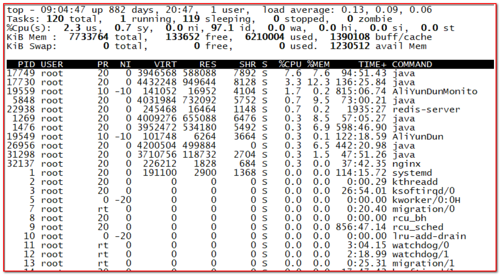

# 项目上线问题排查

## 目录

- [1、RT飙高问题排查过程](#1RT飙高问题排查过程)
- [2、CPU飙高问题排查过程](#2CPU飙高问题排查过程)
- [3、数据库连接池满排查过程](#3数据库连接池满排查过程)
- [4、数据库CPU被打满排查过程](#4数据库CPU被打满排查过程)
- [5、OOM问题排查过程](#5OOM问题排查过程)
- [6、频繁FullGC问题排查](#6频繁FullGC问题排查)
- [7、Arthas统计方法耗时的原理是什么？](#7Arthas统计方法耗时的原理是什么)
- [8、慢SQL问题排查](#8慢SQL问题排查)
- [9、Load飙高问题排查过程](#9Load飙高问题排查过程)

# 1、RT飙高问题排查过程

当遇到实时（RT）飙高的问题时，可以按照以下步骤进行排查：

1. **确认问题现象：** 首先，需要明确实时飙高的具体表现和受影响的方面。例如，是CPU使用率飙高还是网络延迟增加，是某个特定服务的响应时间增长，还是整个系统的吞吐量下降等。
2. **监测系统指标：** 使用系统监控工具或性能分析工具来收集系统的关键指标。这些指标包括CPU使用率、内存使用率、网络吞吐量、磁盘IO等。通过监测这些指标，可以了解系统在实时飙高期间的状态。
3. **查看日志和错误信息：** 检查系统日志和错误日志，寻找与实时飙高相关的任何错误或异常信息。这些信息可能会提供有关问题原因的线索，例如异常堆栈跟踪、错误消息等。
4. **分析负载和请求模式：** 研究实时飙高期间的负载和请求模式。检查是否有异常的请求频率或请求量增加，是否有突发的负载压力，以及是否有特定的请求类型或资源导致了飙高问题。
5. **检查系统配置和资源限制：** 检查系统的配置和资源限制，包括服务器硬件配置、操作系统参数、应用程序配置等。确保系统的配置与实际需求相匹配，并且没有过度限制资源的设置。
6. **排查代码问题：** 检查应用程序的代码，寻找可能导致实时飙高的问题。这可能包括低效的算法、循环中的死循环、资源泄漏、线程阻塞等。使用性能分析工具来确定代码中的瓶颈和性能热点。
7. **排查第三方服务：** 如果系统依赖于第三方服务，检查这些服务是否出现故障或延迟。可能需要联系第三方服务提供商来了解是否存在与实时飙高相关的问题。
8. **进行压力测试和负载测试：** 使用压力测试工具模拟实际负载，并观察系统在高负载情况下的表现。这有助于确定系统的性能极限和可能的瓶颈。
9. **逐步回退变更：** 如果实时飙高问题与最近的系统变更相关，可以逐步回退这些变更，以确定是否有特定的变更引起了飙高问题。
10. **寻求专家帮助：** 如果以上步骤无法解决问题，可以寻求专家的帮助，例如系统管理员、开发人员或性能工程师。他们可能有更深入的知识和经验来解决实时飙高问题。

通过以上排查步骤，可以逐步缩小问题范围，找到实时飙高问题的根本原因，并采取相应的措施来解决问题。

# 2、CPU飙高问题排查过程

排查 CPU 飙高问题的过程可以分为以下步骤：

1. **确认问题：** 首先，要明确 CPU 飙高的问题是否真实存在。可以通过监控工具、系统日志等途径来验证 CPU 使用率是否异常升高。
2. **确定影响范围：** 确定是整个系统的 CPU 使用率升高还是特定进程/应用程序导致的。这可以通过查看系统级别的监控数据和进程级别的监控数据来判断。
3. **分析进程和应用程序：** 如果是特定进程或应用程序导致的 CPU 飙高，就需要分析这些进程/应用程序的行为。可以使用工具如 `top`、`htop`、`ps` 等来查看进程的 CPU 使用率、内存占用、线程数等信息。
4. **查看系统资源使用情况：** 检查内存、磁盘、网络等资源的使用情况，因为资源竞争也可能导致 CPU 飙高。特别注意内存的使用情况，过多的交换（swap）可能会导致 CPU 使用率升高。
5. **检查日志：** 查看系统日志、应用程序日志以及可能的错误日志，以便找到任何异常或错误信息。有时候某些异常事件可能导致 CPU 使用率升高。
6. **性能分析工具：** 使用性能分析工具，如 `perf`、`strace`、`dtrace` 等，来跟踪进程的系统调用、函数调用和事件，以帮助确定是哪些操作导致了 CPU 飙高。
7. **检查代码：** 如果问题与特定应用程序相关，可能需要检查应用程序的代码，查找可能的瓶颈或死循环。代码中可能存在的资源竞争、不合理的循环等问题都可能导致 CPU 使用率升高。
8. **硬件问题排除：** 考虑硬件故障可能导致的问题，如散热不足、硬件损坏等，这些问题也可能导致 CPU 飙高。
9. **升级和优化：** 如果确定问题是由于某个应用程序或组件的性能问题导致的，可以尝试升级软件版本，应用性能优化技巧，或者调整配置参数来缓解问题。
10. **监控和预防：** 一旦问题解决，建议设置持续的监控来跟踪系统和应用程序的性能，以便及时发现并预防类似问题的再次发生。

在排查 CPU 飙高问题时，关键是收集足够的信息，从多个角度进行分析，以便确定问题的根本原因。根据不同的情况，可能需要结合多种方法和工具来解决问题。

# 3、数据库连接池满排查过程

数据库连接池满的报警，报错信息如下

应用报警：4103.ERR\_ATOM\_CONNECTION\_POOL\_FULL，应用数据库连接池满。

陆续出现 4200.ERR\_GROUP\_NOT\_AVALILABLE、4201.ERR\_GROUP\_NO\_ATOM\_AVAILABLE、4202.ERR\_SQL\_QUERY\_TIMEOUT等数据库异常报警。

当数据库连接池满时，可以按照以下步骤进行排查：

1. **确认连接池满的迹象：** 监控数据库连接池的指标，例如连接数、活动连接数、空闲连接数等。如果这些指标达到连接池的最大限制，说明连接池已满。
2. **查看数据库连接池配置：** 检查连接池的配置参数，包括最大连接数、最小空闲连接数、连接超时时间等。确保这些参数的设置合理，并且能够满足系统的需求。
3. **分析连接池使用情况：** 查看连接池的使用情况，包括连接的获取和释放过程。记录下频繁获取连接的代码路径和时间点，以及连接释放是否及时。这有助于找出连接泄露或者连接使用不当的问题。
4. **检查数据库连接资源：** 检查数据库服务器的连接资源情况。查看数据库服务器的最大连接数设置，以及当前连接数是否接近最大限制。如果数据库服务器也存在连接数限制，可以考虑增加最大连接数的配置。
5. **检查数据库性能：** 检查数据库服务器的性能指标，例如 CPU 使用率、内存使用率、磁盘 I/O 等。如果数据库服务器的性能达到瓶颈，可能导致连接池满。优化数据库性能可以缓解连接池满的问题。
6. **检查数据库操作：** 检查应用程序中的数据库操作，包括查询语句、事务处理等。优化数据库操作可以减少连接的占用时间，从而减少连接池的压力。
7. **检查应用程序并发访问：** 检查应用程序的并发访问情况，特别是在高峰时段。如果并发访问量过大，可能会导致连接池满。可以考虑增加连接池的大小或者优化应用程序的并发处理能力。
8. **查看日志和异常信息：** 检查应用程序的日志和异常信息，查找是否有连接池相关的错误或异常。这些信息可以帮助定位连接池满的原因。
9. **性能分析工具：** 使用性能分析工具来跟踪应用程序的数据库连接使用情况，例如连接的创建、销毁、使用时间等。这有助于找出连接使用不当或者泄露的问题。
10. **优化和调整：** 根据排查结果，进行相应的优化和调整。可以调整连接池的配置参数，增加连接池的大小，优化数据库操作，或者增加数据库服务器的性能。

通过以上步骤的排查，可以找出数据库连接池满的原因，并采取相应的措施来解决问题。重要的是收集足够的信息，从多个角度进行分析，以便确定问题的根本原因。

# 4、数据库CPU被打满排查过程

开发经常收到数据库的报警，提示我们的数据库的CPU有异常飙高的情况，通过top命令发现，经常把CPU打满了。

排查数据库CPU被打满的问题通常需要一系列步骤来定位和解决。下面是一般的排查过程：

1. **确认CPU使用率高**: 首先，确保数据库服务器的CPU使用率确实是高的。可以使用操作系统提供的工具（如`top`、`htop`等）或数据库性能监控工具来验证。
2. **检查数据库负载**: 查看数据库的当前负载情况，包括并发连接数、查询数量、事务处理数等。这可以帮助确认是否存在异常的数据库活动。
3. **分析长时间运行的查询**: 使用数据库性能分析工具，如`EXPLAIN`语句、查询计划查看是否有复杂、低效率的查询在运行。优化这些查询可以减轻CPU负担。
4. **检查索引使用情况**: 确保数据库表使用了适当的索引。没有或者不正确使用索引可能导致查询变得非常耗时，进而导致CPU使用率上升。
5. **检查锁等待情况**: 死锁或者大量的锁等待会导致CPU被打满。确保应用程序和数据库使用了合适的锁策略，避免锁争用。
6. **检查硬件资源**: 确保数据库服务器的硬件资源足够，包括CPU核数、内存、磁盘I/O等。不足的硬件资源可能导致CPU过载。
7. **检查并发连接数**: 大量并发连接可能导致CPU过载。评估并优化应用程序连接池的设置，确保不会有过多的闲置连接。
8. **监控长时间运行的进程**: 使用操作系统的工具来监控是否有长时间运行的进程占用了过多的CPU资源。这可能是恶意进程或者其他异常情况。
9. **审查系统日志**: 检查数据库服务器的系统日志，查找异常、错误消息，这有助于找到可能的问题根源。
10. **考虑数据库优化**: 如果排查过程中发现一些持续存在的性能问题，考虑数据库的整体优化，包括配置优化、硬件升级、数据库版本升级等。
11. **性能测试**: 在排查过程结束后，可以进行性能测试，验证优化措施是否有效，是否解决了CPU被打满的问题。

总之，排查数据库CPU被打满的过程需要综合考虑多个因素，从数据库层面、应用程序层面和硬件层面分析，最终找到根本原因并采取相应措施来解决问题。

# 5、OOM问题排查过程

OOM（Out of Memory）问题是指系统内存不足，无法满足进程的内存需求，导致进程被操作系统终止的情况。下面是一般的OOM问题排查过程：

1. **确认OOM错误**: 首先，确认系统中是否发生了OOM错误。可以查看系统日志（如/var/log/messages）或者使用命令`dmesg`来检查系统日志中是否有OOM相关的错误信息。
2. **检查内存使用情况**: 使用系统监控工具（如top、htop）或者命令（如free、vmstat）来检查系统的内存使用情况。确认系统内存是否已经耗尽。
3. **检查进程内存使用**: 确定哪个进程使用了大量的内存。可以使用top命令按内存使用排序，或者使用ps命令查看进程的内存占用情况。
4. **检查内存泄漏**: 如果发现某个进程占用了大量内存，但是没有明显的原因，可能存在内存泄漏的情况。可以使用内存分析工具（如Valgrind）来检测和定位内存泄漏问题。
5. **检查进程资源限制**: 确认进程的资源限制是否合理，包括内存限制（ulimit -a）和文件描述符限制（ulimit -n）。如果限制过低，可能导致进程无法获取足够的内存资源。
6. **检查系统交换空间**: 确认系统是否启用了交换空间（swap），以及交换空间的大小。如果交换空间过小或者未启用，当内存不足时，系统无法将部分内存数据交换到磁盘，从而导致OOM错误。
7. **检查程序日志**: 检查程序的日志文件，查找是否有与内存使用相关的错误或异常信息。这有助于定位程序中可能导致OOM的问题。
8. **优化程序内存使用**: 根据具体情况，优化程序的内存使用方式。可以考虑使用内存池、减少内存分配次数、释放不再使用的内存等方法来降低内存占用。
9. **调整系统配置**: 根据具体情况，可能需要调整系统的内核参数或者其他配置，以提高系统的内存管理和利用效率。
10. **增加硬件资源**: 如果经过优化和调整后仍然无法解决OOM问题，可能需要考虑增加系统的硬件资源，如增加内存容量或者升级到更高性能的服务器。

总之，OOM问题的排查过程需要综合考虑多个因素，包括内存使用情况、进程资源限制、系统配置等，通过定位问题原因并采取相应措施来解决问题。

# 6、频繁FullGC问题排查

频繁的Full GC（Full Garbage Collection）问题通常是由于Java应用程序中的内存管理问题导致的。下面是一般的排查过程：

1. **确认Full GC频率**: 首先，确认Full GC确实发生频繁。可以通过查看Java应用程序的GC日志或者性能监控工具来确定Full GC的发生频率和持续时间。
2. **检查堆内存设置**: 确认Java应用程序的堆内存设置是否合理。堆内存过小可能导致频繁的垃圾回收，而堆内存过大可能导致Full GC时间过长。可以通过调整-Xmx和-Xms参数来适当调整堆内存大小。
3. **分析GC日志**: 详细分析GC日志，查看Full GC发生的原因。GC日志中会提供关于垃圾回收的详细信息，包括每个GC阶段的时间、堆内存使用情况、对象分配速率等。通过分析GC日志可以确定Full GC的具体原因。
4. **检查内存泄漏**: 频繁的Full GC可能是由于内存泄漏导致的。使用内存分析工具（如MAT、VisualVM）来检测和定位内存泄漏问题。分析内存快照可以查看对象的引用链，找出造成内存泄漏的代码或对象。
5. **检查对象生命周期**: 确认应用程序中的对象生命周期是否合理。如果有大量长时间存活的对象，可能会导致频繁的Full GC。可以考虑优化对象的创建和销毁方式，减少对象的生命周期。
6. **优化垃圾回收器参数**: 根据具体情况，可以调整垃圾回收器的参数来优化GC性能。不同的垃圾回收器有不同的参数可供调整，如新生代和老年代的比例、垃圾回收算法等。
7. **减少对象分配**: 频繁的Full GC可能是由于过多的对象分配导致的。可以通过重用对象、使用对象池、减少临时对象的创建等方式来降低对象分配的频率。
8. **检查外部资源释放**: 确保应用程序正确释放外部资源，如数据库连接、文件句柄等。未正确释放外部资源可能导致内存泄漏和频繁的Full GC。
9. **增加堆内存或调整GC策略**: 如果经过优化后仍然无法解决频繁的Full GC问题，可以考虑增加堆内存大小或者尝试其他的GC策略，如G1 GC。
10. **性能测试和监控**: 在排查过程结束后，进行性能测试和监控，验证优化措施是否有效，是否解决了频繁的Full GC问题。

总之，频繁的Full GC问题排查需要综合考虑堆内存设置、GC日志分析、内存泄漏、对象生命周期等因素，并采取相应的优化措施来减少Full GC的频率和持续时间。

# 7、Arthas统计方法耗时的原理是什么？

Arthas 是一款用于 Java 应用程序的诊断工具，可以实时地查看和修改应用程序的运行状态。其中一个功能就是统计方法的耗时，这个功能主要是通过对字节码的修改来实现的。

具体原理如下：

1. **字节码修改**: Arthas 使用字节码增强技术，通过在类加载时修改字节码，在方法的入口和出口处插入计时代码。这使得 Arthas 能够在不修改源代码的情况下，动态地统计方法的执行时间。
2. **方法耗时统计**: 当目标方法被调用时，Arthas 在方法入口处记录当前时间戳（start time），然后在方法退出时记录另一个时间戳（end time）。通过这两个时间戳的差值，就可以计算出方法的执行时间，从而实现方法耗时的统计。
3. **展示和分析**: Arthas 收集到方法耗时的数据后，会将这些数据进行汇总并展示给用户。用户可以通过 Arthas 提供的命令或者 Web 控制台来查看方法的平均执行时间、最大执行时间、执行次数等信息，从而快速定位潜在的性能瓶颈。

需要注意的是，由于 Arthas 是通过字节码增强实现方法耗时的统计，所以在某些情况下可能会对应用程序的性能产生一定的影响，特别是当需要对大量方法进行耗时统计时。因此，在生产环境中，应该谨慎使用 Arthas 的耗时统计功能，避免过度的方法耗时统计对应用程序性能造成不必要的影响。

另外，Arthas 还提供了其他强大的功能，如实时查看方法参数、修改方法返回值等，可以帮助开发人员更方便地诊断和调试 Java 应用程序。

# 8、慢SQL问题排查

慢SQL问题是指在数据库中执行的SQL语句花费了过长的时间来完成。下面是一般的慢SQL问题排查过程：

1. **确认慢SQL**: 首先，确认哪些SQL语句被认为是慢SQL。可以通过数据库的性能监控工具或日志来获取执行时间较长的SQL语句。
2. **分析执行计划**: 对于慢SQL，分析其执行计划是非常重要的。执行计划描述了数据库是如何执行SQL语句的，包括使用的索引、表的访问方式等。通过执行计划可以确定是否存在索引缺失、全表扫描等性能问题。
3. **检查索引使用**: 确认慢SQL是否使用了适当的索引。可以通过执行计划或数据库的索引统计信息来判断是否存在索引缺失、索引选择不当等问题。根据需要，可以创建、修改或删除索引来优化查询性能。
4. **优化SQL语句**: 对于慢SQL，可以考虑对SQL语句进行优化。可以通过重写SQL语句、使用更合适的查询方式（如JOIN、子查询等）、避免使用不必要的函数或操作符等来提高查询性能。
5. **检查表结构和数据量**: 确认表的结构是否合理，并检查表中的数据量是否过大。如果表结构不合理或数据量过大，可能会导致查询性能下降。可以考虑调整表结构、拆分大表、分区等方式来优化查询性能。
6. **数据库优化**: 除了SQL语句本身，还可以考虑对数据库进行优化。例如，调整数据库的缓冲区大小、增加内存、优化数据库参数配置等，以提升数据库的整体性能。
7. **使用数据库工具**: 使用数据库性能监控工具或查询分析工具可以更直观地分析慢SQL问题。这些工具可以提供更详细的性能指标、执行计划、索引建议等信息，帮助更准确地定位和解决慢SQL问题。
8. **性能测试和监控**: 在优化慢SQL后，进行性能测试和监控，验证优化措施是否有效，是否解决了慢SQL问题。

总之，慢SQL问题排查需要综合考虑SQL语句本身、索引使用、表结构、数据库配置等多个因素，并采取相应的优化措施来提高查询性能。同时，定期监控数据库的性能，及时发现和解决慢SQL问题，以保证应用程序的正常运行和良好的性能。

# 9、Load飙高问题排查过程

有一个项目，平常都没事的，运行的都比较好，但每次在发布过程中，刚刚重启好机器经常会有cpu利用率和load飙高的现象，导致我们项目的RT变高，反馈有大量超时.

当服务器的负载（Load）飙高，表示服务器正在承受超过其处理能力的负载，导致性能下降或服务不可用。以下是一般的 Load 飙高问题排查过程：

1. **确认负载情况**: 使用系统监控工具（如top、htop等）或性能监控平台，确认服务器的负载情况。负载通常由三个数字表示，分别是1分钟、5分钟和15分钟的平均负载。如果这些数字超过服务器的处理能力，说明负载过高。
2. **检查系统资源使用**: 检查服务器的 CPU、内存、磁盘和网络等资源的使用情况。使用工具（如top、free、iostat等）来查看各个资源的使用情况，确定是否有资源瓶颈导致负载飙高。
3. **查找高负载进程**: 使用系统监控工具或命令（如top、ps等）查找占用系统资源较多的进程。关注 CPU 使用率高的进程，以及可能导致高磁盘IO或网络流量的进程。
4. **分析高负载进程**: 对于占用系统资源较多的进程，进一步分析其原因。可以查看进程的日志、配置文件、线程信息等，以确定是否存在异常情况、死循环、资源竞争等问题。
5. **优化高负载进程**: 根据分析结果，对高负载进程进行优化。可能的优化措施包括改进代码逻辑、减少资源占用、增加缓存、调整线程池大小等。
6. **扩展资源**: 如果负载过高是由于资源不足导致的，可以考虑扩展服务器资源。例如，增加 CPU 核心、扩大内存容量、使用更快的磁盘等。
7. **监控和自动化**: 部署监控系统，实时监测服务器的负载情况，及时发现和解决负载飙高问题。可以设置警报机制，当负载超过一定阈值时，及时通知运维人员。
8. **性能测试和调优**: 在优化措施实施后，进行性能测试和监控，验证是否解决了负载飙高问题，并持续监控服务器的性能，及时调整和优化。

需要注意的是，负载飙高可能由多种原因引起，可能是由于应用程序的问题，也可能是由于系统配置不当或硬件故障等。因此，在排查过程中需要综合考虑多个因素，并采取相应的措施来解决负载飙高问题。
