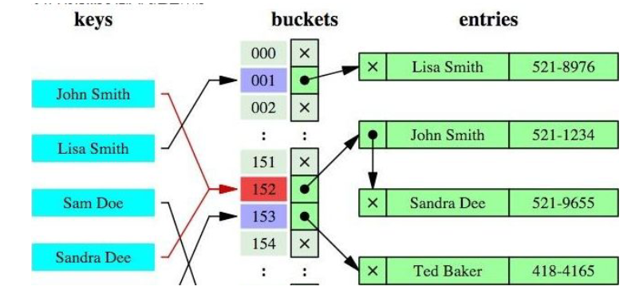
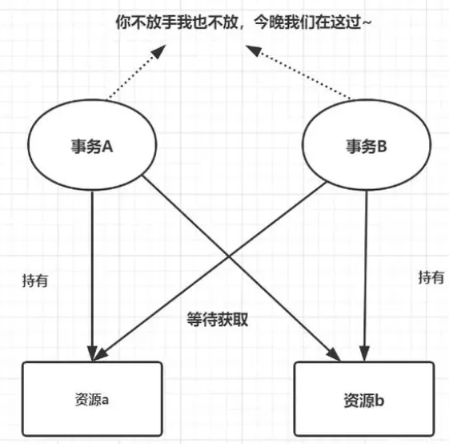
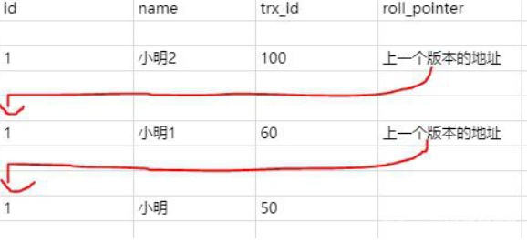
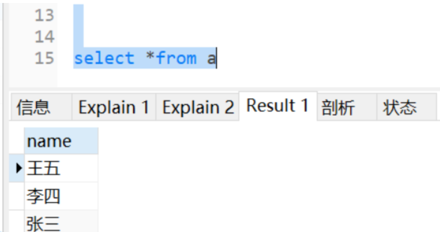
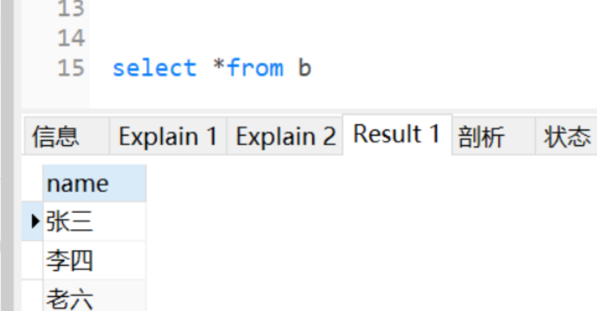
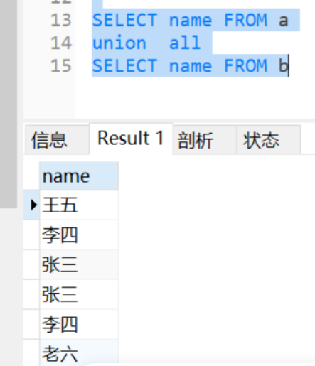
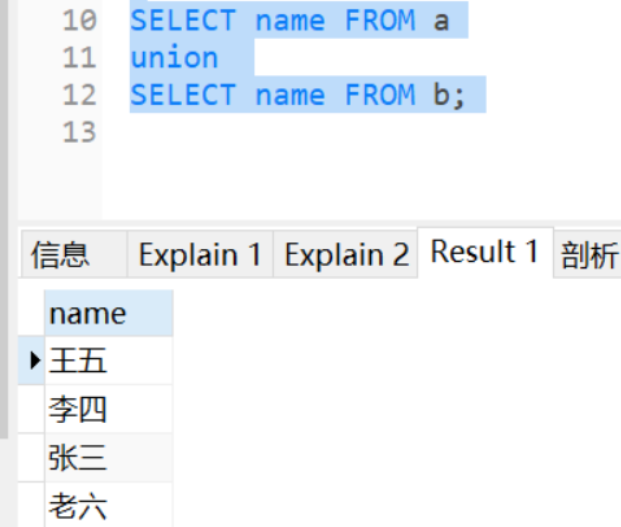
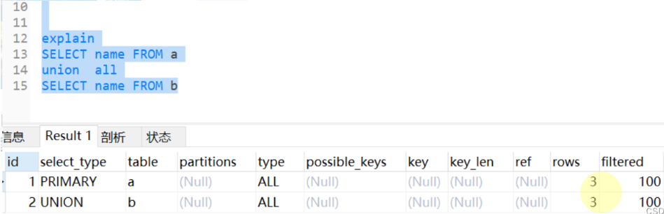
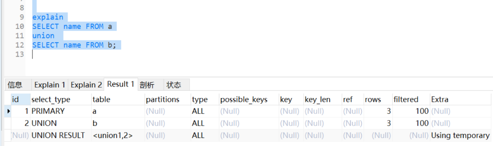

# MySQL

## 目录

- [1、对MySQL数据库去重的关键字是什么？](#1对MySQL数据库去重的关键字是什么)
- [2、MySQL多表连接有哪些方式？怎么用的？这些连接都有什么区别？](#2MySQL多表连接有哪些方式怎么用的这些连接都有什么区别)
- [3、索引的基本原理](#3索引的基本原理)
- [4、说一下索引的优势和劣势？](#4说一下索引的优势和劣势)
- [5、MySQL聚簇和非聚簇索引的区别](#5MySQL聚簇和非聚簇索引的区别)
- [6、MySQL索引的数据结构，各自优劣](#6MySQL索引的数据结构各自优劣)
- [7、MySQL索引的设计原则](#7MySQL索引的设计原则)
- [8、MySQL中B+树和B树的区别](#8MySQL中B树和B树的区别)
- [9、MySQL中的锁类型有哪些？](#9MySQL中的锁类型有哪些)
- [10、MySQL什么是死锁？怎么解决？](#10MySQL什么是死锁怎么解决)
- [11、MySQL的约束有哪些？](#11MySQL的约束有哪些)
- [12、关心过业务系统里面的sql耗时吗？统计过慢查询吗？对慢查询都怎么优化过？](#12关心过业务系统里面的sql耗时吗统计过慢查询吗对慢查询都怎么优化过)
- [13、MySQL事务的基本特性和隔离级别](#13MySQL事务的基本特性和隔离级别)
- [14、MySQL中ACID靠什么保证的？](#14MySQL中ACID靠什么保证的)
- [15、MySQL中的MVCC是什么？](#15MySQL中的MVCC是什么)
- [16、UNION和UNION ALL的区别？](#16UNION和UNION-ALL的区别)
- [17、主键使用自增ID还是UUID，为什么？](#17主键使用自增ID还是UUID为什么)
- [18、MySQL数据库cpu飙升的话，要怎么处理呢？](#18MySQL数据库cpu飙升的话要怎么处理呢)
- [19、什么是存储过程？有哪些优缺点？](#19什么是存储过程有哪些优缺点)
- [20、了解什么是表分区吗？表分区的好处有哪些？](#20了解什么是表分区吗表分区的好处有哪些)
- [21、MySQL主从同步原理](#21MySQL主从同步原理)
- [22、简述MyISAM和InnoDB的区别](#22简述MyISAM和InnoDB的区别)
- [23、简述MySQL中索引类型及对数据库的性能的影响](#23简述MySQL中索引类型及对数据库的性能的影响)
- [24、MySQL执行计划怎么看](#24MySQL执行计划怎么看)
- [25、MySQL常见优化手段](#25MySQL常见优化手段)

# 1、对MySQL数据库去重的关键字是什么？

在MySQL数据库中，可以使用`DISTINCT`关键字来进行去重操作。`DISTINCT`关键字用于查询语句的`SELECT`子句中，用于返回唯一的结果集，去除重复的行。

例如，以下是使用`DISTINCT`关键字进行去重的示例：

`SELECT DISTINCT column1, column2 FROM table_name;`&#x20;

上述示例中，`column1`和`column2`是要查询的列名，`table_name`是要查询的表名。查询结果将返回去重后的唯一行。

需要注意的是，`DISTINCT`关键字会对查询结果的所有列进行去重。如果只想对部分列进行去重，可以指定相应的列名。

# 2、MySQL多表连接有哪些方式？怎么用的？这些连接都有什么区别？

连接方式：左连接、右连接、内连接

使用方法：

左连接：select \* from A LEFT JOIN B on [A.id=B.id](http://A.id=B.id "A.id=B.id");

右连接：select \* from A RIGHT JOIN B on [A.id=B.id](http://A.id=B.id "A.id=B.id");

内连接：select \* from A inner join B on a.xx=b.xx;（其中inner可以省略）

区别：

Inner join 内连接，在两张表进行连接查询时，只保留两张表中完全匹配的结果集

left join 在两张表进行连接查询时，会返回左表所有的行，即使在右表中没有匹配的记录。

right join 在两张表进行连接查询时，会返回右表所有的行，即使在左表中没有匹配的记录。

# 3、索引的基本原理

索引用来快速地寻找那些具有特定值的记录。如果没有索引，一般来说执行查询时遍历整张表。

索引的原理：就是把无序的数据变成有序的查询

1. 把创建了索引的列的内容进行排序。
2. 对排序结果生成倒排表。
3. 在倒排表内容上拼上数据地址链。
4. 在查询的时候，先拿到倒排表内容，再取出数据地址链，从而拿到具体数据

# 4、说一下索引的优势和劣势？

优势：

唯一索引可以保证数据库表中每一行数据的唯一性，索引可以加快数据查询速度，减少查询时间

劣势：

创建索引和维护索引要耗费时间，索引需要占物理空间，除了数据表占用数据空间之外，每一个索引还要占用一定的物理空间，给表中的数据进行增、删、改的时候，索引也要动态的维护。

# 5、MySQL聚簇和非聚簇索引的区别

都是B+树的数据结构

聚簇索引：将数据存储与索引放到了一块、并且是按照一定的顺序组织的，找到索引也就找到了数
据，数据的物理存放顺序与索引顺序是一致的，即：只要索引是相邻的，那么对应的数据一定也是
相邻地存放在磁盘上的。
非聚簇索引：叶子节点不存储数据、存储的是数据行地址，也就是说根据索引查找到数据行的位置
再去磁盘查找数据，这个就有点类似一本书的目录，比如我们要找第三章第一节，那我们先在这个
目录里面找，找到对应的页码后再去对应的页码看文章。

优势：
1、查询通过聚簇索引可以直接获取数据，相比非聚簇索引需要第二次查询（非覆盖索引的情况下）效率要高
2、聚簇索引对于范围查询的效率很高，因为其数据是按照大小排列的。
3、聚簇索引适合用在排序的场合，非聚簇索引不适合。

劣势：
1、维护索引很昂贵，特别是插入新行或者主键被更新导致要分页(page split)的时候。建议在大量插入新行后，选在负载较低的时间段，通过OPTIMIZE TABLE优化表，因为必须被移动的行数据可能造成碎片。使用独享表空间可以弱化碎片。
2、表因为使用UUId（随机ID）作为主键，使数据存储稀疏，这就会出现聚簇索引有可能有比全表扫面更慢，所以建议使用int的auto\_increment作为主键
3、如果主键比较大的话，那辅助索引将会变的更大，因为辅助索引的叶子存储的是主键值；过长的主键值，会导致非叶子节点占用占用更多的物理空间。

InnoDB中一定有主键，主键一定是聚簇索引，不手动设置、则会使用unique索引，没有unique索引，则会使用数据库内部的一个行的隐藏id来当作主键索引。在聚簇索引之上创建的索引称之为辅助索引，辅助索引访问数据总是需要二次查找，非聚簇索引都是辅助索引，像复合索引、前缀索引、唯一索引，辅助索引叶子节点存储的不再是行的物理位置，而是主键值.

MyISM使用的是非聚簇索引，没有聚簇索引，非聚簇索引的两棵B+树看上去没什么不同，节点的结构完全一致只是存储的内容不同而已，主键索引B+树的节点存储了主键，辅助键索引B+树存储了辅助键。表数据存储在独立的地方，这两颗B+树的叶子节点都使用一个地址指向真正的表数据，对于表数据来说，这两个键没有任何差别。由于索引树是独立的，通过辅助键检索无需访问主键的索引树。

如果涉及到大数据量的排序、全表扫描、count之类的操作的话，还是MyISAM占优势些，因为索引所占空间小，这些操作是需要在内存中完成的。

# 6、MySQL索引的数据结构，各自优劣

索引的数据结构和具体存储引擎的实现有关，在MySQL中使用较多的索引有Hash索引，B+树索引等，InnoDB存储引擎的默认索引实现为：B+树索引。对于哈希索引来说，底层的数据结构就是哈希表，因此在绝大多数需求为单条记录查询的时候，可以选择哈希索引，查询性能最快；其余大部分场景，建议选择BTree索引。

B+树：
B+树是一个平衡的多叉树，从根节点到每个叶子节点的高度差值不超过1，而且同层级的节点间有指针相互链接。在B+树上的常规检索，从根节点到叶子节点的搜索效率基本相当，不会出现大幅波动，而且基于索引的顺序扫描时，也可以利用双向指针快速左右移动，效率非常高。因此，B+树索引被广泛应用于数据库、文件系统等场景。

哈希索引：
哈希索引就是采用一定的哈希算法，把键值换算成新的哈希值，检索时不需要类似B+树那样从根节点到叶子节点逐级查找，只需一次哈希算法即可立刻定位到相应的位置，速度非常快。

如果是等值查询，那么哈希索引明显有绝对优势，因为只需要经过一次算法即可找到相应的键值；前提是键值都是唯一的。如果键值不是唯一的，就需要先找到该键所在位置，然后再根据链表往后扫描，直到找到相应的数据；

如果是范围查询检索，这时候哈希索引就毫无用武之地了，因为原先是有序的键值，经过哈希算法后，有可能变成不连续的了，就没办法再利用索引完成范围查询检索；

哈希索引也没办法利用索引完成排序，以及like ‘xxx%’ 这样的部分模糊查询（这种部分模糊查询，其实本质上也是范围查询）；

哈希索引也不支持多列联合索引的最左匹配规则；

B+树索引的关键字检索效率比较平均，不像B树那样波动幅度大，在有大量重复键值情况下，哈希索引的效率也是极低的，因为存在哈希碰撞问题。

# 7、MySQL索引的设计原则

查询更快、占用空间更小

1. 适合索引的列是出现在where子句中的列，或者连接子句中指定的列。
2. 基数较小的表，索引效果较差，没有必要在此列建立索引
3. 使用短索引，如果对长字符串列进行索引，应该指定一个前缀长度，这样能够节省大量索引空间，如果搜索词超过索引前缀长度，则使用索引排除不匹配的行，然后检查其余行是否可能匹配
4. 不要过度索引。索引需要额外的磁盘空间，并降低写操作的性能。在修改表内容的时候，索引会进行更新甚至重构，索引列越多，这个时间就会越长。所以只保持需要的索引有利于查询即可。
5. 定义有外键的数据列一定要建立索引。
6. 更新频繁字段不适合创建索引。
7. 若是不能有效区分数据的列不适合做索引列(如性别，男女未知，最多也就三种，区分度实在太低)
8. 对于那些查询中很少涉及的列，重复值比较多的列不要建立索引。
9. 对于定义为text、image和bit的数据类型的列不要建立索引。

# 8、MySQL中B+树和B树的区别

1、**非叶子节点数据不同**：

- B+树的非叶子节点的数据都在叶子节点中出现过，也就是叶子节点中的数据都在非叶子节点冗余一份。B树中非叶子节点中元素不会冗余。
- B+树非叶子节点只存放指针，不存放数据，B树所有节点（叶子节点）都存放数据。

2、**叶子节点数据不同**：B+树叶子节点存放数据，B树所有节点（非叶子节）点存放数据。数据遍布整个树结构。

3、**时间复杂度不同**：由于B+树的数据都存在叶子节点，因此B+树的时间复杂度固定为o(log n)，而B树的数据分布在每个节点中，因此时间复杂度不固定，最好为o(1).

4、**叶子节点连接不同**：B+树的叶子节点通过有序的双向链表相连，B树叶子节点不相连。

5、**区间查询效率不同**：因为第4点的原因，所以B+树去范围查询效率更快，而B树范围查询比较慢。

因此，存在大量范围查询的场景，适合使用B+树

而对大量单个key查询的场景，可以考虑B树

# 9、MySQL中的锁类型有哪些？

基于锁的属性分类：共享锁、排他锁。

基于锁的粒度分类：行级锁(INNODB)、表级锁(INNODB、MYISAM)、页级锁(BDB引擎 )、记录锁、间隙锁、临键锁。

**共享锁(Share Lock)**：

共享锁又称读锁，简称S锁；当一个事务为数据加上读锁之后，其他事务只能对该数据加读锁，而不能对数据加写锁，直到所有的读锁释放之后其他事务才能对其进行加持写锁。共享锁的特性主要是为了支持并发的读取数据，读取数据的时候不支持修改，避免出现重复读的问题。

**排他锁（Exclusive Lock）**:

排他锁又称写锁，简称X锁；当一个事务为数据加上写锁时，其他请求将不能再为数据加任何锁，直到该锁释放之后，其他事务才能对数据进行加锁。排他锁的目的是在数据修改时候，不允许其他人同时修改，也不允许其他人读取。避免了出现脏数据和脏读的问题.

**表锁**：

表锁是指上锁的时候锁住的是整个表，当下一个事务访问该表的时候，必须等前一个事务释放了锁才能进行对表进行访问；
特点： 粒度大，加锁简单，容易冲突

**行锁：**

行锁是指上锁的时候锁住的是表的某一行或多行记录，其他事务访问同一张表时，只有被锁住的记录不能访问，其他的记录可正常访问；
特点：粒度小，加锁比表锁麻烦，不容易冲突，相比表锁支持的并发要高。

**记录锁(Record Lock)**

记录锁也属于行锁中的一种，只不过记录锁的范围只是表中的某一条记录，记录锁是说事务在加锁后锁住的只是表的某一条记录。
精准条件命中，并且命中的条件字段是唯一索引
加了记录锁之后数据可以避免数据在查询的时候被修改的重复读问题，也避免了在修改的事务未提交前被其他事务读取的脏读问题。

**页锁**：

页级锁是MySQL中锁定粒度介于行级锁和表级锁中间的一种锁。表级锁速度快，但冲突多，行级冲突少，但速度慢。所以取了折衷的页级，一次锁定相邻的一组记录。
特点：开销和加锁时间界于表锁和行锁之间；会出现死锁；锁定粒度界于表锁和行锁之间，并发度一般。

**间隙锁(Gap Lock**）

属于行锁中的一种，间隙锁是在事务加锁后其锁住的是表记录的某一个区间，当表的相邻ID之间出现空隙则会形成一个区间，遵循左开右闭原则。
间隙锁只会出现在REPEATABLE\_READ（可重复读)的事务级别中。
触发条件：防止幻读问题，事务并发的时候，如果没有间隙锁，就会发生如下图的问题，在同一个事务里，A事务的两次查询出的结果会不一样。
比如表里面的数据ID 为 1,4,5,7,10 ,那么会形成以下几个间隙区间，-n-1区间，1-4区间，5-7区间，7-10区间，10-n区间 （-n代表负无穷大，n代表正无穷大）。

**临建锁(Next-Key Lock)：**

也属于行锁的一种，并且它是INNODB的行锁默认算法，总结来说它就是记录锁和间隙锁的组合，临键锁会把查询出来的记录锁住，同时也会把该范围查询内的所有间隙空间也会锁住。
触发条件：范围查询并命中，查询命中了索引。
结合记录锁和间隙锁的特性，临键锁避免了在范围查询时出现脏读、重复读、幻读问题。加了临键锁之后，在范围区间内数据不允许被修改和插入。

# 10、MySQL什么是死锁？怎么解决？

死锁是指两个或多个事务在同一资源上相互占用，并请求锁定对方的资源，从而导致恶性循环的现象。

有四个必要条件：互斥条件，请求和保持条件，环路等待条件，不剥夺条件。

解决死锁思路，一般就是切断环路，尽量避免并发形成环路。如果不同程序会并发存取多个表，尽量约定以相同的顺序访问表，可以大大降低死锁机会；在同一个事务中，尽可能做到一次锁定所需要的所有资源，减少死锁产生概率；对于非常容易产生死锁的业务部分，可以尝试使用升级锁定颗粒度，通过表级锁定来减少死锁产生的概率；如果业务处理不好可以用分布式事务锁或者使用乐观锁；死锁与索引密不可分，解决索引问题，需要合理优化索引。

# 11、MySQL的约束有哪些？

NOT NULL: 约束字段的内容一定不能为NULL。

UNIQUE: 约束字段唯一性，一个表允许有多个Unique约束。

PRIMARY KEY: 约束字段唯一，不可重复，一个表只允许存在一个。

FOREIGN KEY: 用于预防破坏表之间连接的动作，也能防止非法数据插入外键。用来让两张表的数据之间建立连接，从而保证数据的一致性和完整性。

CHECK: 用于控制字段的值范围。保证字段值满足某一个条件。

DEFAULT：保存数据时，如果未指定该字段的值，则采用默认值

# 12、关心过业务系统里面的sql耗时吗？统计过慢查询吗？对慢查询都怎么优化过？

在业务系统中，除了使用主键进行的查询，其他的都会在测试库上测试其耗时，慢查询的统计主要由运维在做，会定期将业务中的慢查询反馈给我们。

慢查询的优化首先要搞明白慢的原因是什么？

**1、是查询条件没有命中索引？**

**2、是load了不需要的数据列？**

**3、还是数据量太大？**

所以优化也是针对这三个方向来的，
1、首先分析语句，看看是否load了额外的数据，可能是查询了多余的行并且抛弃掉了，可能是加载了许多结果中并不需要的列，对语句进行分析以及重写。

2、分析语句的执行计划，然后获得其使用索引的情况，之后修改语句或者修改索引，使得语句可以尽可能的命中索引。

3、如果对语句的优化已经无法进行，可以考虑表中的数据量是否太大，如果是的话可以进行横向或者纵向的分表。

# 13、MySQL事务的基本特性和隔离级别

事务基本特性ACID分别是：

**原子性**:指的是一个事务中的操作要么全部成功，要么全部失败。

**一致性:** 指的是数据库总是从一个一致性的状态转换到另外一个一致性的状态。比如A转账给B100块钱，假设A只有90块，支付之前我们数据库里的数据都是符合约束的,但是如果事务执行成功了,我们的数据库数据就破坏约束了,因此事务不能成功,这里我们说事务提供了一致性的保证。

**隔离性**:指的是一个事务的修改在最终提交前，对其他事务是不可见的。

**持久性**：指的是一旦事务提交，所做的修改就会永久保存到数据库中。

隔离性有4个隔离级别，分别是：

**read uncommit** 读未提交，可能会读到其他事务未提交的数据，也叫做脏读。
用户本来应该读取到id=1的用户age应该是10，结果读取到了其他事务还没有提交的事务，结果读取结果age=20，这就是脏读。

\*\*read commit \*\*读已提交，两次读取结果不一致，叫做不可重复读。
不可重复读解决了脏读的问题，他只会读取已经提交的事务。
用户开启事务读取id=1用户，查询到age=10，再次读取发现结果=20，在同一个事务里同一个查询读取到不同的结果叫做不可重复读。

\*\*repeatable read \*\*可重复复读，这是mysql的默认级别，就是每次读取结果都一样，但是有可能产生幻读。

\*\*serializable \*\*串行，一般是不会使用的，他会给每一行读取的数据加锁，会导致大量超时和锁竞争
的问题。

**脏读**(Drity Read)：某个事务已更新一份数据，另一个事务在此时读取了同一份数据，由于某些原因，前一个RollBack了操作，则后一个事务所读取的数据就会是不正确的。
**不可重复读**(Non-repeatable read):在一个事务的两次查询之中数据不一致，这可能是两次查询过程中间插入了一个事务更新的原有的数据。
**幻读**(Phantom Read):在一个事务的两次查询中数据笔数不一致，例如有一个事务查询了几列(Row)数据，而另一个事务却在此时插入了新的几列数据，先前的事务在接下来的查询中，就会发现有几列数据是它先前所没有的。

# 14、MySQL中ACID靠什么保证的？

**A（原子性**）由undo log日志保证，它记录了需要回滚的日志信息，事务回滚时撤销已经执行成功的sql。
**C（一致性**）由其他三大特性保证、程序代码要保证业务上的一致性。
**I（隔离性**）由MVCC来保证。
**D（持久性）** 由内存+redo log来保证，mysql修改数据同时在内存和redo log记录这次操作。宕机的时候可以从redo log恢复redolog的刷盘会在系统空闲时进行。

# 15、MySQL中的MVCC是什么？

多版本并发控制：读取数据时通过一种类似快照的方式将数据保存下来，这样读锁就和写锁不冲突了，不同的事务会看到自己特定版本的数据，版本链.

MVCC只在 READ COMMITTED 和 REPEATABLE READ 两个隔离级别下工作。其他两个隔离级别和MVCC不兼容, 因为 READ UNCOMMITTED 总是读取最新的数据行, 而不是符合当前事务版本的数据行。而 SERIALIZABLE 则会对所有读取的行都加锁。

聚簇索引记录中有两个必要的隐藏列：
trx\_id：用来存储每次对某条聚簇索引记录进行修改的时候的事务id。

roll\_pointer：每次对哪条聚簇索引记录有修改的时候，都会把老版本写入undo日志中。这个
roll\_pointer就是存了一个指针，它指向这条聚簇索引记录的上一个版本的位置，通过它来获得上一个版本的记录信息。(注意插入操作的undo日志没有这个属性，因为它没有老版本)

已提交读和可重复读的区别就在于它们生成ReadView的策略不同。

开始事务时创建ReadView，ReadView维护当前活动的事务id，即未提交的事务id，排序生成一个数组.

访问数据，获取数据中的事务id，对比ReadView：

如果在ReadView的左边（比ReadView都小），可以访问（在左边意味着该事务已经提交）

如果在ReadView的右边（比ReadView都大）或者就在ReadView中，不可以访问，获取roll\_pointer，取上一版本重新对比（在右边意味着，该事务在ReadView生成之后出现，在ReadView中意味着该事务还未提交）

已提交读隔离级别下的事务在每次查询的开始都会生成一个独立的ReadView,而可重复读隔离级别则在第一次读的时候生成一个ReadView，之后的读都复用之前的ReadView。

这就是Mysql的MVCC,通过版本链，实现多版本，可并发读-写，写-读。通过ReadView生成策略的不同实现不同的隔离级别

# 16、UNION和UNION ALL的区别？

先说结论，因为[UNION](https://so.csdn.net/so/search?q=UNION\&spm=1001.2101.3001.7020 "UNION") 操作会对结果去重且排序，所以从速度来说， UNION ALL会更胜一筹。建两张表，分别插入几条数据：

这两张表唯一的不同就是数据中，一个是“王五”，一个是“老六”。

**1.使用union all**

可以看出，union all 没有去重，查出了两个“张三”和“李四”；

**2.使用union**

由此可见，“张三”和“李四”被去重了。 &#x20;
然后，我们再来看下两个SQL（也就是union和union all）的性能分析：

**3. 使用union all 性能分析**

**4. 使用union性能分析**

**通过性能分析可得出，union比union all 多做了操作。由此得结论：**

1.union去重并排序，union all直接返回合并的结果，不去重也不排序；
2.union all比union性能好；

# 17、主键使用自增ID还是UUID，为什么？

如果是单机的话，选择自增ID；如果是分布式系统，优先考虑UUID，但还是最好公司自己有一套分布式唯一ID生产方案。自增ID：数据存储空间小，查询效率高。但是如果数据量过大,会超出自增长的值范围，多库合并，也有可能出现问题。uuid：适合大量数据的插入和更新操作，但它是无序的，插入数据效率慢，占用空间大。

# 18、MySQL数据库cpu飙升的话，要怎么处理呢？

排查过程：

使用top命令观察，确定是mysqld导致还是其他原因。

如果是mysqld导致的，show processlist，查看session情况，确定是不是有消耗资源的sql在运行。

找出消耗高的 sql，看看执行计划是否准确， 索引是否缺失，数据量是否太大。

处理：

kill掉这些线程(同时观察cpu使用率是否下降)，

进行相应的调整(比如说加索引、改sql、改内存参数)

重新跑SQL。

其他情况：

也有可能是每个sql消耗资源并不多，但是突然之间，有大量的session 连进来导致cpu飙升，这种情况就需要跟应用一起来分析为何连接数会激增，再做出相应的调整，比如说限制连接数等。

# 19、什么是存储过程？有哪些优缺点？

存储过程，就是一些编译好了的SQL语句，这些SQL语句代码像一个方法实现一些功能（对单表或多表的增删改查），然后给这些代码块取一个名字，在用到这个功能的时候调用即可。

优点：

存储过程是一个预编译的代码块，执行效率比较高，存储过程在服务器端运行，减少客户端的压力，允许模块化程序设计，只需要创建一次过程，以后在程序中就可以调用该过程任意次，类似方法的复用，一个存储过程替代大量SQL语句 ，可以降低网络通信量，提高通信速率，可以一定程度上确保数据安全。

缺点：

调试麻烦，可移植性不灵活，存在重新编译问题

# 20、了解什么是表分区吗？表分区的好处有哪些？

表分区，是指根据一定规则，将数据库中的一张表分解成多个更小的容易管理的部分。从逻辑上看，只有一张表，但是底层却是由多个物理分区组成。

存储更多数据。分区表的数据可以分布在不同的物理设备上，从而高效地利用多个硬件设备。和单个磁盘或者文件系统相比，可以存储更多数据。

优化查询。在where语句中包含分区条件时，可以只扫描一个或多个分区表来提高查询效率；涉及sum和count语句时，也可以在多个分区上并行处理，最后汇总结果。

分区表更容易维护。例如：想批量删除大量数据可以清除整个分区。

避免某些特殊的瓶颈，例如InnoDB的单个索引的互斥访问。

# 21、MySQL主从同步原理

MySQL主从同步的过程：

MySQL的主从复制中主要有三个线程： master（binlog dump thread）、slave（I/O thread 、SQLthread） ，Master一条线程和Slave中的两条线程。

主节点 binlog，主从复制的基础是主库记录数据库的所有变更记录到 binlog。binlog 是数据库服
务器启动的那一刻起，保存所有修改数据库结构或内容的一个文件。

主节点 log dump 线程，当 binlog 有变动时，log dump 线程读取其内容并发送给从节点。

从节点 I/O线程接收 binlog 内容，并将其写入到 relay log 文件中。

从节点的SQL 线程读取 relay log 文件内容对数据更新进行重放，最终保证主从数据库的一致性。

注：主从节点使用 binlog 文件 + position 偏移量来定位主从同步的位置，从节点会保存其已接收到的偏移量，如果从节点发生宕机重启，则会自动从 position 的位置发起同步。

由于MySQL默认的复制方式是异步的，主库把日志发送给从库后不关心从库是否已经处理，这样会产生一个问题就是假设主库挂了，从库处理失败了，这时候从库升为主库后，日志就丢失了。由此产生两个概念。

**全同步复制**
主库写入binlog后强制同步日志到从库，所有的从库都执行完成后才返回给客户端，但是很显然这个方式的话性能会受到严重影响。

**半同步复制**
和全同步不同的是，半同步复制的逻辑是这样，从库写入日志成功后返回ACK确认给主库，主库收到至少一个从库的确认就认为写操作完成。

# 22、简述MyISAM和InnoDB的区别

**MyISAM：**
1、不支持事务，但是每次查询都是原子的；
2、支持表级锁，即每次操作是对整个表加锁；
3、存储表的总行数；
4、一个MYISAM表有三个文件：索引文件、表结构文件、数据文件；
5、采用非聚集索引，索引文件的数据域存储指向数据文件的指针。辅索引与主索引基本一致，但是辅索引不用保证唯一性。

**InnoDB**：
1、支持ACID的事务，支持事务的四种隔离级别；
2、支持行级锁及外键约束：因此可以支持写并发；
3、不存储总行数；
4、一个InnoDB引擎存储在一个文件空间（共享表空间，表大小不受操作系统控制，一个表可能分布在多个文件里），也有可能为多个（设置为独立表空，表大小受操作系统文件大小限制，一般为2G），受操作系统文件大小的限制；
5、主键索引采用聚集索引（索引的数据域存储数据文件本身），辅索引的数据域存储主键的值；因此从辅索引查找数据，需要先通过辅索引找到主键值，再访问主键索引树；索引最好使用自增主键，防止插入数据时，为维持B+树结构，文件的大调整。

# 23、简述MySQL中索引类型及对数据库的性能的影响

**普通索引**：允许被索引的数据列包含重复的值。
**唯一索引**：可以保证数据记录的唯一性。
**主键**：是一种特殊的唯一索引，在一张表中只能定义一个主键索引，主键用于唯一标识一条记录，使用关键字 PRIMARY KEY 来创建。
**联合索引**：索引可以覆盖多个数据列，如像INDEX(columnA, columnB)索引。
**全文索引**：通过建立 倒排索引 ,可以极大的提升检索效率,解决判断字段是否包含的问题，是目前搜索引擎使用的一种关键技术。可以通过ALTER TABLE table\_name ADD FULLTEXT (column);创建全文索引索引可以极大的提高数据的查询速度。

通过使用索引，可以在查询的过程中，使用优化隐藏器，提高系统的性能。
但是会降低插入、删除、更新表的速度，因为在执行这些写操作时，还要操作索引文件
索引需要占物理空间，除了数据表占数据空间之外，每一个索引还要占一定的物理空间，如果要建立聚簇索引，那么需要的空间就会更大，如果非聚集索引很多，一旦聚集索引改变，那么所有非聚集索引都会跟着变。

# 24、MySQL执行计划怎么看

执行计划就是sql的执行查询的顺序，以及如何使用索引查询，返回的结果集的行数
EXPLAIN SELECT \* from A where X=? and Y=?

1 **.id** ：是一个有顺序的编号，是查询的顺序号，有几个 select 就显示几行。id的顺序是按 select 出现的顺序增长的。id列的值越大执行优先级越高越先执行，id列的值相同则从上往下执行，id列的值为NULL最后执行。

**2.selectType** 表示查询中每个select子句的类型
SIMPLE： 表示此查询不包含 UNION 查询或子查询
PRIMARY： 表示此查询是最外层的查询（包含子查询）
SUBQUERY： 子查询中的第一个 SELECT
UNION： 表示此查询是 UNION 的第二或随后的查询
DEPENDENT UNION： UNION 中的第二个或后面的查询语句, 取决于外面的查询
UNION RESULT：UNION 的结果
DEPENDENT SUBQUERY: 子查询中的第一个 SELECT, 取决于外面的查询. 即子查询依赖于外层查
询的结果.
DERIVED：衍生，表示导出表的SELECT（FROM子句的子查询）

**3.table**：表示该语句查询的表

**4.type：** 优化sql的重要字段，也是我们判断sql性能和优化程度重要指标。他的取值类型范围：
const：通过索引一次命中，匹配一行数据
system: 表中只有一行记录，相当于系统表；
eq\_ref：唯一性索引扫描，对于每个索引键，表中只有一条记录与之匹配
ref： 非唯一性索引扫描,返回匹配某个值的所有
range: 只检索给定范围的行，使用一个索引来选择行，一般用于between、<、>；
index: 只遍历索引树；
ALL: 表示全表扫描，这个类型的查询是性能最差的查询之一。 那么基本就是随着表的数量增多，执行效率越慢。

执行效率：
\*\*ALL < index < range< ref < eq\_ref < const < system。\*\*最好是避免ALL和index，至少也要有ref。

**5.possible\_keys**：它表示Mysql在执行该sql语句的时候，可能用到的索引信息，仅仅是可能，实际不一定会用到。

**6.key：** 此字段是 mysql 在当前查询时所真正使用到的索引。 他是possible\_keys的子集

**7.key\_len**：表示查询优化器使用了索引的字节数，这个字段可以评估组合索引是否完全被使用，这也是我们优化sql时，评估索引的重要指标

**9.rows**：mysql 查询优化器根据统计信息，估算该sql返回结果集需要扫描读取的行数，这个值相关重要，索引优化之后，扫描读取的行数越多，说明索引设置不对，或者字段传入的类型之类的问题，说明要优化空间越大。

**10.filtered：** 返回结果的行占需要读到的行(rows列的值)的百分比，就是百分比越高，说明需要查询到数据越准确， 百分比越小，说明查询到的数据量大，而结果集很少

**11.extra**
using filesort ：表示 mysql 对结果集进行外部排序，不能通过索引顺序达到排序效果。一般有using filesort都建议优化去掉，因为这样的查询 cpu 资源消耗大，延时大。
using index：覆盖索引扫描，表示查询在索引树中就可查找所需数据，不用扫描表数据文件，往往说明性能不错。
using temporary：查询有使用临时表, 一般出现于排序， 分组和多表 join 的情况， 查询效率不高，建议优化。
using where ：sql使用了where过滤,效率较高。

# 25、MySQL常见优化手段

（1）尽量选择较小的列

（2）将where中用的比较频繁的字段建立索引

（3）select子句中避免使用‘ \*’

（4）避免在索引列上使用计算、not in 和<>等操作

（5）当只需要一行数据的时候使用limit 1

（6）保证单表数据不超过200W，适时分割表。针对查询较慢的语句，可以使用explain 来分析该语句具体的执行情况。

（7）避免改变索引列的类型。

（8）选择最有效的表名顺序，from子句中写在最后的表是基础表，将被最先处理，在from子句中包含多个表的情况下，你必须选择记录条数最少的表作为基础表。

（9）避免在索引列上面进行计算。

（10）能用关联查询的不要用子查询

（11）尽量缩小子查询的结果
