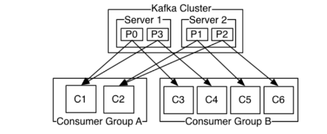
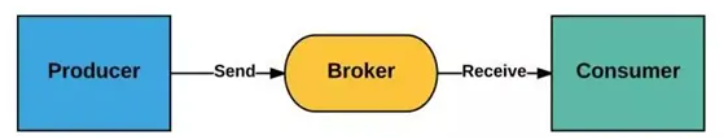
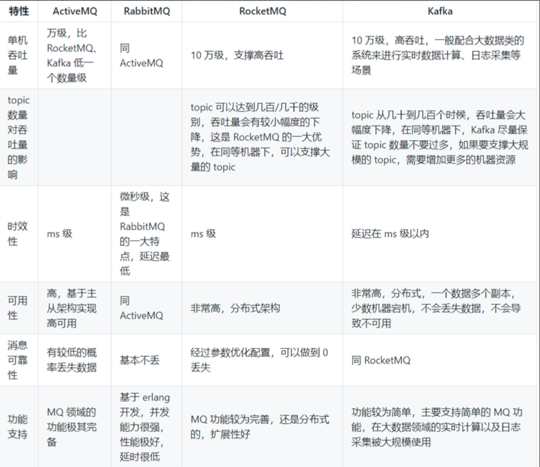
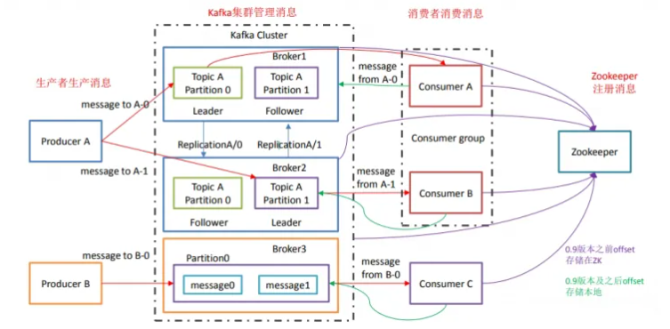
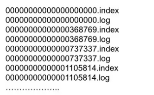

# Kafka面试题

## 目录

- [1、Kafka 都有哪些特点？](#1Kafka-都有哪些特点)
- [2、Kafka的选择场景](#2Kafka的选择场景)
- [3、Kafka的架构设计](#3Kafka的架构设计)
- [4、Kafka 分区的目的？](#4Kafka-分区的目的)
- [5、ISR、AR 是什么？](#5ISRAR-是什么)
- [6、LEO、HW、LW等分别代表什么](#6LEOHWLW等分别代表什么)
- [7、消费者和消费者组有什么关系？](#7消费者和消费者组有什么关系)
- [8、想Kafka消息是采用Pull模式，还是Push模式？](#8想Kafka消息是采用Pull模式还是Push模式)
- [9、kafka 的 ack 的三种机制](#9kafka-的-ack-的三种机制)
- [10、Kafka是如何保障数据不丢失的？](#10Kafka是如何保障数据不丢失的)
- [11、什么是“零拷贝”？有什么作用？](#11什么是零拷贝有什么作用)
- [12、Kafka与RabbitMQ相比有什么优势？](#12Kafka与RabbitMQ相比有什么优势)
- [13、Kafka中的Topic和Partition有什么关系？](#13Kafka中的Topic和Partition有什么关系)
- [14、Kafka的消费消息是如何传递的？](#14Kafka的消费消息是如何传递的)
- [15、如何确保Kafka集群的高可用？](#15如何确保Kafka集群的高可用)
- [16、Kafka中的消费者偏移量是如何管理的？](#16Kafka中的消费者偏移量是如何管理的)
- [17、Kafka中的消息如何分配给不同的消费者？](#17Kafka中的消息如何分配给不同的消费者)
- [18、Kafka中的消息是如何存储的？](#18Kafka中的消息是如何存储的)
- [Kafka其他常见问题](#Kafka其他常见问题)
  - [Kafka入门](#Kafka入门)
    - [什么是消息队列与Kafka简介](#什么是消息队列与Kafka简介)
      - [为什么需要消息队列？](#为什么需要消息队列)
      - [消息队列有什么优点和缺点？](#消息队列有什么优点和缺点)
    - [Kafka的优势和特点](#Kafka的优势和特点)
    - [Kafka与传统消息队列的对比](#Kafka与传统消息队列的对比)
    - [Kafka的架构设计](#Kafka的架构设计)
    - [工作流程](#工作流程)
      - [tips](#tips)
    - [Kafka的数据模型与消息存储机制](#Kafka的数据模型与消息存储机制)
      - [消息存储结构](#消息存储结构)
      - [索引文件](#索引文件)
      - [数据文件](#数据文件)
    - [Kafka文件存储优势](#Kafka文件存储优势)
      - [写message](#写message)
      - [读message](#读message)
      - [Kafka高效文件存储设计特点](#Kafka高效文件存储设计特点)
    - [Kafka 副本同步机制](#Kafka-副本同步机制)
      - [ACKS 机制](#ACKS-机制)
      - [生产者重试机制：](#生产者重试机制)
      - [ISR 机制：](#ISR-机制)
    - [Kafka 副本数据一致性](#Kafka-副本数据一致性)
      - [尽管采用 acks = all 但是也会出现 不一致的场景，例如：](#尽管采用-acks--all-但是也会出现-不一致的场景例如)
      - [针对不同的产生原因，解决方案不同：](#针对不同的产生原因解决方案不同)

#### 1、Kafka 都有哪些特点？

高[吞吐量](https://so.csdn.net/so/search?q=吞吐量\&spm=1001.2101.3001.7020 "吞吐量")、低延迟：kafka每秒可以处理几十万条消息，它的延迟最低只有几毫秒，每个topic可以分多个partition, consumer group 对partition进行consume操作。 •可扩展性： •持久性、可靠性：消息被持久化到本地磁盘，并且支持数据备份防止数据丢失 •容错性：允许集群中节点失败 •高并发：支持数千个客户端同时读写

### 2、Kafka的选择场景

**日志收集**：一个公司可以用Kafka可以收集各种服务的log，通过kafka以统一接口服务的方式开放给各种consumer，例如hadoop、HBase等。

**消息系统**：解耦和上游生产者和下游消费者、缓存消息等。

**用户活动跟踪**：Kafka经常被用来记录web用户或者app用户的各种活动，如浏览网页、搜索、点击等活动，这些活动信息被各个服务器发布到kafka的topic中，然后订阅者通过订阅这些topic来做实时的监控分析。

**运营指标**：Kafka也经常用来记录运营监控数据。包括收集各种分布式应用的数据，生产各种操作的集中反馈，比如报警和报告。

### 3、Kafka的架构设计

从高阶和顶层看，生产者发送消息到kafka集群，然后消费者来获取消息进行后续处理

| **核心组件**                  | **概念**                                                                                                                                                                                                                |
| ------------------------- | --------------------------------------------------------------------------------------------------------------------------------------------------------------------------------------------------------------------- |
| **Producer**              | **生产者，可以向Broker topic发布消息的客户端**                                                                                                                                                                                       |
| **Consumer**              | **消费者，从Broker topic订阅取消息的客户端**                                                                                                                                                                                        |
| **Broker**                | **Broker是一个kafka实例，简单说就是一台kafka服务器，kafkaCluster表示集群。一个Linux服务器上启动一个或多个 kafka服务器实例。**                                                                                                                                  |
| **Topic**                 | **主题,Kafka将消息分门别类，每一类的消息称之为一个主题。可以理解为一个队列，生产者和消费者面向的都是一个topic**                                                                                                                                                       |
| **Partition**             | **Topic的分区，每个 Topic 可以有多个分区，同一个Topic 在不同分区的数据是不重复的，每个Partition是一个有序的队列。分区作用是做负载，提高 kafka 的吞吐量以及提高读写并行能力。每个partition都由一系列有序的、不可变的消息组成，这些消息被连续的追加到partition中。partition中的每个消息都有一个连续递增的序列号叫做offset，偏移量offset在每个分区中是唯一的。** |
| **Offset**                | **生产者Offset：消息写入的时候，每一个分区都有一个offset，这个offset就是生产者的offset，同时也是这个分区的最新最大的offset。 消费者Offset：某个分区的offset情况。例如：生产者写入的offset是最新值是10，当一个Consumer开始消费时，从0消费，一直消费到了5，消费者的offset为5。**                                           |
| **Replication**           | **Partition(分区)的副本。每个分区可以有多个Replication，由一个Leader和若干个Follower组成。Leader负责接收生产者push的消息和消费者poll消费消息。Follower会实时从自己的Leader中同步数据保持同步。Leader故障时,某个Follower会上位为新的Leader。保证高可用**。                                             |
| **Message**               | **kafka集群存储的消息是以topic为类别记录的，每个消息（也叫记录record）**                                                                                                                                                                        |
| **ConsumerGroup(CG)**     | **消费者组，由多个Consumer组成，每个ConsumerGroup中可以有多个consumer，每个consumer属于一个ConsumerGroup。同一个Topic下的某一个分区只能被某个消费者组内的同一个消费者所消费，但可以被多个 consumer group 消费**                                                                         |
| **In-sync Replicas（ISR）** | **（ISR）已同步副本：表示存活且副本都已和Leader同步的的broker集合，是Leader所有replicas副本的子集（包括leader本身）。如果某个副本节点宕机，该副本就会从ISR集合中剔除。**                                                                                                             |

### 4、Kafka 分区的目的？

| 容错性   | 由于数据被分散存储到多个Partition上，即使某个节点或者Partition出现故障，也不会影响整个Topic数据的完整性和可用性。                          |
| ----- | --------------------------------------------------------------------------------------------- |
| 水平扩展性 | 通过将Topic划分为多个Partition，Kafka可以实现水平扩展，从而提高整体的吞吐量。这意味着它可以同时处理更多的消息和请求，而不会因为单个节点或磁盘容量的限制而导致性能瓶颈。 |
| 并行处理  | 每个Partition可以由不同的消费者并行处理，提高了系统的处理能力。                                                          |
| 顺序性   | 在同一个Partition内部，消息是按照一定的顺序存储的。这对于那些需要在特定顺序下处理消息的场景来说是一个重要的特性，因为它保证了消息的有序性。                    |

### 5、ISR、AR 是什么？

ISR：In-Sync Replicas 副本同步队列

AR：Assigned Replicas 所有副本

### 6、LEO、HW、LW等分别代表什么

LEO：是 LogEndOffset 的简称，代表当前日志文件中下一条。

•HW：水位或水印（watermark）一词，严格来说，它表示的就是位置信息，即位移（offset）partition 对应的 ISR中 最小的 LEO 作为 HW，consumer 最多只能消费到 HW 所在的位置上一条信息。

•LW：Low Watermark 低水位, 代表 AR 集合中最小的 logStartOffset 值

### 7、消费者和消费者组有什么关系？

**一个分区同一个时刻在一个消费组中只能有一个消费者在消费，从而保证消费顺序。消费组中的消费者的数量不能比一个Topic中的分区的数量多，否则，多出来的消费者消费不到消息。**

### 8、想Kafka消息是采用Pull模式，还是Push模式？

Kafka最初考虑的问题是，customer应该从brokes拉取消息还是brokers将消息推送到consumer，也就是pull还push。在这方面，Kafka遵循了一种大部分消息系统共同的传统的设计：producer将消息推送到broker，consumer从broker拉取消息。

一些消息系统比如Scribe和Apache Flume采用了push模式，将消息推送到下游的consumer。这样做有好处也有坏处：由broker决定消息推送的速率，对于不同消费速率的consumer就不太好处理了。消息系统都致力于让consumer以最大的速率最快速的消费消息，但不幸的是，push模式下，当broker推送的速率远大于consumer消费的速率时，consumer恐怕就要崩溃了。最终Kafka还是选取了传统的pull模式。

Pull模式的另外一个好处是consumer可以自主决定是否批量的从broker拉取数据。Push模式必须在不知道下游consumer消费能力和消费策略的情况下决定是立即推送每条消息还是缓存之后批量推送。如果为了避免consumer崩溃而采用较低的推送速率，将可能导致一次只推送较少的消息而造成浪费。Pull模式下，consumer就可以根据自己的消费能力去决定这些策略。

Pull有个缺点是，如果broker没有可供消费的消息，将导致consumer不断在循环中轮询，直到新消息到达。为了避免这点，Kafka有个参数可以让consumer阻塞直到新消息到达。

### 9、kafka **的** **ack** **的三种机制**

- **acks=0：生产者发送数据后就不管了，不会等待broker的ack（确认），这个延迟最低但是存储的保证最弱当server挂掉的时候就会丢数据**
- **acks=1：生产者会等待ack值 ，leader确认接收到消息后发送ack（确认）。但是如果leader 挂掉后他不确保是否复制完成，新leader也会导致数据丢失，可靠性中等，效率中等。**
- **acks=-1(all)：生产者会等所有的follower的副本受到数据后才会受到leader 发出的ack（确认），也即Leader和ISR队列里面所有Follwer应答，可靠性高效率最低**

### 10、Kafka是如何保障数据不丢失的？

该问题已经成为了Kafka面试的惯例，如同Java的**HashMap**，属于高频出现的面试问题。那么，我们该怎么理解这个问题呢？问题是**Kafka如何保障数据不丢失**，即**Kafka的Broker提供了什么机制保证数据不丢失的。**

其实对于Kafka的Broker而言，Kafka 的**复制机制**和**分区的多副本**架构是Kafka 可靠性保证的核心。把消息写入多个副本可以使Kafka 在发生崩溃时仍能保证消息的持久性。

搞清楚了问题的核心，再来看一下该怎么回答这个问题：主要包括三个方面

1.Topic 副本因子个数：replication.factor >= 3

2.同步副本列表(ISR)：min.insync.replicas = 2

3.禁用unclean选举：unclean.leader.election.enable=false

下面将会逐步分析上面的三个配置：

- **副本因子**

Kafka的topic是可以分区的，并且可以为分区配置多个副本，该配置可以通过`replication.factor`参数实现。Kafka中的分区副本包括两种类型：领导者副本（Leader Replica）和追随者副本（Follower Replica)，每个分区在创建时都要选举一个副本作为领导者副本，其余的副本自动变为追随者副本。在 Kafka 中，追随者副本是不对外提供服务的，也就是说，任何一个追随者副本都不能响应消费者和生产者的读写请求。所有的请求都必须由领导者副本来处理。换句话说，所有的读写请求都必须发往领导者副本所在的 Broker，由该 Broker 负责处理。追随者副本不处理客户端请求，它唯一的任务就是从领导者副本**异步拉取**消息，并写入到自己的提交日志中，从而实现与领导者副本的同步。

一般来说，副本设为3可以满足大部分的使用场景，也有可能是5个副本(比如银行)。如果副本因子为N，那么在N-1个broker 失效的情况下，仍然能够从主题读取数据或向主题写入数据。所以，更高的副本因子会带来更高的可用性、可靠性和更少的故障。另一方面，副本因子N需要至少N个broker ，而且会有N个数据副本，也就是说它们会占用N倍的磁盘空间。实际生产环境中一般会在可用性和存储硬件之间作出权衡。

除此之外，副本的分布同样也会影响可用性。默认情况下，Kafka会确保分区的每个副本分布在不同的Broker上，但是如果这些Broker在同一个机架上，一旦机架的交换机发生故障，分区就会不可用。所以建议把Broker分布在不同的机架上，可以使用**broker.rack**参数配置Broker所在机架的名称。

- **同步副本列表**

In-sync replica(ISR)称之为同步副本，ISR中的副本都是与Leader进行同步的副本，所以不在该列表的follower会被认为与Leader是不同步的。那么，ISR中存在是什么副本呢？首先可以明确的是：Leader副本总是存在于ISR中。而follower副本是否在ISR中，取决于该follower副本是否与Leader副本保持了“同步”。

Kafka的broker端有一个参数[**replica.lag.time.max.ms**](http://replica.lag.time.max.ms "replica.lag.time.max.ms"), 该参数表示follower副本滞后与Leader副本的最长时间间隔，默认是10秒。这就意味着，只要follower副本落后于leader副本的时间间隔不超过10秒，就可以认为该follower副本与leader副本是同步的，所以哪怕当前follower副本落后于Leader副本几条消息，只要在10秒之内赶上Leader副本，就不会被踢出出局。

可以看出ISR是一个动态的，所以即便是为分区配置了3个副本，还是会出现同步副本列表中只有一个副本的情况(其他副本由于不能够与leader及时保持同步，被移出ISR列表)。如果这个同步副本变为不可用，我们必须在**可用性**和**一致性**之间作出选择(CAP理论)。

根据Kafka 对可靠性保证的定义，消息只有在被写入到所有同步副本之后才被认为是已提交的。但如果这里的“所有副本”只包含一个同步副本，那么在这个副本变为不可用时，数据就会丢失。如果要确保已提交的数据被写入不止一个副本，就需要把最小同步副本数量设置为大一点的值。对于一个包含3 个副本的主题分区，如果**min.insync.replicas=2** ，那么至少要存在两个同步副本才能向分区写入数据。

如果进行了上面的配置，此时必须要保证ISR中至少存在两个副本，如果ISR中的副本个数小于2，那么Broker就会停止接受生产者的请求。尝试发送数据的生产者会收到**NotEnoughReplicasException**异常，消费者仍然可以继续读取已有的数据。

- **禁用unclean选举**

选择一个**同步副本列表**{ISR}中的分区作为leader 分区的过程称为**clean leader election**。注意，这里要与在**非同步副本中**选一个分区作为leader分区的过程区分开，在非同步副本中选一个分区作为leader的过程称之为**unclean leader election**。由于ISR是动态调整的，所以会存在ISR列表为空的情况，通常来说，非同步副本落后 Leader 太多，因此，如果选择这些副本作为新 Leader，就可能出现数据的丢失。毕竟，这些副本中保存的消息远远落后于老 Leader 中的消息。在 Kafka 中，选举这种副本的过程可以通过Broker 端参数 **unclean.leader.election.enable**控制是否允许 Unclean 领导者选举。开启 Unclean 领导者选举可能会造成数据丢失，但好处是，它使得分区 Leader 副本一直存在，不至于停止对外提供服务，因此提升了高可用性。反之，禁止 Unclean Leader 选举的好处在于维护了数据的一致性，避免了消息丢失，但牺牲了高可用性。分布式系统的CAP理论说的就是这种情况。

不幸的是，**unclean leader election**的选举过程仍可能会造成数据的不一致，因为同步副本并不是**完全**同步的。由于复制是**异步**完成的，因此无法保证follower可以获取最新消息。比如Leader分区的最后一条消息的offset是100，此时副本的offset可能不是100，这受到两个参数的影响：

- [**replica.lag.time.max.ms**](http://replica.lag.time.max.ms "replica.lag.time.max.ms")：同步副本滞后与leader副本的时间

  \*   [**zookeeper.session.timeout.ms**](http://zookeeper.session.timeout.ms "zookeeper.session.timeout.ms")：与zookeeper会话超时时间

简而言之，如果我们允许不同步的副本成为leader，那么就要承担丢失数据和出现数据不一致的风险。如果不允许它们成为leader，那么就要接受较低的可用性，因为我们必须等待原先的首领恢复到可用状态。

关于unclean选举，不同的场景有不同的配置方式。对**数据质量和数据一致性**要求较高的系统会禁用这种unclean的leader选举(比如银行)。如果在**可用性**要求较高的系统里，比如实时点击流分析系统， 一般不会禁用unclean的leader选举。

### 11、什么是“零拷贝”？有什么作用？

零拷贝是操作系统提供的一种优化 IO 操作的重要机制。通过零拷贝技术，操作系统可以极大的减少在一次 IO 操作中，数据从一个内存区域复制到另一个内存区域的次数，以及在此过程中对 CPU 的性能消耗。零拷贝技术可以极大的提高数据传输的效率，避免不必要的数据拷贝，从而降低系统负载。 &#x20;
零拷贝有两种实现方式，mmap文件映射和sendfile文件复制。 &#x20;
●mmap机制主要依赖于内存区域映射技术，可以减少一次 IO 操作中，内核态与用户态之间的数据传输，从而减少因为上下文切换而带来的 CPU 性能开销。mmap机制通常适合于对大量小文件的 IO 操作，Kafka 大量的运用 mmap 机制加速 Partition 日志文件的读写过程。 &#x20;
●sendfile主要依赖于 DMA 数据传输技术，采用一组单独的指令集来进行负责数据在内存不同区域之间的拷贝过程。这样就不再需要 CPU 来进行复制，从而减少 CPU 性能消耗，让 CPU 可以用于更重要的计算任务。sendfile通常适合于大文件的拷贝传输操作，Kafka 大量的运用 sendfile 机制，加速消息从 Partition 文件到网卡的传输过程。 &#x20;
总之，零拷贝是由操作系统提供的一种高效的文件读写技术，而 Kafka 则大量的运用了零拷贝技术，从而极大的提升了 Kafka 整体的工作性能。

### 12、Kafka与RabbitMQ相比有什么优势？

Kafka 和 RabbitMQ 都是流行的消息中间件系统，他们各自都有一些优势和适用场景。以下是 Kafka 相对于 RabbitMQ 的一些比较明显的优势： &#x20;
1分布式架构： Kafka 是为大规模分布式流处理而设计的，具有高度可伸缩性。RabbitMQ 虽然也支持分布式架构，但相对而言，Kafka 的集群设计更完善，更适合处理大规模的消息流。 &#x20;
2吞吐量： Kafka每秒可处理十几万消息，而 RabbitMQ 每秒可处理几万条消息。 &#x20;
3消息复制和可用性：Kafka 允许配置多个消息副本，确保数据的冗余存储，提高可用性和容错性。RabbitMQ 也支持镜像队列以实现冗余，但是不如 Kafka 的多副本复制灵活。 &#x20;
4时间溯源：Kafka 在事件溯源和事件驱动架构中非常强大。他允许事件在 Topic 中保留一段时间，以便后续的分析和回溯查询。RabbitMQ 通常用于实时消息传递，对于事件溯源不够灵活。 &#x20;
5批处理和流处理： Kafka 提供了流处理 API，课用于实时数据流处理等场景。而 RabbitMQ 倾向于更专注的处理实时消息传递。 &#x20;
6社区和生态系统：Kafka 有一个庞大的社区和丰富的生态系统，提供了许多与大数据和流处理相关的工具和库。RabbitMQ 也有一个活跃的社区，但是相对而言社区规模以及社区活跃性就要小很多。 &#x20;
如果您需要处理大规模的实时数据流或事件驱动架构，Kafka 可能更适合；如果您更关注传统的消息传递和队列处理，RabbitMQ 的高级功能更丰富，可能更合适。因此，选择哪种消息中间件还是要取决于具体的应用场景。 &#x20;

### 13、Kafka中的Topic和Partition有什么关系？

在Kafka中，Topic和Partition是两个密切相关的概念。 &#x20;
●Topic是Kafka中消息的逻辑分类，可以看作是一个消息的存储类别。它是按照不同的主题对消息进行分类，并且可以用于区分和筛选数据。每个Topic可以有多个Partition，每个Partition都是Topic的一个子集，包含了一部分特定的消息。 &#x20;
●Partition则是Kafka 中实际保存数据的单位。每个Topic可以被划分为多个Partition，而这些 Partition 会尽量平均的分配到各个 Broker 上。当一条消息发送到Kafka时，它会被分配到一个特定的Partition中，并最终写入 Partition 对应的日志文件里。这个分配过程是根据Partition的规则来完成的，比如可以按照消息的某个属性进行哈希或者按照时间戳进行排序等。 &#x20;
因此，Topic和Partition的关系是，Topic是消息的逻辑分类，用于区分和筛选数据，而Partition则是Topic的物理划分，用于将消息分配到不同的部分中以便于处理和存储。Topic 和 Partition 的设计对于高吞吐量和横向扩展非常有用。因为生产者和消费者只需要根据 Topic 进行具体的业务实现，而不用关心消息在集群内的分布情况。而在集群内部，这些 Partition 会尽量平均的分布在不同的 Broker节点上，从而提高了系统 整体的性能和可伸缩性。

### 14、Kafka的消费消息是如何传递的？

在Kafka中，消息的传递主要涉及三个环节：生产者生产消息、broker保存消息和消费者消费消息。 &#x20;
1生产者生产消息：生产者负责将消息发布到Kafka broker。在发布消息时，生产者需要指定目标主题。消息被写入后，将被存储在指定分区的当前副本中。当发送消息失败时，生产者还会提供确认以及重试机制，以保证消息能够正确的发送到 Broker 上。 &#x20;
2broker保存消息：Kafka broker接收到生产者发送的消息后，会将其存储在内部的缓冲区中，等待消费者拉取。当消费者向broker发送拉取请求时，broker会从缓冲区中获取消息并返回给消费者。Kafka broker能够保证消息的可靠性和顺序性，即使在异常情况下（如服务器崩溃），也能够保证消息不会丢失。 &#x20;
3消费者消费消息：消费者从Kafka broker中订阅指定的主题，并拉取消息进行消费。消费者可以以同步或异步的方式拉取消息，并对拉取到的消息进行处理。当消费者处理完消息后，会向Kafka broker发送确认消息，表示消息已经被成功处理。这样可以保证消息被正确处理且不会重复消费。 &#x20;
总体来说，Kafka通过生产者、Kafka broker和消费者的协同工作，实现了高吞吐量、高可靠性和高可扩展性的消息传递。

### 15、如何确保Kafka集群的高可用？

Kafka设计了多种机制，共同保证集群的高可用性： &#x20;
1分布式架构：Kafka集群通常由多个Broker组成，每个Broker存储部分数据副本。这样，即使某个Broker出现故障，其他Broker也可以继续处理和存储消息，从而保证整体的高可用性。 &#x20;
2数据冗余：Kafka通过数据冗余来保证高可用性。每个Topic的数据会被分成多个Partition，并在多个Broker上进行复制。即使某个Broker出现故障，数据仍然可以从其他Broker中获取。 &#x20;
3副本机制：副本是Kafka实现高可用性的重要手段。Kafka中的每个Partition都有多个副本，这些副本分布在不同的Broker上，从而在部分Broker故障时，仍然有足够的副本可用以保证高可用性。 &#x20;
4分区领导者选举：在Kafka中，每个Partition都有一个领导者（Leader）和零个或多个追随者（Follower）。当领导者不可用时，追随者会进行领导者选举，以保证系统的可用性。 &#x20;
5消费者组实现负载均衡：Kafka的消费者可以组成消费者组，通过消费者组，可以将负载均匀地分配到多个消费者上，从而避免单个消费者的性能瓶颈，提高整个Kafka集群的可用性。 &#x20;
6故障检测和恢复： Kafka 会使用 Zookeeper 等组件协助监控和管理集群的状态。当检测到故障节点时，就会自动将不可用的节点从集群中排除。而等到故障节点恢复后，也会重新将节点加入到集群当中。 &#x20;
集群高可用性是 Kafka非常关键的设计之一。通过多项机制组合，使得 Kafka 可以成为处理关键业务数据的可信平台。

### 16、Kafka中的消费者偏移量是如何管理的？

在Kafka中，消费者偏移量是指消费者在处理消息过程中所处的位置。Kafka中的消费者偏移量由两部分组成：Topic和Partition。对于每个消费者组，Kafka都会为其维护在每个 Partition 上的偏移量，以便在处理消息时可以准确地跟踪进度。 &#x20;
消费者偏移量的管理可以通过以下方式进行： &#x20;
1手动提交偏移量：消费者可以通过调用commitSync或commitAsync方法手动提交偏移量到Kafka。手动提交偏移量的方式需要开发者在适当的时机调用提交方法，确保消费者处理完消息后再提交偏移量。这种方式对于灵活性和精确控制偏移量非常有用，但需要开发者自行考虑提交的时机和异常处理。 &#x20;
2自动提交偏移量：消费者可以配置为在后台自动提交偏移量。这意味着消费者会定期自动将已经处理的消息的偏移量提交给Kafka，而不需要开发者手动处理。通过配置参数enable.auto.commit为true，以及设置auto.commit.interval.ms参数来控制自动提交的频率。自动提交偏移量简化了管理，但可能会导致消息的重复处理或丢失，因此需要根据具体业务场景谨慎配置。 &#x20;
总之，Kafka 消费者的偏移量管理是确保消息传递的可靠性和一致性的重要部分。它允许消费者灵活地管理消息的消费进度，以满足不同的应用需求。无论您选择自动还是手动管理偏移量，都需要确保偏移量的正确提交，以避免消息的重复消费。

### 17、Kafka中的消息如何分配给不同的消费者？

Kafka中的消息是通过分区（Partition）分配给不同的消费者的。Kafka将每个Topic划分为多个Partition，每个Partition存储一部分消息。消费者通过订阅Topic来消费消息，而Kafka将Partition中的消息按照一定的分配策略分配给消费者组中的不同消费者。 &#x20;
Kafka提供了多种分区分配策略，用于确定如何将分区分配给消费者。例如： &#x20;
1RoundRobin 轮询策略：Kafka将Partition按照轮询的方式分配给消费者组中的不同消费者，每个消费者依次获得一个Partition，直到所有Partition被分配完毕。当消费者数量发生变化时，Kafka会重新分配Partition。 &#x20;
2Range 范围策略：Kafka将Partition按照Range的方式分配给消费者组中的不同消费者，每个消费者负责处理指定范围内的Partition。这种分配方式适用于Topic的Partition数量较少，而消费者数量较多的情况。 &#x20;
3Sticky 粘性策略： 尽量保持每个消费者在一段时间内消费相同的分区，以减少分区重新分配的频率 &#x20;
当消费者处理完一个Partition中的所有消息后，它会向Kafka发送心跳请求，Kafka会将该Partition分配给其他消费者进行处理。这种机制确保了消息在不同的消费者之间负载均衡，并提高了容错性。如果一个消费者出现故障，其他消费者可以继续处理Partition中的消息，而不会导致消息丢失或重复处理。

### 18、Kafka中的消息是如何存储的？

Kafka 中的消息是以文件的方式持久化到磁盘中进行存储的，这是 Kafka 的一个关键特性，确保消息的可靠性和可用性。Kafka中的消息是通过以下方式进行存储的： &#x20;
1Partition 分区：Partition是Kafka中消息存储的基本单位，每个Topic下的消息都会被划分成多个Partition进行管理。每个Partition都是一个有序的、不变的消息队列，消息按照追加的顺序被添加到队列尾部。 &#x20;
2Segment 分块：Partition会被进一步划分成多个Segment，Segment是逻辑上的文件组，方便进行数据的管理和查找。每个Segment里都包含多个文件，这些文件名相同且被集合在一起。 &#x20;
3文件索引：Segment中的每个文件都有自己的索引文件和数据文件，索引文件存储了当前数据文件的索引信息，而数据文件则存储了当前索引文件名对应的数据信息。 &#x20;
4消息偏移：Kafka中的每个消息都会被分配到一个特定的Partition中，然后根据Partition内的Segment划分，被存储到对应的数据文件中。消息的偏移量信息则会被记录在索引文件中。 &#x20;
5持久化：Kafka中的每个消息都包含一个64位的偏移量，该偏移量表示消息在Partition中的位置。当消费者读取消息时，可以通过偏移量信息来确定需要从哪个位置开始读取。 &#x20;
Kafka 的消息存储是基于日志文件和分区的，确保了消息的可靠性、持久性和高吞吐量。消息被追加到日志文件中，每个消息都有唯一的偏移量，分区和副本机制保证了数据的冗余存储和可用性。这种设计使 Kafka 成为一个可信赖的消息传递系统，适用于各种实时数据处理、日志聚合和事件驱动应用程序。

# Kafka其他常见问题

## Kafka入门

### 什么是消息队列与Kafka简介

消息队列（Message Queue，简称MQ），指保存消息的一个容器，本质是个队列。

消息（Message）是指在应用之间传送的数据，消息可以非常简单，比如只包含文本字符串，也可以更复杂，可能包含嵌入对象。

消息队列（Message Queue）是一种应用间的通信方式，消息发送后可以立即返回，有消息系统来确保信息的可靠专递，消息发布者只管把消息发布到MQ中而不管谁来取，消息使用者只管从MQ中取消息而不管谁发布的，这样发布者和使用者都不用知道对方的存在。

- Producer：消息生产者，负责产生和发送消息到 Broker；
- Broker：消息处理中心。负责消息存储、确认、重试等，一般其中会包含多个 queue；
- Consumer：消息消费者，负责从 Broker 中获取消息，并进行相应处理；

#### 为什么需要消息队列？

1、屏蔽异构平台的细节：发送方、接收方系统之间不需要了解双方，只需认识消息。

2、异步：消息堆积能力；发送方接收方不需同时在线，发送方接收方不需同时扩容（削峰）。

3、解耦：防止引入过多的API给系统的稳定性带来风险；调用方使用不当会给被调用方系统造成压力，被调用方处理不当会降低调用方系统的响应能力。

4、复用：一次发送多次消费。

5、可靠：一次保证消息的传递。如果发送消息时接收者不可用，消息队列会保留消息，直到成功地传递它。

6、提供路由：发送者无需与接收者建立连接，双方通过消息队列保证消息能够从发送者路由到接收者，甚至对于本来网络不易互通的两个服务，也可以提供消息路由。

#### 消息队列有什么优点和缺点？

1. 核心优点
2. 解耦
3. 异步
4. 削峰
5. 缺点
6. 系统可用性降低：系统引入的外部依赖越多，越容易挂掉。
7. 系统复杂度提高了
8. 一致性问题：消息传递给多个系统，部分执行成功，部分执行失败，容易导致数据不一致

### Kafka的优势和特点

- **高吞吐量**：单机每秒处理几十上百万的消息量。即使存储了许多TB的消息，它也保持稳定的性能。
- **高性能**：单节点支持上千个客户端，并保证零停机和零数据丢失，异步化处理机制
- **持久化：** 将消息持久化到磁盘。通过将数据持久化到硬盘以及replica(follower节点)防止数据丢失。
- **零拷贝**：减少了很多的拷贝技术，以及可以总体减少阻塞事件，提高吞吐量。
- **可靠性 ：** Kafka是分布式，分区，复制和容错的。
- Kafka的特点 ：
- **顺序读，顺序写**
- **利用Linux的页缓存**
- **分布式系统，易于向外扩展。所有的Producer、Broker和Consumer都会有多个，均为分布式的。无需停机即可扩展机器。多个Producer、Consumer可能是不同的应用。**
- **客户端状态维护:消息被处理的状态是在Consumer端维护，而不是由server端维护。当失败时能自动平衡。**
- **支持online（在线）和offline（离线）的场景。**
- **支持多种客户端语言。Kafka支持Java、.NET、PHP、Python等多种语言。**

### Kafka与传统消息队列的对比

各种对比之后，有如下建议：

- ActiveMQ，没经过大规模吞吐量场景的验证，社区也不是很活跃，所以不推荐；
- RabbitMQ，虽然erlang 语言阻止了大量的 Java 工程师去深入研究和掌控它，对公司而言，几乎处于不可控的状态，但是毕竟是开源的，比较稳定的支持，活跃度也高，推荐中小型公司使用；推荐
- RocketMQ，阿里出品，Java语言编写，经过了阿里多年双十一大促的考验，性能和稳定性得到了充分的严重。目前在业界被广泛应用在订单，交易，充值，流计算，消息推送，日志流式处理，binlog分发等场景；强烈推荐
- Kafka，如果是大数据领域的实时计算、日志采集等场景，用 Kafka 是业内标准的，绝对没问题，社区活跃度很高，绝对不会黄，何况几乎是全世界这个领域的事实性规范。

### Kafka的架构设计

kafka运行在集群上，集群包含一个或多个服务器。kafka把消息存在topic中，每一条消息包含键值（key），值（value）和时间戳（timestamp）。

kafka有以下一些基本概念：

**Producer** - 消息生产者，就是向kafka broker发消息的客户端。

**Consumer** - 消息消费者，是消息的使用方，负责消费Kafka服务器上的消息。

**Topic** - 主题，由用户定义并配置在Kafka服务器，用于建立Producer和Consumer之间的订阅关系。生产者发送消息到指定的Topic下，消息者从这个Topic下消费消息。

**Partition** - 消息分区，一个topic可以分为多个 partition，每个partition是一个有序的队列。partition中的每条消息都会被分配一个有序的id（offset）。

**Broker** - 一台kafka服务器就是一个broker。一个集群由多个broker组成。一个broker可以容纳多个topic。

**Consumer Group** - 消费者分组，用于归组同类消费者。每个consumer属于一个特定的consumer group，多个消费者可以共同消息一个Topic下的消息，每个消费者消费其中的部分消息，这些消费者就组成了一个分组，拥有同一个分组名称，通常也被称为消费者集群。

**Offset** - 消息在partition中的偏移量。每一条消息在partition都有唯一的偏移量，消息者可以指定偏移量来指定要消费的消息。

### 工作流程

- producer先从zookeeper的 "/brokers/.../state"节点找到该partition的leader
- producer将消息发送给该leader
- leader将消息写入本地log
- followers从leader pull消息
- 写入本地log后向leader发送ACK
- leader收到所有ISR中的replication的ACK后，增加HW（high watermark，最后commit 的offset）并向producer发送ACK

#### tips

- Kafka 中消息是以topic 进行分类的，生产者生产消息，消费者消费消息，都是面向topic的。
- topic 是逻辑上的概念，而partition 是物理上的概念，每个partition 对应一个log 文件，该log 文件中存储的就是producer 生产的数据。Producer 生产的数据会被不断追加到该log 文件末端，且每条数据都有自己的offset。消费者组中的每个消费者，都会实时记录自己消费到了哪个offset，以便出错恢复时，从上次的位置继续消费。

### Kafka的数据模型与消息存储机制

#### 消息存储结构

Kafka 有 Topic 和 Partition 两个概念，一个 Topic 可以有多个 Partition。在实际存储的时候，Topic + Partition 对应一个文件夹，这个文件夹对应的是这个 Partition 的数据。

在 Kafka 的数据文件目录下，一个 Partition 对应一个唯一的文件夹。如果有 4 个 Topic，每个 Topic 有 5 个 Partition，那么一共会有 4 \* 5 = 20 个文件夹。而在 文件夹下，Kafka 消息是采用 Segment File 的存储方式进行存储的。

Segment File 的大概意思是：将大文件拆分成小文件来存储，这样一个大文件就变成了一段一段（Segment 段）。这样的好处是 IO 加载速度快，不会有很长的 IO 加载时间。Kafka 的消息存储就采用了这种方式。

如上图所示，在一个文件夹下的数据会根据 Kafka 的配置拆分成多个小文件。拆分规则可以根据文件大小拆分，也可以根据消息条数拆分，这个是 Kafka 的一个配置，这里不细说。

在 Kafka 的数据文件夹下，分为两种类型的文件：索引文件（Index File）和数据文件（Data File）。索引文件存的是消息的索引信息，帮助快速定位到某条消息。数据文件存储的是具体的消息内容。

#### 索引文件

索引文件的命名统一为数字格式，其名称表示 Kafka 消息的偏移量。我们假设索引文件的数字为 N，那么就代表该索引文件存储的第一条 Kafka 消息的偏移量为 N + 1，而上个文件存储的最后一条 Kafka 消息的偏移量为 N（因为 Kafka 是顺序存储的）。例如下图的 368769.index 索引文件，其表示文件存储的第一条 Kafka 消息的偏移量为 368770。而 368769 表示的是 0000.index 这个索引文件的最后一条消息。所以 368769.index 索引文件，其存储的 Kafka 消息偏移量范围为 368769-737337。

索引文件存储的是简单地索引数据，其格式为：「N,Position」。其中 N 表示索引文件里的第几条消息，而 Position 则表示该条消息在数据文件（Log File）中的物理偏移地址。例如下图中的「3,497」表示：索引文件里的第 3 条消息（即 offset 368772 的消息，368772 = 368769+3），其在数据文件中的物理偏移地址为 497。

其他的以此类推，例如：「8,1686」表示 offset 为 368777 的 Kafka 消息，其在数据文件中的物理偏移地址为 1686。

#### 数据文件

数据文件的命名格式与索引文件的命名格式完全一样，这里就不再赘述了。

通过上面索引文件的分析，我们已经可以根据 offset 快速定位到某个数据文件了。那接着我们怎么读取到这条消息的内容呢？要读取到这条消息的内容，我们需要搞清楚数据文件的存储格式。

数据文件就是所有消息的一个列表，而每条消息都有一个固定的格式，如下图所示。

从上图可以看到 Kafka 消息的物理结构，其包含了 Kafka 消息的 offset 信息、Kafka 消息的大小信息、版本号等等。有了这些信息之后，我们就可以正确地读取到 Kafka 消息的实际内容。

### Kafka文件存储优势

**Kafka运行时很少有大量读磁盘的操作，主要是定期批量写磁盘操作，因此操作磁盘很高效**。这跟Kafka文件存储中读写message的设计是息息相关的。Kafka中读写message有如下特点:

#### 写message

- 消息从java堆转入page cache(即物理内存)。
- 由异步线程刷盘,消息从page cache刷入磁盘。

#### 读message

- 消息直接从page cache转入socket发送出去。
- 当从page cache没有找到相应数据时，此时会产生磁盘IO，从磁 盘Load消息到page cache,然后直接从socket发出去

#### Kafka高效文件存储设计特点

- Kafka把topic中一个parition大文件分成多个小文件段，通过多个小文件段，就容易定期清除或删除已经消费完文件，减少磁盘占用。
- 通过索引信息可以快速定位message和确定response的最大大小。
- 通过index元数据全部映射到memory，可以避免segment file的IO磁盘操作。
- 通过索引文件稀疏存储，可以大幅降低index文件元数据占用空间大小。

### Kafka 副本同步机制

为保证producer发送的数据，能可靠到指定topic，topic的每个的partition收到 producer发送的数据后，都需要向producer发送 ack（acknowledgement确认收到），如果 producer收到 ack，就会进行下一轮的发送。

#### ACKS 机制

在 Kafka 中，消息的 ACK（Acknowledgment，确认）机制与生产者的 **acks** 配置有关。**acks** 配置表示生产者在接收到消息后等待副本同步确认的方式，具体取值有：

- **acks=0：**
- 意义：生产者在成功将消息发送给 Kafka 服务端后不等待任何确认。
- 结果：生产者无法知道消息是否成功到达 Kafka 服务器，可能会导致消息的丢失。这种配置下，生产者不会收到任何 ACK。
- **acks=1：**
- 意义：生产者在成功将消息发送给 Kafka 服务端后，等待该分区的首领节点（leader）确认。
- 结果：生产者会收到分区首领节点的 ACK。这意味着只要分区首领节点成功接收到消息，生产者就会得到确认，而不需要等待其他副本。
- **acks=all 或 acks=-1：**
- 意义：生产者在成功将消息发送给 Kafka 服务端后，等待所有分区副本确认。
- 结果：生产者会等待分区的所有副本都成功接收到消息并确认。这是最安全的配置，因为只有当所有副本都确认接收到消息后，才认为消息被成功提交。

#### 生产者重试机制：

Kafka 生产者在发送消息后，如果设置了等待服务器的确认（通过 **acks** 参数配置），会等待一定时间来收到来自服务器的确认（ack）。这个等待时间由 [**timeout.ms**](http://timeout.ms "timeout.ms") 参数控制，默认是 **10000** 毫秒（10秒）。

如果在等待时间内没有收到服务器的确认，生产者可以选择重试发送或者处理发送失败的逻辑。这取决于生产者的配置。通常，生产者会根据配置的重试次数和重试间隔来进行重试，以确保消息最终被成功发送。

在 Kafka 的生产者配置中，你可以找到以下与重试相关的配置项：

- **retries**: 定义了生产者在发送消息时的最大重试次数。
- [**retry.backoff.ms**](http://retry.backoff.ms "retry.backoff.ms"): 定义了两次重试之间的等待时间间隔。

#### ISR 机制：

Kafka根据**副本同步**的情况，分成了3个**集合**：

- AR（Assigned Replicas）：包括ISR和OSR
- ISR（In-sync Replicas）：和leader副本保持同步的副本集合，可以被认为是可靠的数据
- OSR（Out-Sync Replicas）：和Leader副本同步失效的副本集合

当 kafka 副本同步机制是所有follower都同步成功才返回 ack 给生产者时，如果有一个follower，因为某种故障，迟迟不能与leader 进行同步，那leader 就要一直等下去，直到它完成同步，才能发送ack。这个问题怎么解决呢？

Leader维护了一个动态的in-sync replica set (ISR-同步副本列表)，意为和leader保持同步的follower集合。根据follower发来的FETCH请求中的fetch offset判断ISR中的follower完成数据同步是否成功。如果follower长时间未向leader同步数据，则该follower将被踢出ISR，该时间阈值由replica.lag.time.max.ms参数设定。Leader发生故障之后，就会从ISR中选举新的leader。

- ISR(In-Sync Replicas )：与leader保持同步的follower集合
- AR(Assigned Replicas)：分区的所有副本
- ISR是由leader维护，follower从leader同步数据有一些延迟（包括延迟时间replica.lag.time.max.ms和延迟条数replica.lag.max.messages两个维度, 当前最新的版本0.10.x中只支持replica.lag.time.max.ms这个维度），任意一个超过阈值都会把follower剔除出ISR， 存入OSR(Outof-Sync Replicas)列表，新加入的follower也会先存放在OSR中。
- AR=ISR+OSR。

### Kafka 副本数据一致性

#### 尽管采用 acks = all 但是也会出现 不一致的场景，例如：

假设 leader 接受了 producer 传来的数据为 8 条，ISR 中三台 follower（broker0,broker1,broker2）开始同步数据，由于网络传输，另外两台 follower 同步数据的速率不同。当 broker1 同步了 4 条数据，broker2 已经同步了 6 条数据，此时，leader-broker0 突然挂掉，从 ISR 中选取了 broker1 作为主节点，此时 leader-broker1 同步了 4 条，broker2 同步 6，就会造成 leader 和 followe r之间数据不一致问题。

- **HW** （High Watermark）俗称高水位，它标识了一个特定的消息偏移量（offset），消费者只能拉取到这个offset之前的消息，对于同一个副本对象而言，其 HW 值不会大于 LEO 值。小于等于 HW 值的所有消息都被认为是“已备份”的（replicated） 。**所有分区副本中消息偏移量最小值。**
- **LEO**（Log End Offset），即日志末端位移(log end offset)，记录了该副本底层日志(log)中下一条消息的位移值。**注意是下一条消息！也就是说**，如果 LEO =8，那么表示该副本保存了 8 条消息，位移值范围是\[0, 7]。LEO 的大小相当于当前日志分区中最后一条消息的 offset 值加1，分区 ISR 集合中的每个副本都会维护自身的 LEO，而 **ISR 集合中最小的 LEO 即为分区的 HW**，**对消费者而言只能消费 HW 之前的消息**。

#### 针对不同的产生原因，解决方案不同：

- 当服务出现故障时：如果是 Follower 发生故障，这不会影响消息写入，只不过是少了一个备份而已。处理 相对简单一点。Kafka 会做如下处理：&#x20;

- 将故障的 Follower 节点临时踢出 ISR 集合。而其他 Leader 和 Follower 继续正常接收消息。
- 出现故障的 Follower 节点恢复后，不会立即加入 ISR 集合。该 Follower 节点会读取本地记录的上一次的 HW，将自己的日志中高于 HW 的部分信息全部删除掉，然后从 HW 开始，向 Leader 进行消息同步。
- 等到该 Follower 的 LEO 大于等于整个 Partiton 的 HW 后，就重新加入到 ISR 集合中。这也就是说这个 Follower 的消息进度追上了 Leader。
- 如果是 Leader 节点出现故障，Kafka 为了保证消息的一致性，处理就会相对复杂一点。

- Leader 发生故障，会从 ISR 中进行选举，将一个原本是 Follower 的 Partition提升为新的 Leader。这时， 消息有可能没有完成同步，所以新的 Leader 的LEO 会低于之前 Leader 的 LEO。
- Kafka 中的消息都只能以 Leader 中的备份为准。其他 Follower 会将各自的Log 文件中高于 HW 的部分全部 清理掉，然后从新的 Leader 中同步数据。
- 旧的 Leader 恢复后，将作为 Follower 节点，进行数据恢复。
