# RabbitMQ

## 目录

- [1、简述RabbitMQ的架构设计](#1简述RabbitMQ的架构设计)
- [2、介绍一下RabbitMQ有几种工作模式？](#2介绍一下RabbitMQ有几种工作模式)
- [3、RabbitMQ如何确保消息发送 ？ 消息接收？](#3RabbitMQ如何确保消息发送--消息接收)
- [4、RabbitMQ事务消息](#4RabbitMQ事务消息)
- [5、RabbitMQ如何实现延迟消息？](#5RabbitMQ如何实现延迟消息)
- [6、RabbitMQ如何保证消息的顺序性？](#6RabbitMQ如何保证消息的顺序性)
- [7、如何使用RabbitMQ解决分布式事务？](#7如何使用RabbitMQ解决分布式事务)
- [8、如何防止RabbitMQ消息重复消费？](#8如何防止RabbitMQ消息重复消费)
- [9、如何解决消息队列的延时以及过期失效问题?消息队列满了之后该如何处理?有几百万的消息持续积压几小时,说说如何解决?](#9如何解决消息队列的延时以及过期失效问题消息队列满了之后该如何处理有几百万的消息持续积压几小时说说如何解决)

# 1、简述RabbitMQ的架构设计

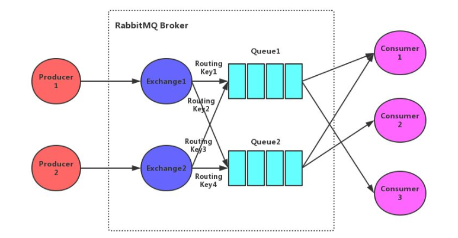

**Broker**：rabbitmq的服务节点&#x20;

**Queue**：队列，是RabbitMQ的内部对象，用于存储消息。RabbitMQ中消息只能存储在队列中。生产者投递消息到队列，消费者从队列中获取消息并消费。多个消费者可以订阅同一个队列，这时队列中的消息会被平均分摊(轮询)给多个消费者进行消费，而不是每个消费者都收到所有的消息进行消费。(注意：RabbitMQ不支持队列层面的广播消费，如果需要广播消费，可以采用一个交换器通过路由Key绑定多个队列，由多个消费者来订阅这些队列的方式。

**Exchange**：交换器。生产者将消息发送到Exchange，由交换器将消息路由到一个或多个队列中。如果路由不到，或返回给生产者，或直接丢弃，或做其它处理。

**RoutingKey**：路由Key。生产者将消息发送给交换器的时候，一般会指定一个RoutingKey，用来指定这个消息的路由规则。这个路由Key需要与交换器类型和绑定键(BindingKey)联合使用才能最终生效。在交换器类型和绑定键固定的情况下，生产者可以在发送消息给交换器时通过指定。RoutingKey来决定消息流向哪里。

**Binding**：通过绑定将交换器和队列关联起来，在绑定的时候一般会指定一个绑定键，这样RabbitMQ就可以指定如何正确的路由到队列了。

交换器和队列实际上是多对多关系。就像关系数据库中的两张表。他们通过BindingKey做关联(多对多关系表)。在投递消息时，可以通过Exchange和RoutingKey(对应BindingKey)就可以找到相对应的队列。

**信道**：信道是建立在Connection 之上的虚拟连接。当应用程序与Rabbit Broker建立TCP连接的时候，客户端紧接着可以创建一个AMQP 信道(Channel) ，每个信道都会被指派一个唯一的ID。RabbitMQ 处理的每条AMQP 指令都是通过信道完成的。信道就像电缆里的光纤束。一条电缆内含有许多光纤束，允许所有的连接通过多条光线束进行传输和接收。

# 2、介绍一下RabbitMQ有几种工作模式？

RabbitMQ是一种流行的消息中间件，它支持多种工作模式，以满足不同的消息传递需求。以下是RabbitMQ中常见的几种工作模式：

1. **简单模式（Simple Queue）**：
   - 也被称为点对点模式。
   - 在这种模式下，有一个生产者（Producer）将消息发送到队列（Queue），然后有一个消费者（Consumer）从队列中接收和处理消息。
     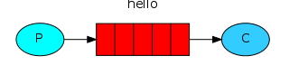

应用场景： 将发送的电子邮件放到消息队列，然后邮件服务在队列中获取邮件并发送给收件人

2.**工作队列模式（Work queues**）

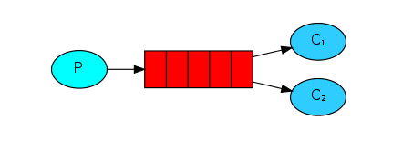

在多个消费者之间分配任务（竞争的消费者模式），一个生产者对应多个消费者，一般适用于执行资源密集型任务，单个消费者处理不过来，需要多个消费者进行处理。

应用场景： 一个订单的处理需要10s，有多个订单可以同时放到消息队列，然后让多个消费者同时处理，这样就是并行了，而不是单个消费者的串行情况。

**3.发布订阅模式（Publish/Subscribe）**

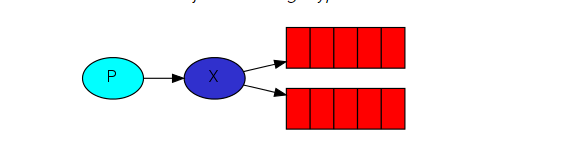

一次向许多消费者发送消息，一个生产者发送的消息会被多个消费者获取，也就是将消息将广播到所有的消费者中。

应用场景： 更新商品库存后需要通知多个缓存和多个数据库，这里的结构应该是：

- 一个fanout类型交换机扇出两个个消息队列，分别为缓存消息队列、数据库消息队列
- 一个缓存消息队列对应着多个缓存消费者
- 一个数据库消息队列对应着多个数据库消费者

4、**路由模式（Routing**）

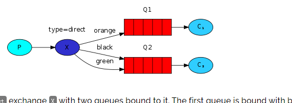

有选择地（Routing key）接收消息，发送消息到交换机并且要指定路由key ，消费者将队列绑定到交换机时需要指定路由key，仅消费指定路由key的消息

应用场景： 如在商品库存中增加了1台iphone12，iphone12促销活动消费者指定routing key为iphone12，只有此促销活动会接收到消息，其它促销活动不关心也不会消费此routing key的消息。

5、**主题模式（Topics**）

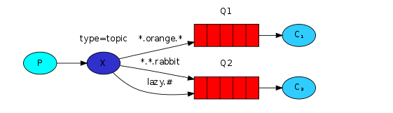

根据主题（Topics）来接收消息，将路由key和某模式进行匹配，此时队列需要绑定在一个模式上，#匹配一个词或多个词，\*只匹配一个词。

应用场景： 同上，iphone促销活动可以接收主题为iphone的消息，如iphone12、iphone13等。

6、**发布者确认（Publisher Confirms）**

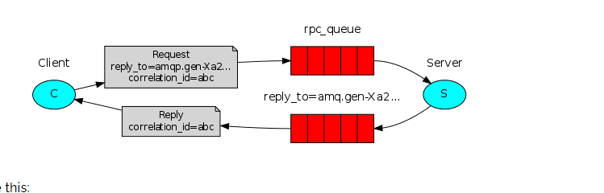

与发布者进行可靠的发布确认，发布者确认是RabbitMQ扩展，可以实现可靠的发布。在通道上启用发布者确认后，RabbitMQ将异步确认发送者发布的消息。

应用场景： 对于消息可靠性要求较高，比如钱包扣款。而一旦我们使用了消息队列，我们基本都要保证消息的百分百投递，因此建议使用的时候尽量选择该模式。

**7、RPC(这种模式用的很少)**

# 3 **、RabbitMQ如何确保消息发送 ？ 消息接收？**

**即消息百分百投递问题。**

**发送方确认机制**：

信道需要设置为 confirm 模式，则所有在信道上发布的消息都会分配一个唯一 ID。

一旦消息被投递到queue（可持久化的消息需要写入磁盘），信道会发送一个确认给生产者（包含消息唯一ID）。如果消息和队列是可持久化的，那么确认消息会在将消息写入磁盘之后发出。

如果 RabbitMQ 发生内部错误从而导致消息丢失，会发送一条 nack（未确认）消息给生产者。

所有被发送的消息都将被 confirm（即 ack） 或者被nack一次。但是没有对消息被 confirm 的快慢做任何保证，并且同一条消息不会既被 confirm又被nack。

发送方确认模式是异步的，生产者应用程序在等待确认的同时，可以继续发送消息。当确认消息到达生产者，生产者的回调方法会被触发来处理该确认消息，如果RabbitMQ因为自身内部错误导致消息丢失，就会发送一条nack消息，生产者应用程序同样可以在回调方法中处理该nack消息。

ConfirmCallback接口：只确认是否正确到达 Exchange 中，成功到达则回调。

ReturnCallback接口：消息失败返回时回调

**接收方确认机制：**

消费者在声明队列时，可以指定noAck参数，当noAck=false时，RabbitMQ会等待消费者显式发回ack信号后才从内存(或者磁盘，持久化消息)中移去消息。否则，消息被消费后会被立即删除。
消费者接收每一条消息后都必须进行确认（消息接收和消息确认是两个不同操作）。只有消费者确认了消息，RabbitMQ 才能安全地把消息从队列中删除。

RabbitMQ不会为未ack的消息设置超时时间，它判断此消息是否需要重新投递给消费者的唯一依据是消费该消息的消费者连接是否已经断开。这么设计的原因是RabbitMQ允许消费者消费一条消息的时间可以很长。保证数据的最终一致性；

如果消费者返回ack之前断开了链接，RabbitMQ 会重新分发给下一个订阅的消费者。（可能存在消息重复消费的隐患，需要去重）；

&#x20;**消息队列本身**

可以进行消息持久化, 即使rabbitMQ挂了，重启后也能恢复数据

如果要进行消息持久化，那么需要对以下3种实体均配置持久化

a) Exchange

声明exchange时设置持久化（durable = true）并且不自动删除(autoDelete = false)

b) Queue

声明queue时设置持久化（durable = true）并且不自动删除(autoDelete = false)

c) message

发送消息时通过设置deliveryMode=2持久化消息

# 4、RabbitMQ事务消息

**通过对信道的设置实现**

1. channel.txSelect()；通知服务器开启事务模式；服务端会返回Tx.Select-Ok
2. channel.basicPublish；发送消息，可以是多条，可以是消费消息提交ack
3. channel.txCommit()提交事务；
4. channel.txRollback()回滚事务；

**消费者使用事务：**

1. autoAck=false，手动提交ack，以事务提交或回滚为准；
2. autoAck=true，不支持事务的，也就是说你即使在收到消息之后在回滚事务也是于事无补的，队列已经把消息移除了

如果其中任意一个环节出现问题，就会抛出IoException异常，用户可以拦截异常进行事务回滚，或决定要不要重复消息。事务消息会降低rabbitmq的性能。

# 5、RabbitMQ如何实现延迟消息？

RabbitMQ本身并不直接支持延迟消息的功能，但可以通过结合使用RabbitMQ的一些特性来实现延迟消息的效果。下面介绍两种常见的实现方式：

1. 利用消息的过期时间和死信队列（DLX）：这种方式可以通过设置消息的过期时间来实现延迟消息的效果。具体步骤如下：
   - 创建一个普通的交换机和队列用于接收延迟消息。
   - 设置队列的消息过期时间，可以通过设置队列的`x-message-ttl`参数或通过单独设置消息的`expiration`属性。
   - 设置队列的死信交换机和死信路键，将过期的消息发送到指定的死信交换机和路由键。
   - 创建一个死信交换机和队列，用于处理过期的消息。
   - 将队列绑定到死信交换机上，指定合适的路由键。
   - 发送延迟消息时，将消息发送到普通的交换机和队列。
     消息会在指定的过期时间后发送到死信交换机和队列，从而实现延迟消息的效果。
2. 使用RabbitMQ的延迟插件（rabbitmq\_delayed\_message\_exchange）：RabbitMQ社区提供了一个延迟插件，可以直接实现延迟消息的功能。具体步骤如下：
   - 下载并安装rabbitmq\_delayed\_message\_exchange插件。
   - 启用延迟插件，通过RabbitMQ的管理界面或命令行工具进行配置。
   - 创建一个延迟交换机和队列，将延迟插件应用到交换机上。
   - 发送延迟消息时，将消息发送到延迟交换机和队列，同时设置消息的延迟时间。
     延迟交换机会根据消息的延迟时间将消息发送到指定的目标队列，从而实现延迟消息的效果。

需要注意的是，以上两种方式都是通过消息的过期时间来实现延迟消息的，因此在使用时需要根据实际需求和性能考虑合适的延迟时间设置。另外，延迟消息的实现可能会增加系统的复杂性和消息的处理延迟，需要根据具体业务场景进行评估和选择。

# 6、RabbitMQ如何保证消息的顺序性？

消息队列中的若干消息如果是对同一个数据进行操作，这些操作具有前后的关系，必须要按前后的顺序执行，否则就会造成数据异常。举例： &#x20;
比如通过mysql binlog进行两个数据库的数据同步，由于对数据库的数据操作是具有顺序性的，如果操作顺序搞反，就会造成不可估量的错误。比如数据库对一条数据依次进行了 插入->更新->删除操作，这个顺序必须是这样，如果在同步过程中，消息的顺序变成了 删除->插入->更新，那么原本应该被删除的数据，就没有被删除，造成数据的不一致问题。

举例场景：

RabbitMQ：

①一个queue，有多个consumer去消费，这样就会造成顺序的错误，consumer从MQ里面读取数据是有序的，但是每个consumer的执行时间是不固定的，无法保证先读到消息的consumer一定先完成操作，这样就会出现消息并没有按照顺序执行，造成数据顺序错误。

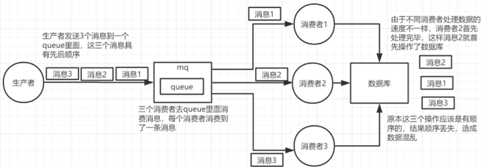

②一个queue对应一个consumer，但是consumer里面进行了多线程消费，这样也会造成消息消费顺序错误。

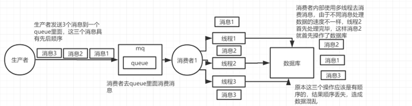

解决方案：

①拆分多个queue，每个queue一个consumer，就是多一些queue而已，确实是麻烦点；这样也会造成吞吐量下降，可以在消费者内部采用多线程的方式取消费。

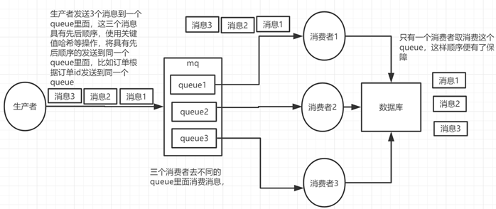

一个queue对应一个consumer

②或者就一个queue但是对应一个consumer，然后这个consumer内部用内存队列做排队，然后分发给底层不同的worker来处理

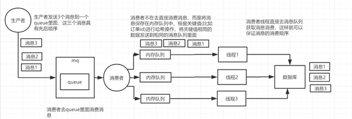

一个queue对应一个consumer，采用多线程

# 7、如何使用RabbitMQ解决分布式事务？

**分布式事务：** 不同的服务操作不同的数据源（库或表），保证数据一致性的问题。

**解决：** 采用RabbitMQ消息最终一致性的解决方案，解决分布式事务问题。

分布式事务场景：

1、电商项目中的商品库和ES库数据同步问题。

2、电商项目中：支付----订单---库存，一系列操作，进行状态更改等。

在互联网应用中，基本都会有用户注册的功能。在注册的同时，我们会做出如下操作：

收集用户录入信息，保存到数据库向用户的手机或邮箱发送验证码等等…

如果是传统的集中式架构，实现这个功能非常简单：开启一个本地事务，往本地数据库中插入一条用户数据，发送验证码，提交事物。

但是在分布式架构中，用户和发送验证码是两个独立的服务，它们都有各自的数据库，那么就不能通过本地事物保证操作的原子性。这时我们就需要用到 RabbitMQ（消息队列）来为我们实现这个需求。

在用户进行注册操作的时候，我们为该操作创建一条消息，当用户信息保存成功时，把这条消息发送到消息队列。验证码系统会监听消息，一旦接受到消息，就会给该用户发送验证码。

# **8、如何防止RabbitMQ消息重复消费？**

保证消息幂等性。和保证接口幂等性一样。

RabbitMQ、RocketMQ、Kafka等任何队列不保证消息不重复，如果业务需要消息不重复消费，则需要消费端处理业务消息要保持幂等性

方式一：Redis的setNX() , 做消息id去重 java版本目前不支持设置过期时间。

```java
//Redis中操作，判断是否已经操作过 TODO

boolean flag = jedis.setNX(key);

if(flag){

//消费

}else{

//忽略，重复消费

} 
```

方式二：redis的 Incr 原子操作：key自增，大于0 返回值大于0则说明消费过，(key可以是消息的md5取值, 或者如果消息id设计合理直接用id做key)

```java
int num = jedis.incr(key);

if(num == 1){

//消费

}else{

//忽略，重复消费

}
```

方式三：数据库去重表

设计一个去重表，某个字段使用Message的key做唯一索引，因为存在唯一索引，所以重复消费会失败

```java
CREATE TABLE `message_record` ( `id` int(11) unsigned NOT NULL AUTO_INCREMENT, `key` varchar(128) DEFAULT NULL, `create_time` datetime DEFAULT NULL, PRIMARY KEY (`id`), UNIQUE KEY `key` (`key`) ) ENGINE=InnoDB DEFAULT CHARSET=utf8mb4;
```

方式四：数据库主键id唯一约束。（但是注意不能把主键id设置为了自增，因此需要生成一个唯一的全局id.作为主键）。

**方式五：利用消息队列自带的判断消息唯一性（在消费端）机制**

```java
如果判断该消息已经处理过一次 // getRedelivered() 判断是否已经处理过一次消息！ 
if (!message.getMessageProperties().getRedelivered()) {
 System.out.println("消息已重复处理,拒绝再次接收"); 
 // 拒绝消息 channel.basicReject(message.getMessageProperties().getDeliveryTag(), false); }
  else {
   System.out.println("该消息不是重复的");

channel.basicNack(message.getMessageProperties().getDeliveryTag(), false, true);

} 

```

**方式六：利用**Redis机制

**生产者：**

```java
public void sendMessage(){
    JSONObject jsonObject = new JSONObject();
    jsonObject.put("message","hello world");
    String json = jsonObject.toJSONString();
    Message message = MessageBuilder.withBody(json.getBytes()).setContentType(MessageProperties.CONTENT_TYPE_JSON).setContentEncoding("UTF-8").setMessageId(UUID.randomUUID()+"").build();
    amqpTemplate.convertAndSend("javatrip",message);
}
```

**消费者：**

```java
public class Consumer {

    @RabbitHandler
    public void receiveMessage(Message message) throws Exception {


        String messageId = message.getMessageProperties().getMessageId();
        String msg = new String(message.getBody(),"UTF-8");
        System.out.println("接收到的消息为："+msg+"==消息id为："+messageId);

        String messageIdRedis = redisTemplate.opsForValue().get("messageId")

        if(messageId == messageIdRedis){
            // 代表是重复的
            return;
        }
        JSONObject jsonObject = JSONObject.parseObject(msg);
        String email = jsonObject.getString("message");
        redisTemplate.opsForValue().set("messageId",messageId);
    }
}
```

# 9、如何解决消息队列的延时以及过期失效问题?消息队列满了之后该如何处理?有几百万的消息持续积压几小时,说说如何解决?

方案分析

该问题,其本质针对的场景，都是说，可能你的消费端出了问题，不消费了，或者消费的极其极其慢。另外还有可能你的消息队列集群的磁盘都快写满了，都没人消费，这个时候怎么办？或者是整个这就积压了几个小时，你这个时候怎么办？或者是你积压的时间太长了，导致比如rabbitmq设置了消息过期时间后就没了怎么办？

所以这种问题线上常见的，一般不出，一出就是大问题，一般常见于，举个例子，消费端每次消费之后要写mysql，结果mysql挂了，消费端挂掉了。导致消费速度极其慢。

分析1+话术

这个是我们真实遇到过的一个场景，确实是线上故障了，这个时候要不然就是修复consumer的问题，让他恢复消费速度，然后傻傻的等待几个小时消费完毕。(可行,但是不建议 在面试的时候说)

一个消费者一秒是1000条，一秒3个消费者是3000条，一分钟是18万条，1000多万条

所以如果你积压了几百万到上千万的数据，即使消费者恢复了，也需要大概1小时的时间才能恢复过来

一般这个时候，只能操作临时紧急扩容了，具体操作步骤和思路如下：

1）先修复consumer的问题，确保其恢复消费速度，然后将现有cnosumer都停掉

2）新建一个topic，partition是原来的10倍，临时建立好原先10倍或者20倍的queue数量

3）然后写一个临时的分发数据的consumer程序，这个程序部署上去消费积压的数据，消费之后不做耗时的处理，直接均匀轮询写入临时建立好的10倍数量的queue

4）接着临时征用10倍的机器来部署consumer，每一批consumer消费一个临时queue的数据

5）这种做法相当于是临时将queue资源和consumer资源扩大10倍，以正常的10倍速度来消费数据

6）等快速消费完积压数据之后，得恢复原先部署架构，重新用原先的consumer机器来消费消息

分析2+话术

rabbitmq是可以设置过期时间的，就是TTL，如果消息在queue中积压超过一定的时间就会被rabbitmq给清理掉，这个数据就没了。那这就是第二个坑了。这就不是说数据会大量积压在mq里，而是大量的数据会直接搞丢。

这个情况下，就不是说要增加consumer消费积压的消息，因为实际上没啥积压，而是丢了大量的消息。我们可以采取一个方案，就是批量重导，这个我们之前线上也有类似的场景干过。就是大量积压的时候，我们当时就直接丢弃数据了，然后等过了高峰期以后，比如大家一起喝咖啡熬夜到晚上12点以后，用户都睡觉了。

这个时候我们就开始写程序，将丢失的那批数据，写个临时程序，一点一点的查出来，然后重新灌入mq里面去，把白天丢的数据给他补回来。也只能是这样了。

假设1万个订单积压在mq里面，没有处理，其中1000个订单都丢了，你只能手动写程序把那1000个订单给查出来，手动发到mq里去再补一次

分析3+话术

如果走的方式是消息积压在mq里，那么如果你很长时间都没处理掉，此时导致mq都快写满了，咋办？这个还有别的办法吗？没有，谁让你第一个方案执行的太慢了，你临时写程序，接入数据来消费，消费一个丢弃一个，都不要了，快速消费掉所有的消息。然后走第二个方案，到了晚上再补数据吧。
