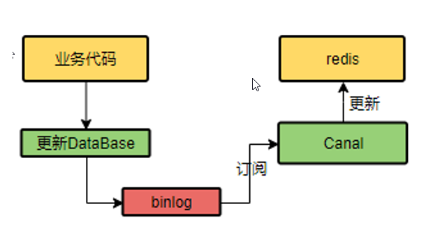

# Redis

# 1 Redis是AP的还是CP的？

Redis是一个支持多种数据结构的内存数据库，它可以根据配置和使用方式在AP和CP之间做出选择。具体来说，Redis可以在不同的场景下提供不同的一致性级别：

1\. 在默认情况下，Redis追求最高的性能和可用性，更倾向于AP模型（即可用性优先）。它使用主从复制和哨兵机制来实现高可用性，但在出现网络分区或节点故障时，可能会导致数据的不一致性。

2\. 但是，Redis也提供了一些支持一致性的特性，例如Redis Cluster和Redis Sentinel。通过使用这些特性，Redis可以在需要更高一致性的场景下选择CP模型（即一致性优先）。在Redis Cluster中，数据被分片存储在不同的节点上，并使用Gossip协议来保持数据的一致性。Redis Sentinel则提供了监控和自动故障转移的功能，以保证高可用性和数据的一致性。

因此，根据具体的配置和使用方式，Redis可以在AP和CP之间进行选择。

# 2 介绍一下Redis的集群方案？

**1、主从模式：**

主机数据更新后根据配置和策略， 自动同步到备机的master/slaver机制，Master以写为主，Slave以读为主

主从复制有以下作用：

读写分离，性能扩展

容灾快速恢复

主从复制的三种模式：

一主二仆： 一个redis服务作为Master,主要负责写操作，多个redis服务作为Slave,主要负责读操作

薪火相传：上一个Slave可以是下一个slave的Master，Slave同样可以接收其他 slaves的连接和同步请求

反客为主：当一个master宕机后，后面的slave可以立刻升为master，其后面的slave不用做任何修改。用 slaveof no one  将从机变为主机

**2、哨兵模式：**
sentinel，哨兵是 redis 集群中非常重要的一个组件，主要有以下功能：

- 集群监控：负责监控 redis master 和 slave 进程是否正常工作。
- 消息通知：如果某个 redis 实例有故障，那么哨兵负责发送消息作为报警通知给管理员。
- 故障转移：如果 master node 挂掉了，会自动转移到 slave node 上。
- 配置中心：如果故障转移发生了，通知 client 客户端新的 master 地址。

哨兵用于实现 redis 集群的高可用，本身也是分布式的，作为一个哨兵集群去运行，互相协同工作。

- 故障转移时，判断一个 master node 是否宕机了，需要大部分的哨兵都同意才行，涉及到了分布式选举
- 即使部分哨兵节点挂掉了，哨兵集群还是能正常工作的
- 哨兵通常需要 3 个实例，来保证自己的健壮性
- 哨兵 + redis 主从的部署架构，是不保证数据零丢失的，只能保证 Redis 集群的高可用性。
  对于哨兵 + redis 主从这种复杂的部署架构，尽量在测试环境和生产环境，都进行充足的测试和演练。

**3、Redis Cluster模式：**

Redis Cluster是一种服务端Sharding技术，3.0版本开始正式提供。采用slot(槽)的概念，一共分成16384个槽。将请求发送到任意节点，接收到请求的节点会将查询请求发送到正确的节点上执行。

**方案说明**：

- 通过哈希的方式，将数据分片，每个节点均分存储一定哈希槽(哈希值)区间的数据，默认分配了16384 个槽位
- 每份数据分片会存储在多个互为主从的多节点上
- 数据写入先写主节点，再同步到从节点(支持配置为阻塞同步)
- 同一分片多个节点间的数据不保持强一致性
- 读取数据时，当客户端操作的key没有分配在该节点上时，redis会返回转向指令，指向正确的节点
- 扩容时需要需要把旧节点的数据迁移一部分到新节点

在 Redis Cluster 架构下，每个 Redis 要放开两个端口号，比如一个是 6379，另外一个就是加1w 的端口号，比如 16379。
16379 端口号是用来进行节点间通信的，也就是 cluster bus 的通信，用来进行故障检测、配置更新、故障转移授权。cluster bus 用了另外一种二进制的协议，gossip 协议，用于节点间进行高效的数据交换，占用更少的网络带宽和处理时间。

**优点：**

- 无中心架构，支持动态扩容，对业务透明
- 具备Sentinel的监控和自动Failover(故障转移)能力
- 客户端不需要连接集群所有节点，连接集群中任何一个可用节点即可
- 高性能，客户端直连redis服务，免去了proxy代理的损耗

**缺点：**

- 运维也很复杂，数据迁移需要人工干预
- 只能使用0号数据库
- 不支持批量操作(pipeline管道操作)
- 分布式逻辑和存储模块耦合等

Redis Sharding是Redis Cluster出来之前，业界普遍使用的多Redis实例集群方法。其主要思想是采用
哈希算法将Redis数据的key进行散列，通过hash函数，特定的key会映射到特定的Redis节点上。Java
redis客户端驱动jedis，支持Redis Sharding功能，即ShardedJedis以及结合缓存池的
ShardedJedisPool

**优点:**
优势在于非常简单，服务端的Redis实例彼此独立，相互无关联，每个Redis实例像单服务器一样运行，非常容易线性扩展，系统的灵活性很强
**缺点:**
由于sharding处理放到客户端，规模进一步扩大时给运维带来挑战。
客户端sharding不支持动态增删节点。服务端Redis实例群拓扑结构有变化时，每个客户端都需要更新调整。连接不能共享，当应用规模增大时，资源浪费制约优化

# 3 什么是Redis的数据分片？

Redis的数据分片是一种数据分布在多个节点上的技术，用于实现水平扩展和负载均衡。在Redis中，数据分片是通过哈希槽（Hash Slot）来实现的。

具体而言，数据分片的过程如下：

1\. 哈希槽的定义：Redis将整个数据空间划分为固定数量的哈希槽，通常是16384个。每个哈希槽都有一个唯一的标识符，从0到16383。

2\. 数据的映射：当客户端发送一个命令请求时，Redis Cluster通过对的哈希值进行计算，将键值对映射到一个特定的哈希槽中。这样，每个键值对就被分配到了一个特定的哈希槽中。

3\. 哈希槽的分配：Redis Cluster将所有的哈希槽均匀地分配给各个节点，每个节点负责存储一部分哈希槽对应的数据。这样，数据就被分片存储在了多个节点上。

4\. 数据的查找：当客户端需要访问某个键值对时，它首先计算键的哈希值，然后根据哈希值找到对应的哈希槽。客户端根据哈希槽的信息找到负责该哈希槽的节点，并将请求发送给该节点。

5\. 数据的迁移：当需要添加或删除节点时，Redis Cluster会进行数据的迁移，以保持各个节点负载均衡。数据迁移的过程中，哈希槽会从一个节点移动到另一个节点，保证数据的分片均匀和一致。通过数据分片，Redis可以在多个节点上并行处理请求，提高了系统的吞吐量和容量。

同时，数据分片还实现了负载均衡和故障隔离，当某个节点故障时，其他节点仍然可以继续提供服务。总的来说，Redis的数据分片通过哈希槽的方式，将数据分布在多个节点上，实现了水平扩展、负载均衡和故障隔离。

# 4 Redis为什么这么快？

Redis之所以被认为是快速的，主要有以下几个原因：

1. 内存存储：Redis将数据存储在内存中，而不是磁盘上。相比于磁盘访问内存访问速度更快，可以实现很低的延迟和高吞吐量。
2. 单线程模型：Redis采单线程模型，避免了多线程间的竞争和上下文切换的开销。线程模型简化了并发控制，减少了锁的使用，提高了处理请求的效率。
3. 高效的数据结构：Redis提供了多种高效的数据结构，如字符串、哈希表、跳跃表、集合和有序集合等。这些数据结构在内部实现上都经过了优化，能够快速地进行插入、删除、查找和遍历操作。
4. 异步操作：Redis支持异步操作，可以在后台执行一些耗时的操作，如持久化、复制和集群的同步等。这样可以减少客户端的等待时间，提高系统的响应速度。
5. 高效的网络通信（核心）：Redis自定义的RESP协议进行网络通信，协议本身简单而高效。Redis的网络通信采用非阻塞I/O多路复用机制和事件驱动的方式，可以处理大量的并发连接，提高了系统的并发性能。
6. 优化的算法和数据结构：Redis在内部实现中使用了许多优化的算法和数据结构。例如，使用跳跃表（Skip List）来实现有序集合，使用压缩列表（ziplist）来存储小规模的列表和哈希表等。这些优化可以减少内存占用和提高数据操作的效率。

总的来说，Redis之所以快速，是因为它使用内存存储、采用单线程模型、提供高效的数据结构、支持异步操作、优化网络通信和使用优化的算法和数据结构等。这些特性使得能够在处理大量请求时保持低延迟和高吞吐量。

# 5 Redis 的事务机制是怎样的？

**1、事务开始**
MULTI命令的执行，标识着一个事务的开始。MULTI命令会将客户端状态的 flags 属性中打开
REDIS\_MULTI 标识来完成的。

**2、命令入队**
当一个客户端切换到事务状态之后，服务器会根据这个客户端发送来的命令来执行不同的操作。如果客户端发送的命令为MULTI、EXEC、WATCH、DISCARD中的一个，立即执行这个命令，否则将命令放入一个事务队列里面，然后向客户端返回 QUEUED 回复

- 如果客户端发送的命令为 EXEC、DISCARD、WATCH、MULTI 四个命令的其中一个，那么服务器
  立即执行这个命令。
- 如果客户端发送的是四个命令以外的其他命令，那么服务器并不立即执行这个命令。
  首先检查此命令的格式是否正确，如果不正确，服务器会在客户端状态（RedisClient）的 flags 属性关闭 REDIS\_MULTI 标识，并且返回错误信息给客户端。

如果正确，将这个命令放入一个事务队列里面，然后向客户端返回 QUEUED 回复

**3、事务执行**

客户端发送 EXEC 命令，服务器执行 EXEC 命令逻辑。

- 如果客户端状态的 flags 属性不包含 REDIS\_MULTI 标识，或者包含 REDIS\_DIRTY\_CAS 或者
  REDIS\_DIRTY\_EXEC 标识，那么就直接取消事务的执行。
- 否则客户端处于事务状态（flags 有 REDIS\_MULTI 标识），服务器会遍历客户端的事务队列，然后执行事务队列中的所有命令，最后将返回结果全部返回给客户端；

Redis 不支持事务回滚机制，但是它会检查每一个事务中的命令是否错误。
Redis 事务不支持检查那些程序员自己逻辑错误。例如对 String 类型的数据库键执行对HashMap 类型的操作！

**WATCH** 命令是一个乐观锁，可以为 Redis 事务提供 check-and-set （CAS）行为。可以监控一个或多个键，一旦其中有一个键被修改（或删除），之后的事务就不会执行，监控一直持续到EXEC命令。

**MULTI**命令用于开启一个事务，它总是返回OK。MULTI执行之后，客户端可以继续向服务器发送任意多条命令，这些命令不会立即被执行，而是被放到一个队列中，当EXEC命令被调用时，所有队列中的命令才会被执行。

**EXEC：** 执行所有事务块内的命令。返回事务块内所有命令的返回值，按命令执行的先后顺序排
列。当操作被打断时，返回空值 nil 。
通过调用DISCARD，客户端可以清空事务队列，并放弃执行事务， 并且客户端会从事务状态中退
出。

**UNWATCH**命令可以取消watch对所有key的监控

# 6  介绍下Redis的主从复制模式？

Redis的主从复制（Master-Slave Replication）是一种常见的架构模式，用于在不同Redis实例之间同步数据。主从模式允许一个Redis实例（称为主节点）将其数据复制到一个或多个其他Redis实例（称为从节点），从而实现数据的备份、读写分离、扩展性以及高可用性。

主从模式的工作原理：

1. **角色定义：**
   - **主节点（Master）：** 主节点是数据的源头，负责接收写入请求并处理客户端的读写操作。
   - **从节点（Slave）：** 从节点通过复制主节点的数据来保持数据的同步，并且可以用于读取操作。
2. **初始化同步：**
   - 当一个从节点与主节点建立连接时，它会发送一个同步命令给主节点，请求复制数据。
   - 主节点接受到请求后，执行一个后台的快照操作（类似于RDB持久化），将数据库状态保存到一个RDB文件中。
   - 主节点将这个RDB文件发送给从节点，并在发送过程中继续记录执行的写命令。
3. **增量复制：**
   - 一旦从节点完成初始数据同步，主节点将继续将新的写命令发送给从节点。
   - 从节点接收到这些写命令并应用到自己的数据库中，保持与主节点的数据状态同步。
   - 从节点定期向主节点发送心跳请求以确认连接是否存活，并在需要时重新同步数据。

# 7 Redis的持久化机制是怎样的？

Redis提供了两种方式的持久化机制，分别是RDB快照和AOF日志。

**RDB：Redis DataBase**
在指定的时间间隔内将内存中的数据集快照写入磁盘，实际操作过程是fork一个子进程，先将数据集写入临时文件，写入成功后，再替换之前的文件，用二进制压缩存储。

**优点：**
1、整个Redis数据库将只包含一个文件 dump.rdb，方便持久化。
2、容灾性好，方便备份。
3、性能最大化，fork 子进程来完成写操作，让主进程继续处理命令，所以是 IO 最大化。使用单独子进程来进行持久化，主进程不会进行任何 IO 操作，保证了 redis 的高性能
4.相对于数据集大时，比 AOF 的启动效率更高。

**缺点：**
1、数据安全性低。RDB 是间隔一段时间进行持久化，如果持久化之间 redis 发生故障，会发生数据丢失。所以这种方式更适合数据要求不严谨的时候)
2、由于RDB是通过fork子进程来协助完成数据持久化工作的，因此，如果当数据集较大时，可能会导致整个服务器停止服务几百毫秒，甚至是1秒钟。

**AOF：Append Only File**
以日志的形式记录服务器所处理的每一个写、删除操作，查询操作不会记录，以文本的方式记录，可以打开文件看到详细的操作记录。

**优点：**
1、数据安全，Redis中提供了3种同步策略，即每秒同步、每修改同步和不同步。事实上，每秒同步也是异步完成的，其效率也是非常高的，所差的是一旦系统出现宕机现象，那么这一秒钟之内修改的数据将会丢失。而每修改同步，我们可以将其视为同步持久化，即每次发生的数据变化都会被立即记录到磁盘中。。
2、通过 append 模式写文件，即使中途服务器宕机也不会破坏已经存在的内容，可以通过 redis-
check-aof 工具解决数据一致性问题。
3、AOF 机制的 rewrite 模式。定期对AOF文件进行重写，以达到压缩的目的

**缺点：**
1、AOF 文件比 RDB 文件大，且恢复速度慢。
2、数据集大的时候，比 rdb 启动效率低。
3、运行效率没有RDB高。

**AOF和RDB对比：**

- AOF文件比RDB更新频率高，优先使用AOF还原数据。
- AOF比RDB更安全也更大
- RDB性能比AOF
- 如果两个都配了优先加载AOF

| **比较**   | **AOF**     | **RDB**   |
| -------- | ----------- | --------- |
| 默认选择     | No          | Yes       |
| 数据格式     | RESP格式所有写命令 | 压缩的二进制文件  |
| 数据的安全性   | 三种写回策略决定    | 分钟级别数据的丢失 |
| 文件大小     | 大           | 小         |
| 恢复速度     | 慢           | 快         |
| 重写机制     | Yes         | No        |
| 重写阻塞主线   | No          | No        |
| Redis的性能 | 三种写回策略决定    | 分钟级别的快照   |
| 数据恢复的选择  | Yes         | No        |

# 8 Redis 的过期策略是怎么样的？

Redis是key-value数据库，我们可以设置Redis中缓存的key的过期时间。Redis的过期策略就是指当Redis中缓存的key过期了，Redis如何处理。

**惰性过期**：只有当访问一个key时，才会判断该key是否已过期，过期则清除。该策略可以最大化地节省CPU资源，却对内存非常不友好。极端情况可能出现大量的过期key没有再次被访问，从而不会被清除，占用大量内存。

**定期过期**：每隔一定的时间，会扫描一定数量的数据库的expires字典中一定数量的key，并清除其中已过期的key。该策略是一个折中方案。通过调整定时扫描的时间间隔和每次扫描的限定耗时，可以在不同情况下使得CPU和内存资源达到最优的平衡效果。

(expires字典会保存所有设置了过期时间的key的过期时间数据，其中，key是指向键空间中的某个键的指针，value是该键的毫秒精度的UNIX时间戳表示的过期时间。键空间是指该Redis集群中保存的所有键。)

Redis中同时使用了惰性过期和定期过期两种过期策略。

# 9 Redis的内存淘汰策略是怎么样的？

Redis 4.0 之前一共实现了 6 种内存淘汰策略，在 4.0 之后，又增加了 2 种策略。我们可以按照是否会进行数据淘汰把它们分成两类：

- 不进行数据淘汰的策略，只有 noeviction 这一种。
- 会进行淘汰的 7 种其他策略。
-

会进行淘汰的 7 种策略，再进一步根据淘汰候选数据集的范围把它们分成两类：

- 在设置了过期时间的数据中进行淘汰，包括 volatile-random、volatile-ttl、volatile-lru、volatile-lfu（Redis 4.0 后新增）四种。
- 在所有数据范围内进行淘汰，包括 allkeys-lru、allkeys-random、allkeys-lfu（Redis 4.0 后新增）三种。

具体解释下各个策略：

默认情况下，Redis 在使用的内存空间超过 maxmemory 值时，并不会淘汰数据，也就是设定的 noeviction 策略。对应到 Redis 缓存，也就是指，一旦缓存被写满了，再有写请求来时，Redis 不再提供服务，而是直接返回错误。Redis 用作缓存时，实际的数据集通常都是大于缓存容量的，总会有新的数据要写入缓存，这个策略本身不淘汰数据，也就不会腾出新的缓存空间，我们不把它用在 Redis 缓存中。

接着 volatile-random、volatile-ttl、volatile-lru 和 volatile-lfu 这四种淘汰策略。它们筛选的候选数据范围，被限制在已经设置了过期时间的键值对上。也正因为此，即使缓存没有写满，这些数据如果过期了，也会被删除。

比如我们使用 EXPIRE 命令对一批键值对设置了过期时间后，无论是这些键值对的过期时间是快到了，还是 Redis 的内存使用量达到了 maxmemory 阈值，Redis 都会进一步按照 volatile-ttl、volatile-random、volatile-lru、volatile-lfu 这四种策略的具体筛选规则进行淘汰

- volatile-ttl 在筛选时，会针对设置了过期时间的键值对，根据过期时间的先后进行删除，越早过期的越先被删除。
- volatile-random 就像它的名称一样，在设置了过期时间的键值对中，进行随机删除。
- volatile-lru 会使用 LRU 算法筛选设置了过期时间的键值对。
- volatile-lfu 会使用 LFU 算法选择设置了过期时间的键值对。

相对于 volatile-ttl、volatile-random、volatile-lru、volatile-lfu 这四种策略淘汰的是设置了过期时间的数据，allkeys-lru、allkeys-random、allkeys-lfu 这三种淘汰策略的备选淘汰数据范围，就扩大到了所有键值对，无论这些键值对是否设置了过期时间。它们筛选数据进行淘汰的规则是：

- allkeys-random 策略，从所有键值对中随机选择并删除数据
- allkeys-lru 策略，使用 LRU 算法在所有数据中进行筛选。
- allkeys-lfu 策略，使用 LFU 算法在所有数据中进行筛选。

这也就是说，如果一个键值对被删除策略选中了，即使它的过期时间还没到，也需要被删除。当然，如果它的过期时间到了但未被策略选中，同样也会被删除。

# 10 **Redis的LRU算法**

LRU 算法的全称是 Least Recently Used，从名字上就可以看出，这是按照最近最少使用的原则来筛选数据，最不常用的数据会被筛选出来，而最近频繁使用的数据会留在缓存中。

那具体是怎么筛选的呢？LRU 会把所有的数据组织成一个链表，链表的头和尾分别表示 MRU 端和 LRU 端，分别代表最近最常使用的数据和最近最不常用的数据。

我们现在有数据 6、3、9、20、5。如果数据 20 和 3 被先后访问，它们都会从现有的链表位置移到 MRU 端，而链表中在它们之前的数据则相应地往后移一位。因为，LRU 算法选择删除数据时，都是从 LRU 端开始，所以把刚刚被访问的数据移到 MRU 端，就可以让它们尽可能地留在缓存中。

如果有一个新数据 15 要被写入缓存，但此时已经没有缓存空间了，也就是链表没有空余位置了，那么，LRU 算法做两件事：

- 数据 15 是刚被访问的，所以它会被放到 MRU 端；
- 算法把 LRU 端的数据 5 从缓存中删除，相应的链表中就没有数据 5 的记录了。

其实，LRU 算法背后的想法非常朴素：它认为刚刚被访问的数据，肯定还会被再次访问，所以就把它放在 MRU 端；长久不访问的数据，肯定就不会再被访问了，所以就让它逐渐后移到 LRU 端，在缓存满时，就优先删除它。

不过，LRU 算法在实际实现时，需要用链表管理所有的缓存数据，这会带来额外的空间开销。而且，当有数据被访问时，需要在链表上把该数据移动到 MRU 端，如果有大量数据被访问，就会带来很多链表移动操作，会很耗时，进而会降低 Redis 缓存性能。

所以，在 Redis 中，LRU 算法被做了简化，以减轻数据淘汰对缓存性能的影响，Redis 默认会记录每个数据的最近一次访问的时间戳（由键值对数据结构 RedisObject 中的 lru 字段记录）。然后，Redis 在决定淘汰的数据时，第一次会随机选出 N 个数据，把它们作为一个候选集合。接下来，Redis 会比较这 N 个数据的 lru 字段，把 lru 字段值最小的数据从缓存中淘汰出去。

当需要再次淘汰数据时，Redis 需要挑选数据进入第一次淘汰时创建的候选集合。这儿的挑选标准是：能进入候选集合的数据的 lru 字段值必须小于候选集合中最小的 lru 值。当有新数据进入候选数据集后，如果候选数据集中的数据个数达到了 maxmemory-samples，Redis 就把候选数据集中 lru 字段值最小的数据淘汰出去。

这样一来，Redis 缓存不用为所有的数据维护一个大链表，也不用在每次数据访问时都移动链表项，提升了缓存的性能。

# 11 Redis的淘汰策略的选择

**建议：**

优先使用 allkeys-lru 策略。这样，可以充分利用 LRU 这一经典缓存算法的优势，把最近最常访问的数据留在缓存中，提升应用的访问性能。如果你的业务数据中有明显的冷热数据区分，我建议你使用 allkeys-lru 策略。如果业务应用中的数据访问频率相差不大，没有明显的冷热数据区分，建议使用 allkeys-random 策略，随机选择淘汰的数据就行。

如果你的业务中有置顶的需求，比如置顶新闻、置顶视频，那么，可以使用 volatile-lru 策略，同时不给这些置顶数据设置过期时间。这样一来，这些需要置顶的数据一直不会被删除。

# 12 什么是热Key问题，如何解决热key问题

热Key问题是指在Redis中，某个或某些特定的键被频繁访问，导致对这些键的操作成为系统的性能瓶颈。热Key问题可能会导致Redis负载过高，响应时间延长，甚至造成系统崩溃。

为了解决热Key问题，可以采取以下一些策略：

1. 增加缓存容量：扩大Redis内存容量可以提高缓存命中率，减少对热Key的访问次数，从而缓解热Key问题。可以考虑升级Redis服务器或增加Redis集群节点来增加内存容量。
2. 分片：将热Key均匀地分散到多个Redis实例中，每个实例处理一部分热Key的请求。这样可以降低单个Redis实例的负载压力，提系统整体的吞吐量。
3. 缓存预热：在系统启动或流量低峰期，提前加载热Key的数据到缓存中，使得这些热Key的数据在实际访问时已经存在于缓存中，减少对后端存储的访问。
4. 数据分片：对于热Key所对的数据量较大的情况，可以考虑将数据进行分片存储，将不同片段的数据存放在不同的键上，从而减轻单个键的访问压力。
5. 缓存降级：对于某些热Key，可以考虑将其缓存时间设置较短，或者不缓存，直接访问后端存储。这样可以避免热Key对缓存系统的过度压力，同时确保其他非热Key正常缓存。
6. 使用Redis集群：通过搭建Redis集群，将热Key分散到多个节点上，实现负载均衡和高可用性，提高系统的整体性能和稳定性。

综合考虑具体业务场景和系统需求，可以采取不同的策略或组合使用来解决热Key问题。

# 13 什么是大Key问题，如何解决？

大Key问题是指在Redis数据库中存储了过大的数据结构，如大型列表、哈希、集合等，导致内存占用过高，影响Redis性能的情况。这可能会导致以下问题：

内存占用过高： 大Key占用了大量的内存空间，导致其他数据无法被缓存，从而影响Redis的性能和响应速度。

数据加载时间延长： 由于大Key的加载和传输需要较长时间，会导致读取和写入操作的延迟。

持久化问题： 在进行数据持久化（如RDB快照、AOF日志）时，大Key会增加持久化的时间和磁盘空间占用。

解决大Key问题的方法包括：

数据分片： 将大数据拆分成多个小数据，分别存储在不同的Key中。例如，将一个大型哈希表分成多个小型哈希表。

使用分布式存储： 将大数据存储在分布式数据库中，如Redis Cluster或其他分布式存储系统。

合理选择数据结构： 根据实际需求，选择合适的数据结构，避免在单个Key中存储过大的数据。

数据压缩： 对于可以压缩的数据，使用Redis提供的数据压缩功能，减小存储占用。

使用大Key分析工具： Redis提供了一些工具可以用于识别和处理大Key问题，例如Redis内存分析工具和命令。

定期清理： 周期性地检查数据库，发现并处理大Key，例如将大Key转移至其他存储系统。

合理设置过期时间： 对于不再需要的数据，设置适当的过期时间，让Redis可以自动淘汰这些数据。

综合使用这些方法可以有效地解决大Key问题，提高Redis的性能和稳定性。

# 14 什么是缓存击穿、缓存穿透、缓存雪崩？

击穿、缓存穿透和缓存雪崩都是与缓存相关的常见问题现象。

**缓存击穿**：是指缓存中没有但数据库中有的数据（一般是缓存时间到期），这时由于并发用户特别多，同时读缓存没读到数据，又同时去数据库去取数据，引起数据库压力瞬间增大，造成过大压力。

**解决方案**：

- 设置热点数据永远不过期。
- 加互斥锁

**缓存穿透**：是指缓存和数据库中都没有的数据，导致所有的请求都落到数据库上，造成数据库短时间内承受大量请求而崩掉。

**解决方案：**

1）固定值攻击：缓存一个空对象key-null或者任意一个数据，比如缓存key-"x"

2）随机值攻击：

1、接口层增加校验，如用户鉴权校验，id做基础校验，id<=0的直接拦截；

2、全量缓存：将数据库的数据全部缓存到Redis。

3、缓存id:  将数据库全部数据的id(id要具有唯一性)全部缓存到Redis。

4、布隆过滤器：在项目一启动的时，将数据库中所有的数据全部缓存到布隆过滤器（本地或者分布式版本都可以，根据服务的实例数决定）中。布隆过滤器一个足够大的 bitmap ，一个一定不存在的数据会被这个 bitmap 拦截掉，从而避免了对底层存储系统的查询压力。

5、Redis自带的bitmap

**缓存雪崩**：是指缓存同一时间大面积的失效，所以，后面的请求都会落到数据库上，造成数据库短时间内承受大量请求而崩掉。

**解决方案：**

- 缓存数据的过期时间设置随机，防止同一时间大量数据过期现象发生。
- 给每一个缓存数据增加相应的缓存标记，记录缓存是否失效，如果缓存标记失效，则更新数据缓存。
- 搭建高可用Redis集群架构比如哨兵模式
- 业务服务层面使用降级、熔断、限流手段。（注意这是三套具体的解决方案落地）

# 15 什么情况下会出现数据库和缓存不一致的问题？

数据库和缓存不一致的问题可能会出现在以下几种情况下：

1. 写操作未更新缓存：当应用程序对数据库进行写操作时，如果没有及时更新相关的缓存数据，就会导致数据库和缓存的数据不一致。这通常发生在缓存和数据库的更新操作没有保持同步的情况下。
2. 缓存过期和数据库更新：当缓存中的数据过期时，如果此时有大量的并发请求查询该数据，而后端数据库正在进行更新操作，就有可能导致缓存中的旧数据被读取，与数据库中的新数据不一致。
3. 多级缓存不一致：在多级缓存架构中，不同层级的缓存可能会出现数据不一致的情况。例如，一级缓存（本地缓存）和二级缓存（分布式缓存）之间的数据同步问题，如果没有及时更新或失效旧的缓存数据，就会导致数据库和缓存数据的不一致。
4. 数据库异常和缓存更新失败：当数据库发生异常或写操作失败时，如果缓存更新操作也失败了，就会导致数据库和缓存的数据不一致。例如，数据库写操作成功了，但是缓存更新失败，导致缓存中的数据是旧的或不一致的。

**最终一句话：不管哪种方式，在高并发（读读 读写）情况下都可能导致数据库数据和缓存数据不一致问题。**

# 16 如何解决Redis和数据库的一致性问题？

**解决方案一：双写模式**

- 在写数据库的同时 去将数据写入Redis
- 在无并发的情况下，重试即可。
- 在并发的情况下可能会数据不一致
- **慢的线程旧数据居然把新数据覆盖** 这是暂时性的脏数据问题，但是在数据稳定，缓存过期以后，又能得到最新的正确数据。

**双写模式下的：数据实时更新**

当更新数据库的时候，同步更新缓存，并且加锁。

优点：数据一致性强

缺点：有耦合性，并且写和读的操作成为了串行，牺牲了高并发读数据的能力。

适用环境：适用于数据一致性要求高的场景，比如银行业务，证券交易业务。

**双写模式下的：数据准实时更新**

当更新数据库的同时，异步去更新缓存，比如更新数据库后把一条消息发送到mq中去。

优点：修改数据库数据的业务和修改缓存的数据业务完成了解耦。

缺点：有较短的延迟，并且可能无法保证最终一致性，需要补偿机制。【保证消息百分百投递】

适用环境：对数据实时性要求不严格的场景，比如对一些商品热度值的统计。

**解决方案二：失效模式：**

- 先删缓存 在写数据库或者在写数据库的同时，去删除缓存，
- 在并发的情况下也可能出现不一致

会有两种情况：

情况一：先删除缓存，再更新数据库。

若异常情况：删除缓存成功了，更新数据库失败了。

- 无并发的情况下，重试修改数据库操作即可解决，保证最终的一致性。
- 有并发的情况下，给缓存数据设置过期时间，但是在缓存数据失效的这一段时间内，缓存数据仍然和数据库数据是不一致的。因此还可以在写完数据库之后主动在来删除缓存。（双删）。思想：【主动删除缓存+缓存key的被动失效】

情况二：先更新数据库值，再删除缓存值。

若异常情况：更新数据库成功了，删除缓存失败了。

- 无并发的情况下，重试删除缓存操作即可解决，保证最终的一致性。
- 有并发（读）的情况下，可以不用管，因为等待缓存删除完成，下一次在来读的时候，发现缓存缺失，就会将数据最新的数据读到并同步到缓存中。在等待删除缓存期间也会有一段时间不一致
- 有并发（读、写）的情况下，仍然会出现缓存数据和数据库数据不一致问题，因此还需要通过缓存数据的失效机制+主动删缓存的机制来保证缓存数据和数据库数据的一致性。（在删除缓存和缓存数据失效期间仍然会出现不一致）

**解决方案三：缓存失效机制**

基于缓存本身的失效机制，具体实现方式为设置缓存失效时间，如果有缓存就从缓存中取数据，如果没缓存就从数据库中取数据，并且重新设置缓存。

优点：实现方式简单，与业务完美解耦，不影响正常业务。

缺点：在缓存失效期间仍然会出现不一致，所以有数据一致性有延迟。

适用环境：能接受一定的数据延迟场景，比如对商品的热度值统计。

**解决方案四：延时双删（主要是针对失效模式）**

情况一：先删除缓存，再更新数据库。

在线程A更新完数据库值以后，我们可以让它先sleep一小段时间，再进行一次缓存删除操作。

之所以要加上sleep的这段时间，就是为了让线程B能够先从数据库读取数据，再把缺失的数据写入缓存，然后，线程A再进行删除。所以，线程A sleep的时间，就需要大于线程B读取数据再写入缓存的时间。这个时间怎么确定呢？建议你在业务程序运行的时候，统计下线程读数据和写缓存的操作时间，以此为基础来进行估算。 redis.delKey(X) db.update(X) Thread.sleep(N) redis.delKey(X)

情况二：先更新数据库值，再删除缓存值。

如果线程A删除了数据库中的值，但还没来得及删除缓存值，线程B就开始读取数据了，那么此时，线程B查询缓存时，发现缓存命中，就会直接从缓存中读取旧值。不过，在这种情况下，如果其他线程并发读缓存的请求不多，那么，就不会有很多请求读取到旧值。而且，线程A一般也会很快删除缓存值，这样一来，其他线程再次读取时，就会发生缓存缺失，进而从数据库中读取最新值。所以，这种情况对业务的影响较小 db.update(X)

redis.delKey(X)

Thread.sleep(N) redis.delKey(X)

**解决方案五：** 引入Canal中间件，类似于MySQL的主从数据同步。

大致的流程如下：

1）读Redis：热数据基本都在Redis

2）写MySQL:增删改都是操作MySQL

3）更新Redis数据：MySQ的数据操作binlog，来更新到Redis

第一次将数据全部写入到redis中做一个全量备份，接这mysql中的insert update delet

作为增量进行实时更新。当读取到binglog后分析，利用消息对列，推送到各个redis实例中去，对redis进行更新。



优点：类似于MySQL的主从模式，因为MySQL的主从也是通过订阅binlog日志来实现的数据一致性。

缺点： 引入中间件，代码开发难度较大，成本较高。

# 17 Redis如何实现延迟消息？

Redis本身并不提供延迟消息的特性，但可以通过一些技术手段实现延迟消息的功能。以下是一种基于Redis的延迟消息实现方法：

1. 使用有序集合（Sorted Set）：将延迟消息的到期时间作为有序集合的分数(score)，消息内容作为有序集合的成员(member)。
2. 将延迟消息添加到有序集合中：将延迟消息按照到期时间添加到有序集合中。
3. 定时检查有序集合：通过定时任务或者后台线程，定期检查有序集合中的消息，找到到期的消息。
4. 处理到期的消息：当有序集合中的消息到期时，将其从有序集合中移除，并进行相应的处理，可以将消息发送到消息队列或者进行其他业务操作。

通过以上方法，可以实现延迟消息的功能。需要注意的是，在实现过程中需要考虑以下几点：

- 需要保证定时检查的频率，以确保消息能够及时被处理。
- 可以使用多个有序集合来支持不同延迟时间的消息，将消息按照不同的延迟时间分组存储。
- 可以使用Redis的发布/订阅功能将到期的消息发送到其他服务进行处理。
- 需要考虑消息的可靠性，如处理失败时的重试机制等。

需要根据具体的业务需求和系统架构选择合适的延迟消息方案，以上方法只是其中一种常见的实现方式之一。

# 18 除了做缓存，Redis还能用来干什么？

除了做缓存，Redis还可以用来实现以下几个功能：

1. 数据存储：Redis支持多种数据结构，如字符串、哈希、列表、集合、有序集合等。可以将Redis作为主要的数据存储，用于存储和查询数据。例如，可以将用户会话信息、配置信息、计数器等数据存储在Redis中。
2. 消息队列：Redis的发布/订阅功能可以用作简单的消息队列系统。发布者将消息发布到指定的频道，订阅者可以监听频道并接收消息。这种方式可以用于实现异步任务、事件驱动等场景。
3. 分布式锁：利用Redis的原子性操作和过期时间特性，可以实现分布式锁。通过在Redis中存储一个特定键值对作为锁标识可以实现对共享资源的互斥访问，避免并发问题。
4. 计数器：Redis的自增和自减操作可以用于实现计数器功能。可以用于统计网站的访问量、点赞数量、订单数量等场景。
5. 地理位置应用：Redis地理位置数据结构（Geo）可以存储和查询地理位置信息，如地理坐标、半径查询等。可以用于实现附近的人、地理位置搜索等功能。
6. 实时排行榜：利用Redis的有序集合数据结构，可以实现实时的排行榜功能。可以根据特定的规则将成员和分数存储在有序集合中，并根据分数进行排名。
7. 分布式缓存：Redis可以作为分布式缓存系统，通过集群和主从复制等机制，提供高可用性和高性能的缓存服务。

总之，Redis不仅仅是一个缓存系统还可以用于实现多种功能和应用场景，包括数据存储、消息队列、分布式锁、计数器、地理位置应用、实时排行榜等。

# 19 如何用SETNX实现分布式锁？

使用Redis的SETNX命令可以实现简单的分布式锁。下面是使用SETNX实现分布式锁的基本步骤：

1. 获取：当一个进程或线程需要获取锁时，使用SETNX命令尝试设置一个指定的键（作为锁的标识）。
   ```bash
   SETNX lock_key 1
   ```
   如果返回值为1，表示成功获取锁；如果返回值为0，表示锁已被其他进程或线程持有，获取锁失败。
2. 释放锁：当持有锁的进程或线程需要释放锁时，使用DEL命令删除对应的键。
   ```bash
   DEL lock_key
   ```

通过以上步骤，可以实现简单的分布式锁。需要注意的是，分布式锁的实现需要考虑以下几点：

- 锁的粒度：需要明确锁的范围，即确定需要保护的共享资源。可以使用不同的锁标识来实现对不同资源的锁定。
- 锁的超时：为了避免死锁，可以为获取到的锁设置一个超时时间，避免锁被长时间持有。
- 锁的可重入性：如果同一个进程或线程多次获取同一个锁，需要确保锁的可重入性，即能够正常释放锁。
- 锁的可靠性：需要考虑锁的可靠性，如处理锁的异常情况、网络分区等。
- 锁的误删：B线程加入的锁，可能被A线程删除
- 锁的原子性：加锁设置过期时间和判断删除锁

需要根据具体的业务场景和系统需求，综合考虑以上因素来设计和实现分布式锁。

# 20 什么是RedLock，他解决了什么问题？

RedLock是一个用于解决分布式系统中的锁竞争问题的算法。它是由Redis作者Antirez提出的一种算法，旨在解决Redis的分布式锁在网络分区等异常情况下可能出现的问题。

在分布式系统中使用Redis的SETNX命令来实现锁时，可能会遇到网络分区（例如主节点与从节点之间的网络断开）等故障情况，导致锁的可靠性受到影响。RedLock算法通过引入多个独立的Redis实例，使得锁在多个Redis实例上创建，增加了锁的可靠性。

RedLock算法的基本思想是，使用多个Redis实例（理论上最少需要3个以上）来创建锁。在获取锁时，需要在多个Redis实例上尝试获取锁，并使用大部分Redis实例都获取到锁才算成功。这样即使其中一个实例出现故障或网络分区，仍然可以保证锁的可用性。

RedLock算法的步骤如下：

1. 获取当前时间戳timestamp及随机字符串nonce。
2. 在多个Redis实例上依次尝试获取锁，使用SET命令设置锁标识，设置过期时间为锁的超时时间（一般为较短的时间，避免长时间锁定）。
3. 统计成功获取到锁的Redis实例数。
4. 如果成功获取到锁的Redis实例数大于等于大部分实例数（例如大于等于N/2+1，N为总实例数），则认为获取锁成功。
5. 如果获取锁失败，则需要在已获取锁的Redis实例上释放锁。

RedLock算法并不是用所有场景的通用解决方案，仍然存在一些局限性，例如对于时钟不同步的Redis实例、网络延迟等情况可能会导致锁的可靠性下降。因此，在使用RedLock算法时需要根据具体的业务需求和系统环境进行评估和测试。

# 21 如何用Redisson实现分布式锁？

Redisson是一个基于Redis的分布式对象和服务的框架，它提供了一种简单且可靠的方式来实现分布式锁。下面是使用Redisson实现分布式锁的基本步骤：

1. 引入Redisson依赖：在项目的构建文件中引入Redisson的依赖，例如Maven的pom.xml文件中添加以下依赖：

```xml
<dependency>
    <groupId>org.redisson</groupId>
    <artifactId>redisson</artifactId>
    <version>3.15.5</version>
</dependency>
```

1. 创建Redisson客户端：实例化Redisson客户端，并配置连接信息，例如Redis的地址和密码等。

```java
Config config = new Config();
config.useSingleServer().setAddress("redis://127.0.0.1:6379").setPassword("your_password");
RedissonClient redisson = Redisson.create(config);
```

1. 获取分布式锁：通过Redisson的getLock方法获取一个分布式锁对象。

```java
RLock lock = redisson.getLock("myLock");
```

1. 加锁和解锁：使用lock方法加锁，并在锁定的代码块执行完毕后使用unlock方法解锁。

```java
lock.locktry {
    // 执行需要加锁的代码块
} finally {
    lock.unlock();
}
```

通过以上步骤，就可以使用Redisson实现分布式锁。Redisson还提供了一些其他的功能，如可重入锁、公平锁、读写锁等，可以根据具体的需求选择合适的锁类型。此外，Redisson还支持异步执行和监听锁状态的功能，提供了更多灵活和便捷的方法来操作分布式锁。

需要注意的是，在Redisson实现分布式锁时，仍然需要考虑锁的超时时间、可重入性、互斥性和可靠性等因素，以确保分布式锁的正确和性能优化。
